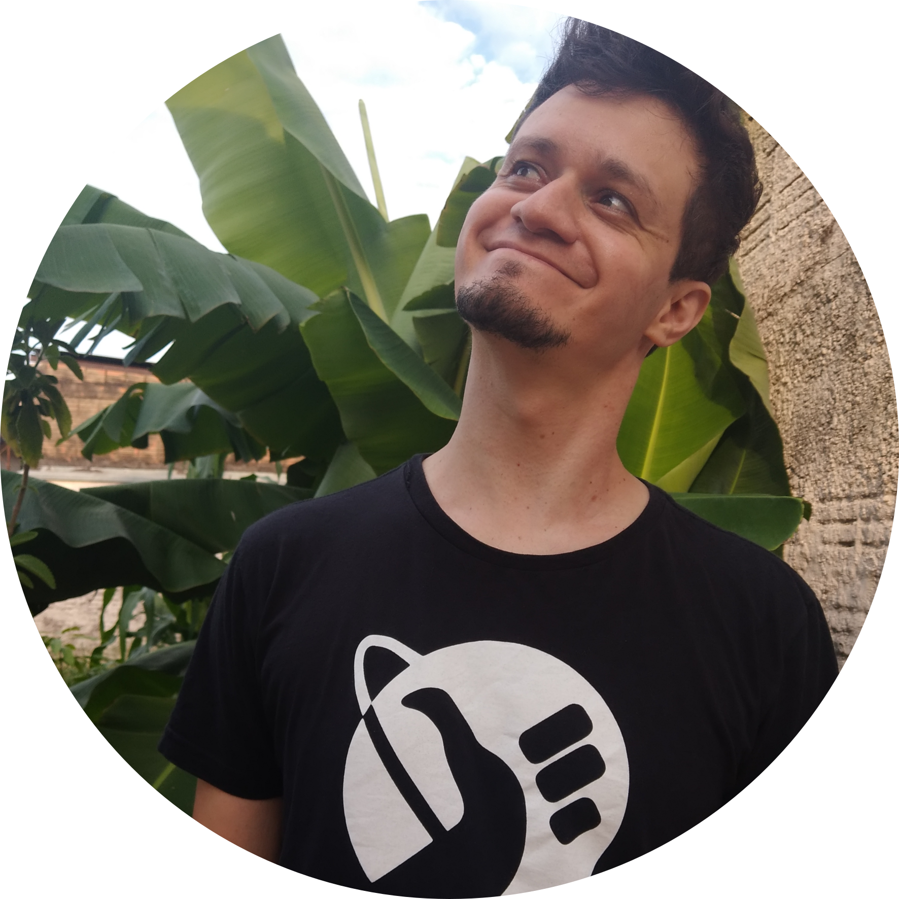
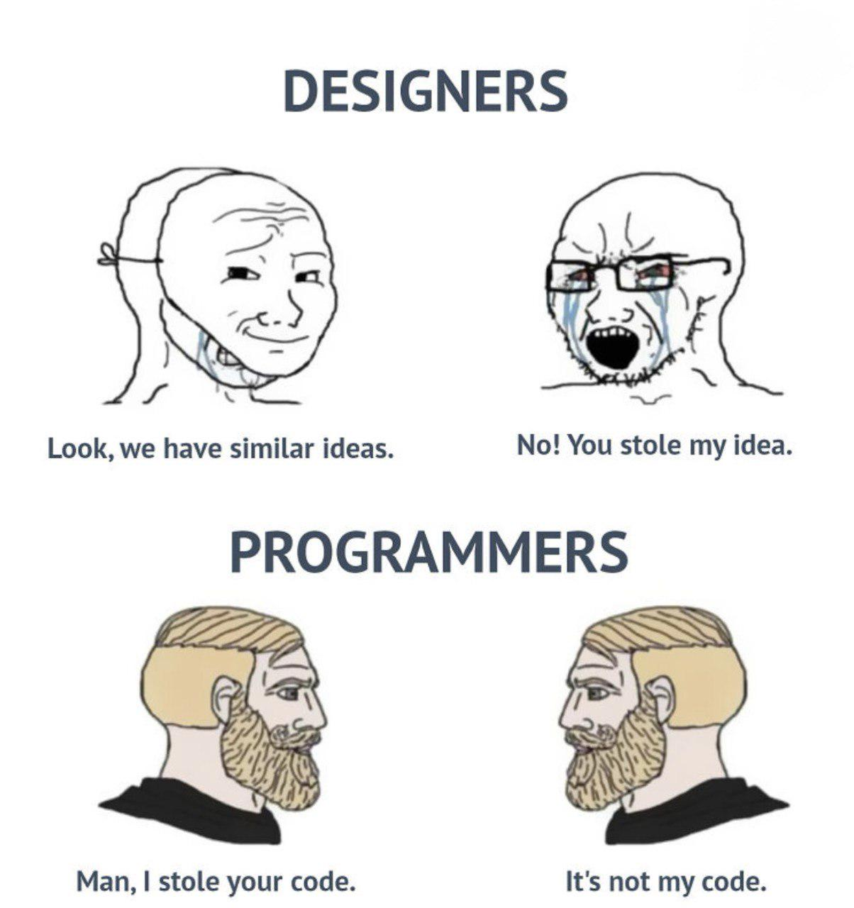

## Yuri Souza

:::::: columns
::: {.column width="50%"}

 {style="border-radius: 50%" width="80%"}

:::

:::: {.column width="50%"}
::: {style="font-size: 70%;"}
 

<strong> EXPERIÊNCIA </strong>

:::
::::
::::::

::: footer
<https://souzayuri.github.io/>
:::

## Yuri Souza

:::::: columns
::: {.column width="50%"}

 {style="border-radius: 50%" width="80%"}

:::

:::: {.column width="50%"}
::: {style="font-size: 70%;"}
 

<strong> EXPERIÊNCIA </strong>

-   Bacharel em Ecologia (UNESP, 2013-2016)

:::
::::
::::::

::: footer
<https://souzayuri.github.io/>
:::

## Yuri Souza

:::::: columns
::: {.column width="50%"}

 {style="border-radius: 50%" width="80%"}

:::

:::: {.column width="50%"}
::: {style="font-size: 70%;"}
 

<strong> EXPERIÊNCIA </strong>

-   Bacharel em Ecologia (UNESP, 2013-2016)
-   Mestre em Ecologia e Biodiversidade (UNESP, 2019-2021)

:::
::::
::::::

::: footer
<https://souzayuri.github.io/>
:::

## Yuri Souza

:::::: columns
::: {.column width="50%"}

 {style="border-radius: 50%" width="80%"}

:::

:::: {.column width="50%"}
::: {style="font-size: 70%;"}
 

<strong> EXPERIÊNCIA </strong>

-   Bacharel em Ecologia (UNESP, 2013-2016)
-   Mestre em Ecologia e Biodiversidade (UNESP, 2019-2021)
-   MBA em Data Science & Analytics (USP-ESAQL, 2021-2023)

:::
::::
::::::

::: footer
<https://souzayuri.github.io/>
:::

## Yuri Souza

:::::: columns
::: {.column width="50%"}

 {style="border-radius: 50%" width="80%"}

:::

:::: {.column width="50%"}
::: {style="font-size: 70%;"}
 

<strong> EXPERIÊNCIA </strong>

-   Bacharel em Ecologia (UNESP, 2013-2016)
-   Mestre em Ecologia e Biodiversidade (UNESP, 2019-2021)
-   MBA em Data Science & Analytics (USP-ESAQL, 2021-2023)
-   Mestre em Biologia (University of Miami, 2022-2025)

:::
::::
::::::

::: footer
<https://souzayuri.github.io/>
:::

## Yuri Souza

:::::: columns
::: {.column width="50%"}

 {style="border-radius: 50%" width="80%"}

:::

:::: {.column width="50%"}
::: {style="font-size: 70%;"}
 

<strong> EXPERIÊNCIA </strong>

-   Bacharel em Ecologia (UNESP, 2013-2016)
-   Mestre em Ecologia e Biodiversidade (UNESP, 2019-2021)
-   MBA em Data Science & Analytics (USP-ESAQL, 2021-2023)
-   Mestre em Biologia (University of Miami, 2022-2025)
-   Analista de Dados (IPÊ/INCAB, 2025)

:::
::::
::::::

::: footer
<https://souzayuri.github.io/>
:::

## Yuri Souza

:::::: columns
::: {.column width="50%"}

 {style="border-radius: 50%" width="80%"}

:::

:::: {.column width="50%"}
::: {style="font-size: 70%;"}
 

<strong> EXPERIÊNCIA </strong>

-   Bacharel em Ecologia (UNESP, 2013-2016)
-   Mestre em Ecologia e Biodiversidade (UNESP, 2019-2021)
-   MBA em Data Science & Analytics (USP-ESAQL, 2021-2023)
-   Mestre em Biologia (University of Miami, 2022-2025)
-   Analista de Dados (IPÊ/INCAB, 2025)
-   <strong> Não sou estátistico nem programador </strong>
:::
::::
::::::

::: footer
<https://souzayuri.github.io/>
:::

## Sobre o curso

Pedido do Prof. Mauro para treinamento do Labic

<video width="100%" controls loop autoplay muted playsinline>

<source src="img/mauro.mp4" type="video/mp4">

Your browser does not support the video tag. </video>

## Sobre os slides {width="5%" left="-100" top="100"}

 

 

::: text-center
{width="300"}

[*Maurício Vancini*](https://mauriciovancine.github.io/)
:::

{.absolute width="40%" right="-100" top="140"}

## Sobre o Conteúdo

 

 

::: text-center
{width="300"}

[*Maurício Vancini*](https://mauriciovancine.github.io/)
:::

::: text-left
{.absolute width="29%" right="-100" top="120"}

[*Livro: Análises Ecológicas no R*](https://analises-ecologicas.netlify.app/)
:::

## Horários {.smaller}

#### Duração: \~21h

| Dia                                    | Horáros                        |
|----------------------------------------|--------------------------------|
| <strong>Dia 01</strong>  07/01/2026 | 09:00 - 12:00 14:00 - 17:00 |
| <strong>Dia 02</strong>  08/01/2026 | 09:00 - 12:00 14:00 - 17:00 |
| <strong>Dia 03</strong>  09/01/2026 | 09:00 - 12:00 14:00 - 17:00 |
| <strong>Dia 04</strong>  10/01/2026 | 09:00 - 12:00                  |

 

## Cronograma {.smaller}

:::: columns
::: {width="100%" style="font-size: 22px"}
| Dia | Atividade |
|------------------------------------|------------------------------------|
| <strong>Dia 01</strong> | Boas-vindas e apresentações |
| <strong>Dia 01</strong> | Aula teórica 1: por que estudar dados em Ecologia? |
| <strong>Dia 01</strong> | Aula teórica 1: introdução ao R, ambiente R e GitHub |
| <strong>Dia 01</strong> | Aula prática 1: configurando o ambiente R e GitHub |
| <strong>Dia 02</strong> | Aula prática 2: introdução à programação em R (Base R) |
| <strong>Dia 02</strong> | Aula prática 2: introdução à programação em R (pacotes & tidyverse) |
| <strong>Dia 02</strong> | Aula prática 2: introdução à programação em R (visualização) |
| <strong>Dia 03</strong> | Aula teórica 3: visualização e comunicação de análises estatísticas (descritiva, Inferencial) |
| <strong>Dia 03</strong> | Aula prática 3: visualização e comunicação de análises estatísticas (descritiva, Inferencial) |
| <strong>Dia 04</strong> | Aula teórica 4: visualização e comunicação de análises estatísticas (preditiva) |
| <strong>Dia 04</strong> | Aula prática 4: visualização e comunicação de análises estatísticas (preditiva) |
:::
::::

## Quem são vocês?

  1. Nome

2.  Formação

3.  Conhece algo sobre R ou programação?

4.  Como se sente em relação à disciplina?

5.  O que faz ou pensa em fazer da vida?

6.  Uma curiosidade sobre você

## Importante

  Esse curso está sendo pago com <strong>dinheiro público!</strong>    Aproveitem o máximo possível! 

## Importante

  Esse curso está sendo pago com <strong>dinheiro público!</strong>    Aproveitem o máximo possível!    <strong>Evitem</strong> celular, redes sociais e outras <strong>distrações!</strong>    Estudar R e estatística geraram <strong>muitas oportunidades</strong> de parcerias em pesquisas e trabalho! 

## Importante

  Só se aprende R...   

## Importante

  Só se aprende R...    ...<strong>'errando'</strong> 

## Importante

  Só se aprende R...    ...<strong>'errando'</strong>    Esse curso é apenas o começo, o aprendizado <strong>é com vocês!</strong>   

## Importante

  Só se aprende R...    ...<strong>'errando'</strong>    Esse curso é apenas o começo, o aprendizado <strong>é com vocês!</strong>    Será como reaprender à <strong>pensar, falar e escrever</strong>    Aprender leva tempo! <strong>Muito tempo...</strong>   

## Importante

  Só se aprende R...    ...<strong>'errando'</strong>    Esse curso é apenas o começo, o aprendizado <strong>é com vocês!</strong>    Será como reaprender à <strong>pensar, falar e escrever</strong>    Aprender leva tempo! <strong>Muito tempo...</strong>    Ponto positivo: <strong>há muito material disponível e grátis</strong> (e AI🙃)!  

## IMPORTANTE!!!

**Estamos num espaço seguro e amigável**

-   Sintam-se à vontade para me interromper e tirar dúvidas

::: footer
Artwork by [\@allison_horst](https://x.com/allison_horst)
:::
