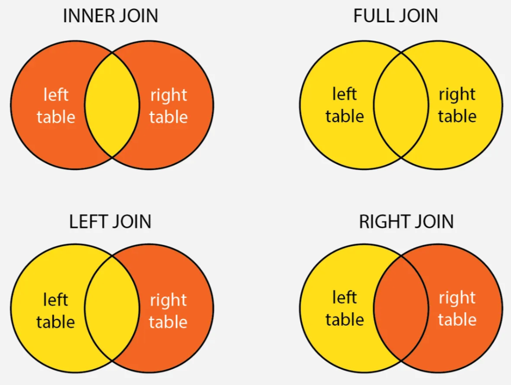

## Manipulação de dados

#### Pacotes

::: {style="font-size: 70%"}
-   O R apresenta **pacotes**, que são um **conjunto de funções**.

-   Existem pacotes para **diversos tipos de funcionalidades** e uso

-   A função do pacote é providenciar um **conjunto de funções**, assim você **não** precisa escrever elas.

-   Dentre esses pacotes, o mais famoso é o `tidyverse`:

    -   um **pacote** com a função de **instalar** e **carregar** outros pacotes

    -   pacotes para **manipulação de dados**, voltado para **Ciência de Dados**

    -   É considerado um "universo" à parte do R, pois todas as suas **ferramentas** possuem formas de uso consistentes e **funcionam** muito bem em conjunto
:::

## Manipulação de dados

{fig-align="center"}

## Manipulação de dados

#### Pacotes

::::: {.columns style="font-size: 80%"}
::: {.column width="50%" style="font-size: 70%"}
**Instalação de pacotes**

-   só é necessário instalar **uma única vez**

```{r eval = FALSE}

install.packages("tidyverse")
```

```{r}

```
:::

::: {.column width="50%" style="font-size: 70%"}
```{r eval = FALSE}


```
:::
:::::

## Manipulação de dados

#### Pacotes

::::: {.columns style="font-size: 80%"}
::: {.column width="50%" style="font-size: 70%"}
**Instalação de pacotes**

-   só é necessário instalar **uma única vez**

```{r eval = FALSE}

install.packages("tidyverse")
```

**Carregar pacotes**

-   **Primeira coisa** a se fazer quando **começar um script**

-   Necessário **carregar toda vez** que abrir um script

```{r}
#| message: true
library("tidyverse")
```
:::

::: {.column width="50%" style="font-size: 70%"}
```{r eval = FALSE}


```
:::
:::::

## Manipulação de dados

#### Pacotes

::::: {.columns style="font-size: 80%"}
::: {.column width="50%" style="font-size: 70%"}
**Instalação de pacotes**

-   só é necessário instalar **uma única vez**

```{r eval = FALSE}

install.packages("tidyverse")
```

**Carregar pacotes**

-   **Primeira coisa** a se fazer quando **começar um script**

-   Necessário **carregar toda vez** que abrir um script

```{r}
#| message: true
library("tidyverse")
```
:::

::: {.column width="50%" style="font-size: 70%"}
**Boas práticas de programação!**

-   Use **`nome do pacote::função`**

    -   ex: `readr::read_csv()`

    -   Os `::` faz a **conexão da função com o respectivo pacote**, assim **evitamos** falhas de incompatibilidade.

```{r eval = FALSE}
readr::read_csv2

```
:::
:::::

## Manipulação de dados

#### `magrittr`

::: {style="font-size: 70%"}
#### Uso do operador pipe (%\>%) (2014)

-   Criou o famoso **pipe =** `%>%`

-   Serve para **passar o resultado de uma função direto para a próxima**, **sem** precisar criar vários **objetos intermediários**.

-   A lógica é usar funções para irem sendo **processadas em sequência de prioridade**

    -   "pegue isso → faça isso → depois isso"

-   O pipe coloca o **objeto como primeiro argumento da função seguinte**.
:::

## Manipulação de dados

#### `magrittr`

::: {style="font-size: 70%"}
#### Uso do operador pipe (%\>%) (2014)

-   Criou o famoso **pipe =** `%>%`

-   Serve para **passar o resultado de uma função direto para a próxima**, **sem** precisar criar vários **objetos intermediários**.

-   A lógica é usar funções para irem sendo **processadas em sequência de prioridade**

    -   "pegue isso → faça isso → depois isso"

-   O pipe coloca o **objeto como primeiro argumento da função seguinte**.

-   Analogia: `produção de uma bebida`
:::

## Manipulação de dados

#### `magrittr`

::: {style="font-size: 70%"}
#### Uso do operador pipe (%\>%) (2014)

-   Criou o famoso **pipe =** `%>%`

-   Serve para **passar o resultado de uma função direto para a próxima**, **sem** precisar criar vários **objetos intermediários**.

-   A lógica é usar funções para irem sendo **processadas em sequência de prioridade**

    -   "pegue isso → faça isso → depois isso"

-   O pipe coloca o **objeto como primeiro argumento da função seguinte**.

-   Analogia: `produção de uma bebida`

    -   **Água** é o **input/entrada**, os equipamentos/processos **seguintes são funções** e são seguidos por um **`%>%` (pipe)**
:::

## Manipulação de dados

#### `magrittr`

::: {style="font-size: 70%"}
#### Uso do operador pipe (%\>%) (2014)

-   Criou o famoso **pipe =** `%>%`

-   Serve para **passar o resultado de uma função direto para a próxima**, **sem** precisar criar vários **objetos intermediários**.

-   A lógica é usar funções para irem sendo **processadas em sequência de prioridade**

    -   "pegue isso → faça isso → depois isso"

-   O pipe coloca o **objeto como primeiro argumento da função seguinte**.

-   Analogia: `produção de uma bebida`

    -   **Água** é o **input/entrada**, os equipamentos/processos **seguintes são funções** e são seguidos por um **`%>%` (pipe)**

    -   O efeito **acaba na última função** a qual não tem mais nenhum `%>%` associado
:::

## Manipulação de dados

#### `magrittr`

::: {style="font-size: 70%"}
#### Uso do operador pipe (%\>%) (2014)

-   Criou o famoso **pipe =** `%>%`

-   Serve para **passar o resultado de uma função direto para a próxima**, **sem** precisar criar vários **objetos intermediários**.

-   A lógica é usar funções para irem sendo **processadas em sequência de prioridade**

    -   "pegue isso → faça isso → depois isso"

-   O pipe coloca o **objeto como primeiro argumento da função seguinte**.

-   Analogia: `produção de uma bebida`

    -   **Água** é o **input/entrada**, os equipamentos/processos **seguintes são funções** e são seguidos por um **`%>%` (pipe)**

    -   O efeito **acaba na última função** a qual não tem mais nenhum `%>%` associado

    -   O que resta é o output/resultado: a bebida pronta após todos os processos.
:::

## Manipulação de dados

#### `magrittr`

::: {style="font-size: 70%"}
#### Uso do operador pipe (%\>%) (2014)

{fig-align="center" width="700"}
:::

## Manipulação de dados

#### `magrittr`

::: {style="font-size: 70%"}
#### Uso do operador pipe (%\>%) (2014)

```{r}

dados_csv <- readr::read_csv("../01_dados/biota_diversidade.csv")
dados_csv
```
:::

## Manipulação de dados

#### `magrittr`

::: {style="font-size: 70%"}
#### Uso do operador pipe (%\>%) (2014)

```{r eval = FALSE}
dados_csv <- readr::read_csv("../01_dados/biota_diversidade.csv")  
dados.tidy <- dados_csv %>% #seleciona o objeto     
```
:::

## Manipulação de dados

#### `magrittr`

::: {style="font-size: 70%"}
#### Uso do operador pipe (%\>%) (2014)

```{r eval = FALSE}
dados_csv <- readr::read_csv("../01_dados/biota_diversidade.csv")  
dados_tidy <- dados_csv %>% #seleciona o objeto     
  select(c(2,3,4)) %>% #seleciona as colunas de interesse     
```
:::

## Manipulação de dados

#### `magrittr`

::: {style="font-size: 70%"}
#### Uso do operador pipe (%\>%) (2014)

```{r eval = FALSE}
dados_csv <- readr::read_csv("../01_dados/biota_diversidade.csv")  
dados_csv
dados_tidy <- dados_csv %>% #seleciona o objeto     
  select(c(2,3,4)) %>% #seleciona as colunas de interesse     
  table() #vamos checar número de elementos repetidos 
```
:::

## Manipulação de dados

#### `magrittr`

::: {style="font-size: 70%"}
#### Uso do operador pipe (%\>%) (2014)

```{r}
dados_csv <- readr::read_csv("../01_dados/biota_diversidade.csv")  
dados_tidy <- dados_csv %>% #seleciona o objeto     
  dplyr::select(c(2,3,4)) %>% #seleciona as colunas de interesse     
  table() #vamos checar número de elementos repetidos 
dados_tidy 
```
:::

## Manipulação de dados

#### Carregar dados

:::::: {style="font-size: 50%"}
#### `readr` **Leitura de dados**

-   Funções para **`importar dados`** de diferentes formatos
-   Parte do **tidyverse**, mais **rápido** que funções base do R
-   Identifica **automaticamente** os tipos de dados
-   Usar `read_csv2()` e `read_table2()` se os dados estiverem em **PT-BR**

::::: columns
::: {.column width="50%" style="font-size: 100%"}
Arquivo **separado** por `vírgula`

```{r}
# Arquivo separado por vírgula
dados_csv <- readr::read_csv("../01_dados/biota_diversidade.csv")
dados_csv
```
:::

::: {.column width="50%" style="font-size: 100%"}
```{r}

```
:::
:::::
::::::

## Manipulação de dados

#### Carregar dados

:::::: {style="font-size: 50%"}
#### `readr` **Leitura de dados**

-   Funções para **`importar dados`** de diferentes formatos
-   Parte do **tidyverse**, mais **rápido** que funções base do R
-   Identifica **automaticamente** os tipos de dados
-   Usar `read_csv2()` e `read_table2()` se os dados estiverem em **PT-BR**

::::: columns
::: {.column width="50%" style="font-size: 100%"}
Arquivo **separado** por `vírgula`

```{r}
# Arquivo separado por vírgula
dados_csv <- readr::read_csv("../01_dados/biota_diversidade.csv")
dados_csv
```
:::

::: {.column width="50%" style="font-size: 100%"}
Arquivo **separado** por `tabulação`

```{r}
# Arquivo separado por tabulação
dados_txt <- readr::read_table("../01_dados/biota_diversidade.txt")
dados_txt
```
:::
:::::
::::::

## Manipulação de dados

#### Checar estrutura dos dados

::: {style="font-size: 60%"}
`glimpse()` visão **compacta** dos dados

-   Mostra **modo de cada coluna**, **dimensões** e primeiras observações
-   Alternativa mais **compacta** que `str()`

```{r}
dplyr::glimpse(dados_csv)
```
:::

## Manipulação de dados

#### Seleção de Colunas

:::::: {style="font-size: 70%"}
`select()` **Selecionar colunas específicas**

::::: columns
::: {.column width="50%"}
Por `nome`

```{r}
dados_csv %>% 
  dplyr::select(Id_plot, Location, Plots)

```
:::

::: {.column width="50%"}
```{r}

```
:::
:::::
::::::

## Manipulação de dados

#### Seleção de Colunas

:::::: {style="font-size: 70%"}
`select()` **Selecionar colunas específicas**

::::: columns
::: {.column width="50%"}
Por `nome`

```{r}
dados_csv %>% 
  dplyr::select(Id_plot, Location, Plots)
```
:::

::: {.column width="50%"}
Por `posição`

```{r}
dados_csv %>% 
  dplyr::select(1, 2, 3)
```
:::
:::::
::::::

## Manipulação de dados

#### Seleção de Colunas

:::::: {style="font-size: 70%"}
`select(-c())` **remover colunas específicas**

::::: columns
::: {.column width="50%" style="font-size: 75%"}
Por `nome`

```{r}
dados_csv %>%    
  dplyr::select(-c(Id_plot, Location, Plots)) 
```
:::

::: {.column width="50%" style="font-size: 75%"}
```{r}
```
:::
:::::
::::::

## Manipulação de dados

#### Seleção de Colunas

:::::: {style="font-size: 70%"}
`select(-c())` **remover colunas específicas**

::::: columns
::: {.column width="50%" style="font-size: 75%"}
Por `nome`

```{r}
dados_csv %>%    
  dplyr::select(-c(Id_plot, Location, Plots)) 
```
:::

::: {.column width="50%" style="font-size: 75%"}
Por `posição`

```{r}
dados_csv %>%    
  dplyr::select(-c(1, 2, 3))
```
:::
:::::
::::::

## Manipulação de dados

#### Seleção de Colunas

:::::: {style="font-size: 70%"}
`select()` funções auxiliares - **Seleção por padrões**

::::: columns
::: {.column width="50%"}
**Colunas** que `começam` com **determinado texto**

```{r}
dados_csv %>% 
  dplyr::select(dplyr::starts_with("D_"))

```
:::

::: {.column width="50%"}
```{r}


```
:::
:::::
::::::

## Manipulação de dados

#### Seleção de Colunas

:::::: {style="font-size: 70%"}
`select()` funções auxiliares - **Seleção por padrões**

::::: columns
::: {.column width="50%"}
**Colunas** que `começam` com **determinado texto**

```{r}
dados_csv %>% 
  dplyr::select(dplyr::starts_with("D_"))
```
:::

::: {.column width="50%"}
**Colunas** que `terminam` com **determinado texto**

```{r}
dados_csv %>% 
  dplyr::select(dplyr::ends_with("on"))
```
:::
:::::
::::::

## Manipulação de dados

#### Seleção de Colunas

::: {style="font-size: 70%"}
`everything()` **Reordenar colunas**

-   `everything()` seleciona **todas as outras colunas** restantes

```{r}
# Colocar Familia como primeira coluna
dados_csv %>% 
  dplyr::select(Treatment, dplyr::everything())
```
:::

## Manipulação de dados

#### Filtragem de Linhas

::: {style="font-size: 70%"}
#### `filter()`**Filtrar linhas por condição**

```         
```

```         
```

```         
```
:::

## Manipulação de dados

#### Filtragem de Linhas

::: {style="font-size: 70%"}
#### `filter()`**Filtrar linhas por condição**

Filtrando por **uma** condição

```{r}
# Uma condição
dados_csv %>% 
  dplyr::filter(Treatment == "closed")

```
:::

## Manipulação de dados

#### Filtragem de Linhas

::: {style="font-size: 70%"}
#### `filter()`**Filtrar linhas por condição**

Filtrando por **duas** condições

```{r}
dados_csv %>% 
  dplyr::filter(Treatment == "closed" & Date == 2019)
```
:::

## Manipulação de dados

#### Filtragem de Linhas

::: {style="font-size: 70%"}
#### `filter()`**Filtrar linhas por condição**

Filtrando por **três** condições

```{r}
dados_csv %>% 
  dplyr::filter(Location == "CBO" | Treatment == "closed" & Date == 2019)
```
:::

## Manipulação de dados

#### Filtragem de Linhas

:::::: {style="font-size: 70%"}
#### `slice()` **Selecionar linhas por posição**

::::: {.columns style="font-size: 70%"}
::: {.column width="50%"}
Primeiras 5 linhas

```{r}
dados_csv %>% 
  dplyr::slice(1:5)
```
:::

::: {.column width="50%"}
```{r}

```
:::
:::::
::::::

## Manipulação de dados

#### Filtragem de Linhas

:::::: {style="font-size: 70%"}
#### `slice()` **Selecionar linhas por posição**

::::: {.columns style="font-size: 70%"}
::: {.column width="50%"}
Primeiras 5 linhas

```{r}
dados_csv %>%    
  dplyr::slice(1:5)
```
:::

::: {.column width="50%"}
Linhas específicas

```{r}
dados_csv %>%       
  dplyr::slice(c(1, 5, 10))
```
:::
:::::
::::::

## Manipulação de dados

#### Filtragem de Linhas

:::::: {style="font-size: 70%"}
#### `slice_sample()` **Amostra aleatória**

::::: {.columns style="font-size: 70%"}
::: {.column width="50%"}
10 linhas **aleatórias**

```{r}
dados_csv %>% 
  dplyr::slice_sample(n = 10)
```
:::

::: {.column width="50%"}
```         
```
:::
:::::
::::::

## Manipulação de dados

#### Filtragem de Linhas

:::::: {style="font-size: 70%"}
#### `slice_sample()` **Amostra aleatória**

::::: {.columns style="font-size: 70%"}
::: {.column width="50%"}
10 linhas **aleatórias**

```{r}
dados_csv %>% 
  dplyr::slice_sample(n = 10)
```
:::

::: {.column width="50%"}
10% dos dados

```{r}
dados_csv %>%    
  dplyr::slice_sample(prop = 0.1)
```
:::
:::::
::::::

## Manipulação de dados

#### Filtragem de Linhas

:::::: {style="font-size: 70%"}
`distinct()` **Remover duplicatas**

::::: {.columns style="font-size: 70%"}
::: {.column width="50%"}
**Linhas únicas** baseado em `todas as colunas`

Ótima função para checar um `data frame` que acabou de receber e não sabe muito sobre

```{r}
dados_csv %>% 
  dplyr::distinct()
```
:::

::: {.column width="50%"}
**Linhas únicas** baseado em `colunas especificas`

```{r}
dados_csv %>% 
  dplyr::distinct(Location)
```
:::
:::::
::::::

## Manipulação de dados

#### Edição de Colunas

::: {style="font-size: 65%"}
`rename()`**Renomear colunas**

```{r}

```
:::

## Manipulação de dados

#### Edição de Colunas

::: {style="font-size: 65%"}
`rename()`**Renomear colunas**

-   Formato: **novo_nome = nome_antigo**

```{r}
dados_csv %>%       
  dplyr::rename(Tratamento = Treatment,                      
                Local = Location,                  
                Parcelas = Plots,                 
                ID = Id_plot)
```
:::

## Manipulação de dados

#### Edição de Colunas

:::::: {style="font-size: 65%"}
`column_to_rownames` pega uma `coluna` existente e **transforma** essa coluna em **nomes de linha**

::::: {.columns style="font-size: 75%"}
::: {.column width="50%"}
```         
```
:::

::: {.column width="50%"}
```         
```
:::
:::::
::::::

## Manipulação de dados

#### Edição de Colunas

:::::: {style="font-size: 65%"}
`column_to_rownames` pega uma `coluna` existente e **transforma** essa coluna em **nomes de linha**

::::: {.columns style="font-size: 75%"}
::: {.column width="50%"}
Super **importante** quando precisar deixar a **estrutura da tabela** para **análises** (`matrix` para PCA,, RDA, NMDS)

Não pode existe nomes duplicados na coluna selecionada

```{r}
dados_csv_col_n <- dados_csv %>% 
  dplyr::filter(Date == 2019) %>% 
  tibble::column_to_rownames("Id_plot") # seleciona a coluna existente
dados_csv_col_n
```
:::

::: {.column width="50%"}
```         
```
:::
:::::
::::::

## Manipulação de dados

#### Edição de Colunas

:::::: {style="font-size: 65%"}
`column_to_rownames` pega uma `coluna` existente e **transforma** essa coluna em **nomes de linha**

::::: {.columns style="font-size: 75%"}
::: {.column width="50%"}
Super **importante** quando precisar deixar a **estrutura da tabela** para **análises** (`matrix` para PCA,, RDA, NMDS)

Não pode existe nomes duplicados na coluna selecionada

```{r}
dados_csv_col_n <- dados_csv %>% 
  dplyr::filter(Date == 2019) %>% 
  tibble::column_to_rownames("Id_plot") # seleciona a coluna existente
dados_csv_col_n
```
:::

::: {.column width="50%"}
Super **importante** quando precisar **transformar** uma

`matrix` in `data frame`

```{r}
dados_csv_col_n %>% 
  dplyr::filter(Date == 2019) %>% 
  tibble::rownames_to_column("Id_plot") # nome da coluna a ser criada
```
:::
:::::
::::::

## Manipulação de dados

#### Criação e Modificação

:::::: {style="font-size: 70%"}
`mutate()` **Criar ou modificar colunas**

-   Talvez a função mais utilizada do tidyverse

::::: {.columns style="font-size: 75%"}
::: {.column width="50%"}
Criar/modificar **uma** `coluna`

```{r}
dados_csv %>% 
  dplyr::mutate(coluna_nova = "")
```
:::

::: {.column width="50%"}
```{r}

```
:::
:::::
::::::

## Manipulação de dados

#### Criação e Modificação

:::::: {style="font-size: 70%"}
`mutate()` **Criar ou modificar colunas**

-   Talvez a função mais utilizada do tidyverse

::::: {.columns style="font-size: 75%"}
::: {.column width="50%"}
Criar/modificar **uma** `coluna`

```{r}
head(dados_csv %>% 
  dplyr::mutate(coluna_nova = ""), n = 5)
```
:::

::: {.column width="50%"}
Criar/modificar **várias** `colunas`

```{r}
head(dados_csv %>% 
  dplyr::mutate(coluna_nova = "",
                Treatment = toupper(Treatment), #coloca tudo maiúsculo
                hbvr_body_size_kg_log = log(hbvr_body_size_kg)), n = 5)
```
:::
:::::
::::::

## Manipulação de dados

#### Criação e Modificação

:::: {style="font-size: 70%"}
`mutate()` **Criar ou modificar colunas**

::: {.columns style="font-size: 90%"}
Ex: adicionar o numero das linhas com `ID` através da função `row_number()`

```{r}

dados_csv <- dados_csv %>% 
  dplyr::mutate(ID = dplyr::row_number()) %>% 
  dplyr::select(ID, dplyr::everything())
dados_csv
```
:::
::::

## Manipulação de dados

#### Criação e Modificação

:::::: {style="font-size: 60%"}
`if_else()` cria uma `coluna` baseado em um **condicional simples**

::::: columns
::: {.column width="50%"}
-   Útil quando precisa **criar uma condição** para alguma finalidade

-   Preenchimento **rápido** e **automático** de uma `coluna`

-   **Se** condição for **verdadeira**, retorna `primeiro valor`

-   **Senão**, retorna `segundo valor`
:::

::: {.column width="50%" style="font-size: 100%"}
```         
```
:::
:::::
::::::

## Manipulação de dados

#### Criação e Modificação

:::::: {style="font-size: 60%"}
`if_else()` cria uma `coluna` baseado em um **condicional simples**

::::: columns
::: {.column width="50%"}
-   Útil quando precisa **criar uma condição** para alguma finalidade

-   Preenchimento **rápido** e **automático** de uma `coluna`

-   **Se** condição for **verdadeira**, retorna `primeiro valor`

-   **Senão**, retorna `segundo valor`
:::

::: {.column width="50%" style="font-size: 100%"}
```{r}
dados_csv %>% 
  dplyr::mutate(Richness_cond = dplyr::if_else(Richness > 5, 
                                               "Verdadeiro",
                                               "Falso")) %>% 
  dplyr::select(1,2,3,4, dplyr::starts_with("Rich"))

```
:::
:::::
::::::

## Manipulação de dados

#### Criação e Modificação

:::::: {style="font-size: 70%"}
`case_when()` cria **múltiplas condições.**

::::: {.columns style="font-size: 70%"}
::: {.column width="50%"}
-   Funciona como uma **sequência de testes lógicos**, avaliados **de cima para baixo**. Cada linha tem a forma:

    -   `condição ~ valor`

-   A primeira condição que der **TRUE** é a que será usada.

-   Se nenhuma das condições anteriores for satisfeita, ele precisa de uma **condição final que sempre seja verdadeira**.

-   Exige que toda observação tenha um resultado, por isso a **última condição é** `TRUE`, se não o resultado vira `NA`

-   Avalia condições **em ordem**

-   Uma das mais importantes e versáteis
:::

::: {.column width="50%"}
```         
```
:::
:::::
::::::

## Manipulação de dados

#### Criação e Modificação

:::::: {style="font-size: 70%"}
`case_when()` cria **múltiplas condições.**

::::: {.columns style="font-size: 70%"}
::: {.column width="50%"}
-   Funciona como uma **sequência de testes lógicos**, avaliados **de cima para baixo**. Cada linha tem a forma:

    -   `condição ~ valor`

-   A primeira condição que der **TRUE** é a que será usada.

-   Se nenhuma das condições anteriores for satisfeita, ele precisa de uma **condição final que sempre seja verdadeira**.

-   Exige que toda observação tenha um resultado, por isso a **última condição é** `TRUE`, se não o resultado vira `NA`

-   Avalia condições **em ordem**

-   Uma das mais importantes e versáteis
:::

::: {.column width="50%" style="font-size: 120%"}
```{r}
dados_csv %>% 
  dplyr::mutate(
    Richness_cat = dplyr::case_when(
      Richness > 20 ~ "muito alta",
      Richness > 10 ~ "alta",
      Richness > 5 ~ "média",
      TRUE ~ "baixa"  # condição padrão
    )) %>% 
  dplyr::select(1,2,3,4, dplyr::starts_with("Rich"))
```
:::
:::::
::::::

## Manipulação de dados

#### Ordenação

:::::: {style="font-size: 70%"}
`arrange()` **Ordena `linhas`. Semelhante** ao `sort()`

::::: {.columns style="font-size: 95%"}
::: {.column width="50%"}
```{r}
dados_csv %>% 
  dplyr::select(1,2,3,4, dplyr::starts_with("Rich")) 

```
:::

::: {.column width="50%"}
```{r}
dados_csv %>% 
  dplyr::select(1,2,3,4, dplyr::starts_with("Rich")) %>% 
  dplyr::arrange(Richness)

```
:::
:::::
::::::

## Manipulação de dados

#### Agregação e Resumo

::: {style="font-size: 60%"}
`summarise()` Permite criar um **resumo dos dados**

-   Muito útil para criar qualquer tipo de equação que necessite de agrupamentos.

-   Reduz os dados a **estatísticas resumidas**

-   Se a `coluna` de interesse tiver `NA` **precisa** usar o argumento `na.rm = TRUE` ou o resultado será `NA`
:::

## Manipulação de dados

#### Agregação e Resumo

:::::: {style="font-size: 60%"}
`summarise()` Permite criar um **resumo dos dados**

-   Muito útil para criar qualquer tipo de equação que necessite de agrupamentos.

-   Reduz os dados a **estatísticas resumidas**

-   Se a `coluna` de interesse tiver `NA` **precisa** usar o argumento `na.rm = TRUE` ou o resultado será `NA`

::::: columns
::: {.column width="50%"}
```{r}
dados_csv %>% 
  dplyr::summarise(
    # mean() é a função para calcular média
    Richness_media = mean(Richness),
    # mean() é a função para calcular média
    Abundance_soma = sum(Abundance),
    Canopy_cover_media = mean(Canopy_cover),
    Treatment_count = n()
    ) 

```
:::

::: {.column width="50%"}
```         
```
:::
:::::
::::::

## Manipulação de dados

#### Agregação e Resumo

:::::: {style="font-size: 60%"}
`summarise()` Permite criar um **resumo dos dados**

-   Muito útil para criar qualquer tipo de equação que necessite de agrupamentos.

-   Reduz os dados a **estatísticas resumidas**

-   Se a `coluna` de interesse tiver `NA` **precisa** usar o argumento `na.rm = TRUE` ou o resultado será `NA`

::::: columns
::: {.column width="50%"}
```{r}
dados_csv %>% 
  dplyr::summarise(
    # mean() é a função para calcular média
    Richness_media = mean(Richness),
    # mean() é a função para calcular média
    Abundance_soma = sum(Abundance),
    Canopy_cover_media = mean(Canopy_cover),
    Treatment_count = n()
    ) 
```
:::

::: {.column width="50%"}
```{r}
dados_csv %>% 
  dplyr::summarise(
    # mean() é a função para calcular média
    Richness_media = mean(Richness),
    # mean() é a função para calcular média
    Abundance_soma = sum(Abundance),
    Canopy_cover_media = mean(Canopy_cover, na.rm = TRUE),
    Treatment_count = n()
    ) 
```
:::
:::::
::::::

## Manipulação de dados

#### Agregação e Resumo

::: {style="font-size: 60%"}
`group_by()`**agrupar por variáveis**

-   Uma das mais úteis

-   Pode agrupar por **múltiplas variáveis**

-   **Necessário** usar `ungroup()` remove o **agrupamento** após resumir

```{r}

```
:::

## Manipulação de dados

#### Agregação e Resumo

::: {style="font-size: 60%"}
`group_by()`**Agrupar por variáveis**

-   Uma das mais úteis

-   Pode agrupar por **múltiplas variáveis**

-   **Necessário** usar `ungroup()` remove o **agrupamento** após resumir

```{r}
dados_csv %>% 
  dplyr::group_by(Location, Treatment) %>% 
  dplyr::summarise(
    Richness_media = mean(Richness),
    Abundance_soma= sum(Abundance),
    #Canopy_cover_media = mean(Canopy_cover, na.rm = TRUE),
    Treatment_count = n()) %>% 
  dplyr::ungroup()
```
:::

## Manipulação de dados

#### Agregação e Resumo

::: {style="font-size: 70%"}
`count()` **contar observações**

**Atalho** para `group_by() + summarise(x = n())`

```{r}


```
:::

## Manipulação de dados

#### Agregação e Resumo

::: {style="font-size: 70%"}
`count()` **contar observações**

**Atalho** para `group_by() + summarise(x = n())`

```{r}
dados_csv %>% 
  dplyr::count(Location)
```
:::

## Manipulação de dados

#### Valores Ausentes

:::::: {style="font-size: 60%"}
`drop_na()` **remover** valores **NA**

::::: {.columns style="font-size: 70%"}
::: {.column width="50%"}
```         
```
:::

::: {.column width="50%"}
```         
```
:::
:::::
::::::

## Manipulação de dados

#### Valores Ausentes

:::::: {style="font-size: 60%"}
`drop_na()` **remover** valores **NA**

::::: {.columns style="font-size: 70%"}
::: {.column width="50%"}
**Remover** `linhas` com `NA` em `todo` o data set

```{r}
dados_csv %>% 
  tidyr::drop_na(Canopy_cover)
```
:::

::: {.column width="50%"}
```         
```
:::
:::::
::::::

## Manipulação de dados

#### Valores Ausentes

:::::: {style="font-size: 60%"}
`drop_na()` **remover** valores **NA**

::::: {.columns style="font-size: 70%"}
::: {.column width="50%"}
**Remover** `linhas` com `NA` em `todo` o data set

```{r}
dados_csv %>% 
  tidyr::drop_na(Canopy_cover)
```
:::

::: {.column width="50%"}
**ou** `colunas` **específicas**

```{r}

dados_csv %>% 
  tidyr::drop_na(Canopy_cover)
```
:::
:::::
::::::

## Manipulação de dados

#### Valores Ausentes

:::: {style="font-size: 60%"}
`replace_na()` **substituir** valores **NA**

Substitui **NA** por valor especificado

Para `replace_na()` usar dentro de `mutate()`

::: {.columns style="font-size: 100%"}
```         
```
:::
::::

## Manipulação de dados

#### Valores Ausentes

:::: {style="font-size: 60%"}
`replace_na()` **substituir** valores **NA**

Substitui **NA** por valor especificado

Para `replace_na()` usar dentro de `mutate()`

::: {.columns style="font-size: 100%"}
**Substituir** `NA` por `0`

```{r}

dados_csv %>% 
  dplyr::mutate(
    Canopy_cover = tidyr::replace_na(Canopy_cover, 0)) %>% 
  dplyr::select(1:5, "Canopy_cover")
```
:::
::::

## Manipulação de dados

#### Transformação de dados

::: {style="font-size: 60%"}
`tidyr` Pacote para **organizar e transformar** `estrutura` de dados

-   Funções principais:

    -   `pivot_longer()`: converte dados de **largo para longo**
    -   `pivot_wider()`: converte dados de **longo para largo**

-   Semelhante ao `transpose` do **Excel**
:::

## Manipulação de dados

#### Transformação de dados

:::::: {style="font-size: 60%"}
`pivot_longer()` **Largo → Longo**

::::: columns
::: {.column width="50%"}
-   **Reduz o número** de `coluna` - data frame mais **limpo**

-   Pega um **conjunto de `colunas`** e **transforma** em `linhas`

    -   `Uma coluna` contendo o nome das colunas anteriores

    -   `Outra coluna` com valores que existiam nas celulas

-   Formato **mais usado** em `análises`
:::

::: {.column width="50%" style="font-size: 75%"}
```         
```
:::
:::::
::::::

## Manipulação de dados

#### Transformação de dados

:::::: {style="font-size: 60%"}
`pivot_longer()` **Largo → Longo**

::::: columns
::: {.column width="50%"}
-   **Reduz o número** de `coluna` - data frame mais **limpo**

-   Pega um **conjunto de `colunas`** e **transforma** em `linhas`

    -   `Uma coluna` contendo o nome das colunas anteriores

    -   `Outra coluna` com valores que existiam nas celulas

-   Formato **mais usado** em `análises`
:::

::: {.column width="50%" style="font-size: 75%"}
```{r}
dados_csv_long <- dados_csv %>% 
  tidyr::pivot_longer(
    cols = 10:19,
    names_to = "Variaveis",
    values_to = "Valores")
dados_csv_long
```
:::
:::::
::::::

## Manipulação de dados

#### Transformação de dados

:::::: {style="font-size: 60%"}
`pivot_longer()` **Largo → Longo**

::::: columns
::: {.column width="50%"}
-   **Reduz o número** de `coluna` - data frame mais **limpo**

-   Pega um **conjunto de `colunas`** e **transforma** em `linhas`

    -   `Uma coluna` contendo o nome das colunas anteriores

    -   `Outra coluna` com valores que existiam nas celulas

-   Formato **mais usado** em `análises`
:::

::: {.column width="50%" style="font-size: 75%"}
```{r}
dados_csv %>% 
    tidyr::pivot_longer(
      cols = 10:19,
      names_to = "Variaveis",
      values_to = "Valores") %>% 
  dplyr::select(3:5, starts_with("Va"))
```
:::
:::::
::::::

## Manipulação de dados

#### Transformação de dados

:::::: {style="font-size: 60%"}
`pivot_wider()` **Longo → Largo**

::::: columns
::: {.column width="50%"}
-   **Reduz o número** de `coluna` - data frame mais longo/visual
-   Pega uma **`coluna`** que contem **nome de variáveis** e **transforma** cada uma em uma `nova coluna`
    -   `Uma coluna` contendo o nome das colunas a serem criadas

    -   `Outra coluna` com valores que são atribuitos as novas colunas e células
-   Formato **mais usado** em `análises` que requerem formato de `matrix`
:::

::: {.column width="50%" style="font-size: 75%"}
```         
```
:::
:::::
::::::

## Manipulação de dados

#### Transformação de dados

:::::: {style="font-size: 60%"}
`pivot_wider()` **Longo → Largo**

::::: columns
::: {.column width="50%"}
-   **Reduz o número** de `coluna` - data frame mais longo/visual
-   Pega uma **`coluna`** que contem **nome de variáveis** e **transforma** cada uma em uma `nova coluna`
    -   `Uma coluna` contendo o nome das colunas a serem criadas

    -   `Outra coluna` com valores que são atribuitos as novas colunas e células
-   Formato **mais usado** em `análises` que requerem formato de `matrix`
:::

::: {.column width="50%" style="font-size: 75%"}
```{r}
dados_csv_long %>% 
    tidyr::pivot_wider(
      names_from = Variaveis,
      values_from = Valores)
```
:::
:::::
::::::

## Manipulação de dados

#### Junção de Tabelas

::: {style="font-size: 70%"}
**Tipos de joins**

-   **Combinar** dados de **diferentes** `data frames`
-   Baseado em **colunas-chave** com `mesmos nomes`
:::

## Manipulação de dados

#### Junção de Tabelas

::: {style="font-size: 70%"}
**Tipos de joins**

-   **Combinar** dados de **diferentes** `data frames`
-   Baseado em **colunas-chave** com `mesmos nomes` e `propriedades`

{fig-align="center" width="350"}
:::

## Manipulação de dados

#### Junção de Tabelas

::: {style="font-size: 70%"}
**Tipos de joins**

-   **Combinar** dados de **diferentes** `data frames`
-   Baseado em **colunas-chave** com `mesmos nomes` e `propriedades`
-   Mais utilizados:

{fig-align="center" width="450"}
:::

## Manipulação de dados

#### Junção de Tabelas

::: {style="font-size: 60%"}
`left_join()` **-** `left_join(Tabela da Esquerda, Tabela da Direita)`

-   **Manter todas as linhas da tabela da `esquerda` e adiciona as da `direita`**

```{r}


```
:::

## Manipulação de dados

#### Junção de Tabelas

::: {style="font-size: 60%"}
`left_join()` **-** `left_join(Tabela da Esquerda, Tabela da Direita)`

-   **Manter todas as linhas da tabela da `esquerda` e adiciona as da `direita`**

```{r}

traits <- readr::read_csv("../01_dados/biota_plant_traits.csv") %>% 
  dplyr::slice_sample(n = 10)
traits
```
:::

## Manipulação de dados

#### Junção de Tabelas

:::::: {style="font-size: 50%"}
`left_join()` **-** `left_join(Tabela da Esquerda, Tabela da Direita)`

-   **Manter todas as linhas da tabela da `esquerda` e adiciona as da `direita.`**
-   Se as linhas já **existirem** nas da esquerda, então **não há alteração**.

::::: {.columns style="font-size: 90%"}
::: {.column width="50%"}
Tabela contendo `dados de traits`

*`Tabela que vai a direita`*

```{r}
traits <- readr::read_csv("../01_dados/biota_plant_traits.csv") %>% 
  dplyr::slice_sample(n = 10)
traits
```
:::

::: {.column width="50%"}
Adicionar a `tabela dos traits` a `outra tabela` com **identificador** de colunas **iguais**

Especificar as `colunas` que tornam a estrutura dos `data frames` iguais **usando** `by = c()`

*`Tabela que vai a esquerda`*

```{r}
head(dados_csv %>% 
  dplyr::left_join(traits, by = c("Id_plot","Location", "Plots", 
                                  "Treatment", "Date")), n = 5)
```
:::
:::::
::::::

## Manipulação de dados

#### Junção de Tabelas

:::::: {style="font-size: 55%"}
`inner_join()`**Manter apenas linhas com match em ambas**

-   Mantém **apenas** linhas que têm correspondência em **ambas** tabelas
-   **Remove** linhas `sem match`

::::: {.columns style="font-size: 85%"}
::: {.column width="50%"}
```{r}

```
:::

::: {.column width="50%"}
```{r}

```
:::
:::::
::::::

## Manipulação de dados

#### Junção de Tabelas

:::::: {style="font-size: 55%"}
`inner_join()`**Manter apenas linhas com match em ambas**

-   Mantém **apenas** linhas que têm correspondência em **ambas** tabelas
-   **Remove** linhas `sem match`

::::: {.columns style="font-size: 85%"}
::: {.column width="50%"}
```{r}

traits.sample <- readr::read_csv("../01_dados/biota_plant_traits.csv") %>%
  dplyr::slice_sample(n = 20)
head(traits.sample, n = 5)

```
:::

::: {.column width="50%"}
```{r}

```
:::
:::::
::::::

## Manipulação de dados

#### Junção de Tabelas

:::::: {style="font-size: 55%"}
`inner_join()`**Manter apenas linhas com match em ambas**

-   Mantém **apenas** linhas que têm correspondência em **ambas** tabelas
-   **Remove** linhas `sem match`

::::: {.columns style="font-size: 85%"}
::: {.column width="50%"}
```{r}

traits.sample <- readr::read_csv("../01_dados/biota_plant_traits.csv") %>%
  dplyr::slice_sample(n = 20)
head(traits.sample, n = 5)

dados.sample <- readr::read_csv("../01_dados/biota_diversidade.csv") %>% 
  dplyr::slice_sample(n = 20)
head(dados.sample, n = 5)
```
:::

::: {.column width="50%"}
```{r}

```
:::
:::::
::::::

## Manipulação de dados

#### Junção de Tabelas

:::::: {style="font-size: 55%"}
`inner_join()`**Manter apenas linhas com match em ambas**

-   Mantém **apenas** linhas que têm correspondência em **ambas** tabelas
-   **Remove** linhas `sem match`

::::: {.columns style="font-size: 85%"}
::: {.column width="50%"}
```{r}

traits.sample <- readr::read_csv("../01_dados/biota_plant_traits.csv") %>%
  dplyr::slice_sample(n = 20)
head(traits.sample, n = 5)

dados.sample <- readr::read_csv("../01_dados/biota_diversidade.csv") %>% 
  dplyr::slice_sample(n = 20)
head(dados.sample, n = 5)
```
:::

::: {.column width="50%"}
```{r}
dados.sample %>%    
  dplyr::inner_join(traits.sample, by = c("Id_plot","Location", "Plots", 
                                          "Treatment", "Date"))
```
:::
:::::
::::::

## Manipulação de dados

#### Junção de Tabelas

:::: {style="font-size: 60%"}
`full_join()` **Manter todas as linhas de ambas as tabelas**

-   Mantém **todas** as linhas de ambas tabelas
-   **NA** onde não há correspondência

::: {.columns style="font-size: 85%"}
```{r}

```
:::
::::

## Manipulação de dados

#### Junção de Tabelas

:::: {style="font-size: 60%"}
`full_join()` **Manter todas as linhas de ambas as tabelas**

-   Mantém **todas** as linhas de ambas tabelas
-   **NA** onde não há correspondência

::: {.columns style="font-size: 85%"}
```{r}
dados_fj <- dados.sample %>%   
  dplyr::full_join(traits.sample, by = c("Id_plot","Location", "Plots",
                                         "Treatment", "Date"))
dados_fj
```
:::
::::

## Manipulação de dados

#### Exportar dados

::: {style="font-size: 70%"}
`write_csv()` **Salvar dados processados**

-   Salva em formato **`CSV`**
-   **Inserir** nome do **objeto** que tem os **dados** a serem salvos
-   Especificar **caminho** e **nome** do arquivo
-   usar `write_csv2()` se quiser **formato** `PT-BR`

```{r}
readr::write_csv(dados_fj, "../01_dados/dados_full_join.csv")
```
:::

## Exercícios

::: columns
{fig-align="center" width="400"}
:::

## Exercícios

::: {.columns style="font-size: 55%"}
-   **Crie um novo script** e **instale** (caso não tenha) e carrega o pacote `tidyverse`

-   **Carregue a tabela** `'../01_dados/tidyverse_exercicios.csv'`

-   **Crie** um **novo** `data frame/objeto` contendo apenas a **espécie:** *`Tapirus_terrestris`*. dica: `filter()`

-   Quantos **registros** de *`Tapirus_terrestris`* tiveram? dica: `table()`

-   Usando a **tabela carregada, crie** um **novo** `data frame` com apenas as colunas:

    -   **Nessa ordem: `scientific_name`**, **`interaction_latrine`**, e **`interaction`**. dica: `select()`

    -   usando esse mesmo `data frame`, **transforme a tabela** em `wide` (largo) colocando os nomes em **`interaction`** **como colunas individuais**, e os valores em **`interaction_latrine`** como os **valores das células**. dica: `pivot_wider()`

-   **carregue as tabelas** `biota_diversidade.csv` e `biota_folhas.csv`

    -   **junte-as**. em um **novo** `data frame` dica: `left_join()`

    -   exporte usando `write_csv()`
:::

## Exercícios

::: {.columns style="font-size: 55%"}
-   **Carregue a tabela** `'../01_dados/tidyverse_exercicios.csv'`

    ```{r}
    dados_exer <- readr::read_csv("../01_dados/tidyverse_exercicios.csv")
    dados_exer
    ```
:::

## Exercícios

::: {.columns style="font-size: 55%"}
-   **Carregue a tabela** `'../01_dados/tidyverse_exercicios.csv'`

    ```{r}
    dados_exer_tr <- dados_exer %>% 
      dplyr::filter(scientific_name == "Tapirus_terrestris")
    dados_exer_tr
    ```
:::

## Exercícios

::: {.columns style="font-size: 55%"}
-   Quantos **registros** de *`Tapirus_terrestris`* tiveram? dica: `table()`

    ```{r}

    table(dados_exer_tr$scientific_name)
    ```
:::

## Exercícios

::: {.columns style="font-size: 55%"}
Usando a **tabela carregada, crie** um **novo** `data frame` com apenas as colunas:

-   **Nessa ordem: `scientific_name`**, **`interaction`**, e **`interaction_latrine`**. dica: `select()`

-   Calcule o numero **total de interações** por **espécie** e **tipo de interação** `(interaction)`. Dica: `group_by()`, `summarise()` e `sum()`

-   usando esse mesmo `data frame`, **transforme a tabela** em `wide` (largo) colocando os nomes em **`interaction`** **como colunas individuais**, e os valores em **`interaction_latrine`** como os **valores das células**. dica: `pivot_wider()`

```{r}
dados_exer_slc <- dados_exer %>% 
  dplyr::select(scientific_name, interaction, interaction_latrine) %>% 
  dplyr::group_by(scientific_name, interaction) %>% 
  dplyr::summarise(interaction_latrine = sum(interaction_latrine)) %>% 
  dplyr::ungroup() %>% 
  tidyr::pivot_wider(names_from = interaction, values_from = interaction_latrine)
dados_exer_slc
```
:::

## Exercícios

:::::: {.columns style="font-size: 52%"}
-   **carregue as tabelas** `biota_diversidade.csv` e `biota_folhas.csv`

    -   **junte-as**. em um **novo** `data frame` dica: `left_join()`

    -   exporte usando `write_csv()`

::::: columns
::: {.column width="50%"}
```{r}
dados_biota_div <- readr::read_csv("../01_dados/biota_diversidade.csv")
dados_biota_folhas <- readr::read_csv("../01_dados/biota_folhas.csv")

dados_biota_div_folhas <- dados_biota_div %>% 
  dplyr::left_join(dados_biota_folhas, by = c("Id_plot",
                                              "Location", "Plots", 
                                              "Treatment", "Date"))
dados_biota_div_folhas 

```
:::

::: {.column width="50%"}
```{r}
readr::write_csv(dados_biota_div_folhas, "../01_dados/dados_biota_div_folhas.csv")

```
:::
:::::
::::::

## 
