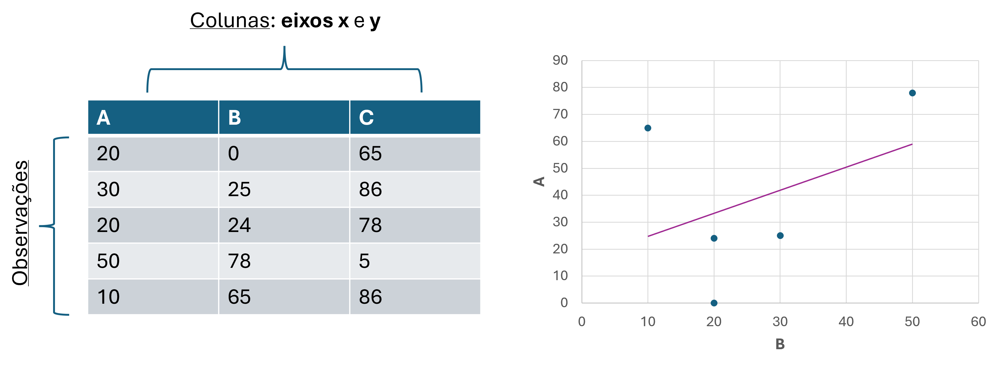
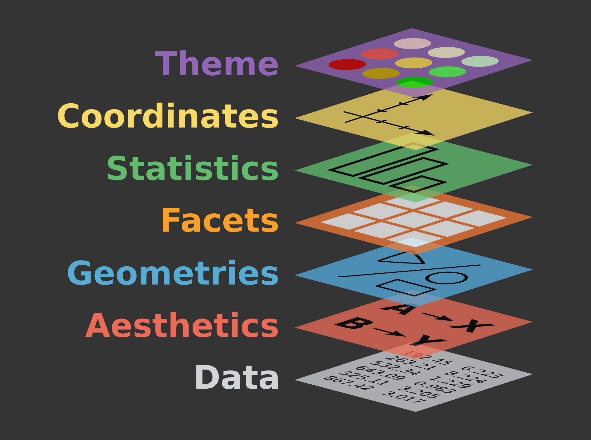
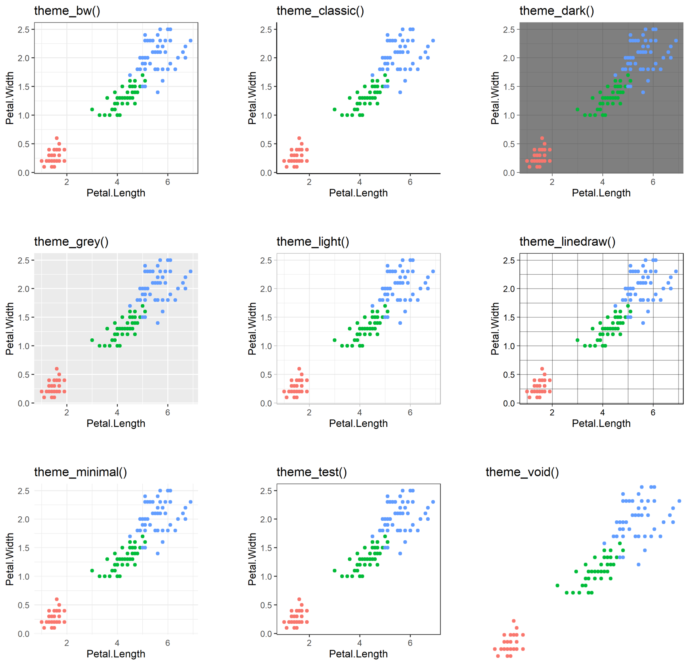
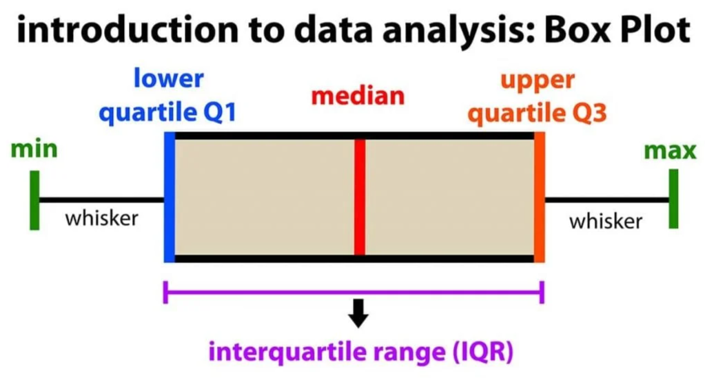

## Até agora nós vimos:

::::: {.columns style="font-size: 80%"}
::: {.column width="50%"}
-   **Introdução ao R e RStudio**

    -   Instalação e configuração dos ambientes

    -   Criação de projetos (`RProjects`)

    -   Comandos básicos de R

-   **Introdução ao Git e GitHub**

    -   Instalação e configuração

    -   Clonagem e criação de repositórios

    -   Integração entre RStudio e GitHub

    -   Upload de arquivos via *`commits`*
:::

::: {.column width="50%"}
-   Tipos de Dados

    -   numéricos, caracteres, lógicos, fatores, binários

    -   Vetores, data frames e listas

-   **Importação e Exportação de Dado**s

    -   Arquivos `.txt,` `.csv`

-   **Manipulação de Dados o R básico**

-   **Pacote tidyverse**

    -   Uso do operador pipe (`%>%`)

    -   Transformação de dados o integração de múltiplos datasets
:::
:::::

## Visualização de dados

#### Importância dos gráficos

-   Melhor forma de **apresentar** e **discutir** seus **dados**

-   Faz uma **síntese** para melhor entendimento

-   Necessário em quase todas as **análises estatísticas**

-   Necessário em quase todas as publicações, trabalhos de consultoria, TCC, dissertação, tese

## Visualização de dados

#### Atualmente, há três principais pacotes para gerar gráficos no R

## Visualização de dados

#### Atualmente, há três principais pacotes para gerar gráficos no R

::: {.columns style="font-size: 80%"}
1.  `base`: **simples**, porém útil para visualizações rápidas de quase todos os formatos de arquivos **plot()**
:::

## Visualização de dados

#### Atualmente, há três principais pacotes para gerar gráficos no R

::: {.columns style="font-size: 80%"}
1.  `base`: **simples**, porém útil para visualizações rápidas de quase todos os formatos de arquivos **plot()**

2.  **`ggplot2`: complexos, demandam certo tempo para realização, mas ficam excelentes para publicação ggplot() +**
:::

## Visualização de dados

#### Atualmente, há três principais pacotes para gerar gráficos no R

::: {.columns style="font-size: 80%"}
1.  `base`: **simples**, porém útil para visualizações rápidas de quase todos os formatos de arquivos **plot()**

2.  **`ggplot2`: complexos, demandam certo tempo para realização, mas ficam excelentes para publicação ggplot() +**

3.  `plotly`: medianos, **gráficos móveis**, podem ser utilizados em apresentações para "arrastar" ou "zoom" **plo_ly()**
:::

## Visualização de dados

::: {.columns style="font-size: 80%"}
Os elementos de um gráfico são representações das **colunas (eixos)** e **linhas (elementos)** das nossas matrizes de dados
:::

## Visualização de dados

::: {.columns style="font-size: 80%"}
Os elementos de um gráfico são representações das **colunas (eixos)** e **linhas (elementos)** das nossas matrizes de dados

E dependendo do **modo das variáveis** (`quantitativas` - inteiras ou contínuas ou `qualitativas`), isso irá indicar o **melhor** tipo de gráfico para representar os dados
:::

## Visualização de dados

::: {.columns style="font-size: 80%"}
Os elementos de um gráfico são representações das **colunas (eixos)** e **linhas (elementos)** das nossas matrizes de dados

E dependendo do **modo das variáveis** (`quantitativas` - inteiras ou contínuas ou `qualitativas`), isso irá indicar o **melhor** tipo de gráfico para representar os dados

{fig-align="center"}
:::

## Visualização de dados

#### Referências úteis

<div>

::::: {.columns style="font-size: 80%"}
::: {.column width="50%"}
**Documentação e tutoriais**

-   [ggplot2 cheat sheet](https://rstudio.github.io/cheatsheets/data-visualization.pdf)

-   [R Graph Gallery](https://r-graph-gallery.com/)

-   [Fundamentals of Data Visualization](https://clauswilke.com/dataviz/)

-   [ggplot2 book](https://ggplot2-book.org/)

-   <https://100.datavizproject.com/>

-   <https://datavizcatalogue.com/>
:::

::: {.column width="50%"}
**Extensões úteis**

-   `ggpubr`: gráficos prontos para publicação
-   `patchwork`: combinar múltiplos gráficos
-   `gganimate`: animações
-   `plotly`: gráficos interativos
:::
:::::

</div>

## Visualização de dados

#### `ggplot2`

::: {style="font-size: 70%"}
-   Pacote para **criação de gráficos**

-   Baseado na **Gramática de Gráficos** (*Grammar of Graphics*)

-   Constrói gráficos em **camadas**

-   Parte do **tidyverse**, funciona perfeitamente com o `%>%`

-   Altamente **customizável** e com aparência **profissional**

{fig-align="center"}
:::

## Visualização de dados

#### `ggplot2`

:::::: {style="font-size: 55%"}
Funciona em camadas

::::: {.columns style="font-size: 85%"}
::: {.column width="65%"}
:::

::: {.column width="35%"}
{width="1000"}
:::
:::::
::::::

## Visualização de dados

#### `ggplot2`

:::::: {style="font-size: 55%"}
Funciona em camadas

::::: {.columns style="font-size: 85%"}
::: {.column width="65%"}
-   Cada camada é **adicionada** com o operador **`+`**
:::

::: {.column width="35%"}
{width="1000"}
:::
:::::
::::::

## Visualização de dados

#### `ggplot2`

:::::: {style="font-size: 55%"}
Funciona em camadas

::::: {.columns style="font-size: 85%"}
::: {.column width="65%"}
-   Cada camada é **adicionada** com o operador **`+`**

-   *Dados* (**`data`**): Define **de onde vêm os dados** utilizados no gráfico.

    -   `ggplot(data = dados)`
:::

::: {.column width="35%"}
{width="1000"}
:::
:::::
::::::

## Visualização de dados

#### `ggplot2`

:::::: {style="font-size: 55%"}
Funciona em camadas

::::: {.columns style="font-size: 85%"}
::: {.column width="65%"}
-   Cada camada é **adicionada** com o operador **`+`**

-   *Dados* (**`data`**): Define **de onde vêm os dados** utilizados no gráfico.

    -   `ggplot(data = dados)`

-   *Mapeamento estético* (**`aes`**) : **mapeamento** de variáveis para **elementos visuais (x, y, cor, forma)**

    -   `aes(x = x, y = y, color = grupo)`
:::

::: {.column width="35%"}
{width="1000"}
:::
:::::
::::::

## Visualização de dados

#### `ggplot2`

:::::: {style="font-size: 55%"}
Funciona em camadas

::::: {.columns style="font-size: 85%"}
::: {.column width="65%"}
-   Cada camada é **adicionada** com o operador **`+`**

-   *Dados* (**`data`**): Define **de onde vêm os dados** utilizados no gráfico.

    -   `ggplot(data = dados)`

-   *Mapeamento estético* (**`aes`**) : **mapeamento** de variáveis para **elementos visuais (x, y, cor, forma)**

    -   `aes(x = x, y = y, color = grupo)`

-   *Geometrias* (**`geom_`**): Define o tipo de gráfico (pontos, linhas, barras).

    -   `geom_point()`
:::

::: {.column width="35%"}
{width="1000"}
:::
:::::
::::::

## Visualização de dados

#### `ggplot2`

:::::: {style="font-size: 55%"}
Funciona em camadas

::::: {.columns style="font-size: 85%"}
::: {.column width="65%"}
-   Cada camada é **adicionada** com o operador **`+`**

-   *Dados* (**`data`**): Define **de onde vêm os dados** utilizados no gráfico.

    -   `ggplot(data = dados)`

-   *Mapeamento estético* (**`aes`**) : **mapeamento** de variáveis para **elementos visuais (x, y, cor, forma)**

    -   `aes(x = x, y = y, color = grupo)`

-   *Geometrias* (**`geom_`**): Define o tipo de gráfico (pontos, linhas, barras).

    -   `geom_point()`

-   *Facetas* (**`facet_`**): Cria **vários gráficos separados** a partir de uma variável.
:::

::: {.column width="35%"}
{width="1000"}
:::
:::::
::::::

## Visualização de dados

#### `ggplot2`

:::::: {style="font-size: 55%"}
Funciona em camadas

::::: {.columns style="font-size: 85%"}
::: {.column width="65%"}
-   Cada camada é **adicionada** com o operador **`+`**

-   *Dados* (**`data`**): Define **de onde vêm os dados** utilizados no gráfico.

    -   `ggplot(data = dados)`

-   *Mapeamento estético* (**`aes`**) : **mapeamento** de variáveis para **elementos visuais (x, y, cor, forma)**

    -   `aes(x = x, y = y, color = grupo)`

-   *Geometrias* (**`geom_`**): Define o tipo de gráfico (pontos, linhas, barras).

    -   `geom_point()`

-   *Facetas* (**`facet_`**): Cria **vários gráficos separados** a partir de uma variável.

-   *Estatísticas* (**`stat_`**): Define **como os dados são transformados** antes de serem desenhados.

    -   Muitas geometrias já usam um `stat` padrão\

        (ex.: `geom_histogram()` usa `stat_bin()` automaticamente)
:::

::: {.column width="35%"}
{width="1000"}
:::
:::::
::::::

## Visualização de dados

#### `ggplot2`

:::::: {style="font-size: 55%"}
Funciona em camadas

::::: {.columns style="font-size: 85%"}
::: {.column width="65%"}
-   Cada camada é **adicionada** com o operador **`+`**

-   *Dados* (**`data`**): Define **de onde vêm os dados** utilizados no gráfico.

    -   `ggplot(data = dados)`

-   *Mapeamento estético* (**`aes`**) : **mapeamento** de variáveis para **elementos visuais (x, y, cor, forma)**

    -   `aes(x = x, y = y, color = grupo)`

-   *Geometrias* (**`geom_`**): Define o tipo de gráfico (pontos, linhas, barras).

    -   `geom_point()`

-   *Facetas* (**`facet_`**): Cria **vários gráficos separados** a partir de uma variável.

-   *Estatísticas* (**`stat_`**): Define **como os dados são transformados** antes de serem desenhados.

    -   Muitas geometrias já usam um `stat` padrão\

        (ex.: `geom_histogram()` usa `stat_bin()` automaticamente)

-   *Temas* **(`theme_`):** Controlam a **aparência geral** (fontes, fundo, grades, legendas).

    -   theme(`legend.position = "bottom"`)
:::

::: {.column width="35%"}
{width="1000"}
:::
:::::
::::::

## Gráfico de Colunas

#### `geom_col()` - Gráficos de **colunas**

::: {style="font-size: 65%"}
**Comparar variáveis categóricas através de um único valor (inteiros ou contínuos) já calculado**

```{r eval=TRUE}
library(tidyverse)
```

```{r}
#| output-location: column 
#| fig-width: 5 
#| fig-height: 4  

dados_csv <- read_csv("../01_dados/biota_diversidade.csv")

dados_csv_bar <- dados_csv %>%    
  dplyr::group_by(Location) %>%    
  dplyr::summarise(Richness_mean = 
                     mean(Richness))
dados_csv_bar

```
:::

## Gráfico de Colunas

#### `geom_col()` - Gráficos de **colunas**

::: {style="font-size: 65%"}
**Comparar variáveis categóricas através de um único valor (inteiros ou contínuos) já calculado**

```{r eval=TRUE}
library(tidyverse)
```

```{r}
#| output-location: column 
#| fig-width: 5 
#| fig-height: 4  

dados_csv <- read_csv("../01_dados/biota_diversidade.csv")

dados_csv_bar <- dados_csv %>%    
  dplyr::group_by(Location) %>%    
  dplyr::summarise(Richness_mean = 
                     mean(Richness))
  
ggplot(data = dados_csv_bar, aes(x = Location, 
                                 y = Richness_mean)) +
  geom_col()

```
:::

## Visualização de dados

`theme_XX()` usar um tema predefinido para mudar background do gráfico

{fig-align="center"}

## Gráfico de Colunas

#### `geom_col()` - Gráficos de **colunas**

::: {style="font-size: 65%"}
**Comparar variáveis categóricas através de um único valor (inteiros ou contínuos) já calculado**

```{r eval=TRUE}
library(tidyverse)
```

```{r}
#| output-location: column 
#| fig-width: 5 
#| fig-height: 4  

dados_csv <- read_csv("../01_dados/biota_diversidade.csv")

dados_csv_bar <- dados_csv %>%    
  dplyr::group_by(Location) %>%    
  dplyr::summarise(Richness_mean = 
                     mean(Richness))
  
ggplot(data = dados_csv_bar, aes(x = Location, 
                                 y = Richness_mean)) +
  geom_col() + 
  theme_classic() # muda o tema do gráfico

```
:::

## Gráfico de Colunas

#### `geom_col()` - Gráficos de **colunas**

::: {style="font-size: 65%"}
**Comparar variáveis categóricas através de um único valor (inteiros ou contínuos) já calculado**

```{r eval=TRUE}
library(tidyverse)
```

```{r}
#| output-location: column 
#| fig-width: 5 
#| fig-height: 4  

dados_csv <- read_csv("../01_dados/biota_diversidade.csv")

dados_csv_bar <- dados_csv %>%    
  dplyr::group_by(Location) %>%    
  dplyr::summarise(Richness_mean = 
                     mean(Richness))
  
ggplot(data = dados_csv_bar, aes(x = Location, 
                                 y = Richness_mean)) +
  geom_col() +
  theme_classic() + # muda o tema do gráfico
  # muda o titulo dos eixos
  labs(x = "Locais", y = "Riqueza média de espécies") 

```
:::

## Gráfico de Colunas

#### `geom_col()` - Gráficos de **colunas**

::: {style="font-size: 65%"}
**Comparar variáveis categóricas através de um único valor (inteiros ou contínuos) já calculado**

```{r eval=TRUE}
library(tidyverse)
```

```{r}
#| output-location: column 
#| fig-width: 5 
#| fig-height: 4  

dados_csv <- read_csv("../01_dados/biota_diversidade.csv")

dados_csv_bar <- dados_csv %>%    
  dplyr::group_by(Location) %>%    
  dplyr::summarise(Richness_mean = 
                     mean(Richness))
  
ggplot(data = dados_csv_bar, aes(x = Location, 
                                 y = Richness_mean)) +
  geom_col() +
  theme_classic() + # muda o tema do gráfico
  # muda o titulo dos eixos
  labs(x = "Locais", y = "Riqueza média de espécies") +
  # permite modificar cada componente do gráfico
  theme(
    # aumentar tamanho da fonte
    axis.title = element_text(size = 16)
    )
```
:::

## Gráfico de Colunas

#### `geom_col()` - Gráficos de **colunas**

::: {style="font-size: 65%"}
**Comparar variáveis categóricas através de um único valor (inteiros ou contínuos) já calculado**

```{r eval=TRUE}
library(tidyverse)
```

```{r}
#| output-location: column 
#| fig-width: 5 
#| fig-height: 4  

dados_csv <- read_csv("../01_dados/biota_diversidade.csv")

dados_csv_bar <- dados_csv %>%    
  dplyr::group_by(Location) %>%    
  dplyr::summarise(Richness_mean = 
                     mean(Richness))
  
ggplot(data = dados_csv_bar, aes(x = Location, 
                                 y = Richness_mean)) +
  geom_col() +
  theme_classic() + # muda o tema do gráfico
  # muda o titulo dos eixos
  labs(x = "Locais", y = "Riqueza média de espécies") +
  # permite modificar cada componente do gráfico
  theme(
    # aumentar tamanho da fonte
    axis.title = element_text(size = 16),
    axis.text.x = element_text(size = 16, 
                               face = "italic",
                               color = "purple")
    )
```
:::

## Gráfico de Barras

#### `geom_bar()` - Gráfico de barras

::: {style="font-size: 65%"}
```{r}


```
:::

## Gráfico de Barras

#### `geom_bar()` - Gráfico de barras

::: {style="font-size: 65%"}
**conta automaticamente quantas vezes um `elemento` (`character`, `numeric`, `logical`) apareceu**

```{r}
```
:::

## Gráfico de Barras

#### `geom_bar()` - Gráfico de barras

::: {style="font-size: 65%"}
**conta automaticamente quantas vezes um `elemento` (`character`, `numeric`, `logical`) apareceu**

-   não tem `variável y` pois ele irá **calcular** ela através da **frequência de registros**

```{r}
```
:::

## Gráfico de Barras

#### `geom_bar()` - Gráfico de barras

::: {style="font-size: 65%"}
**conta automaticamente quantas vezes um `elemento` (`character`, `numeric`, `logical`) apareceu**

-   não tem `variável y` pois ele irá **calcular** ela através da **frequência de registros**

-   Se usar uma variável **numérica** como `x` então o resultado é um `histograma`

```{r}
```
:::

## Gráfico de Barras

#### `geom_bar()` - Gráfico de barras

::: {style="font-size: 65%"}
**conta automaticamente quantas vezes um `elemento` (`character`, `numeric`, `logical`) apareceu**

-   não tem `variável y` pois ele irá **calcular** ela através da **frequência de registros**

-   se usar uma variável **numérica** como `x` então o resultado é um `histograma`

```{r}
#| output-location: column
#| fig-width: 5 
#| fig-height: 4  

ggplot(data = dados_csv, aes(x = Location)) +
  geom_bar(color = "black", fill = "gray") + 
  theme_classic()
```
:::

## Visualização de dados

#### `geom_bar()` - Gráfico de barras

::: {style="font-size: 65%"}
**conta automaticamente quantas vezes um `elemento` (`character`, `numeric`, `logical`) apareceu**

-   não tem `variável y` pois ele irá **calcular** ela através da **frequência de registros**

-   se usar uma variável **numérica** como `x` então o resultado é um `histograma`

```{r}
#| output-location: column
#| fig-width: 5 
#| fig-height: 4  

ggplot(data = dados_csv, aes(x = Richness)) +
  geom_bar(color = "black", fill = "gray") + 
  theme_classic()
```
:::

## Visualização de dados - Cores

::: columns
**Hex (hexadecimal)**: cores são representadas como **combinações numéricas** que indicam a intensidade de **vermelho**:

-   Formato do nome: **`#RRGGBB`**
:::

## Visualização de dados - Cores

::: columns
**Hex (hexadecimal)**: cores são representadas como **combinações numéricas** que indicam a intensidade de **vermelho**:

-   Formato do nome: **`#RRGGBB`**

-   No R podemos usar o **código Hex** da nossa **cor de escolha**

    -   **R-Charts** [`https://r-charts.com/color-palettes/`](https://r-charts.com/color-palettes/)

    -   **Color Codes** [`https://htmlcolorcodes.com/`](https://htmlcolorcodes.com/)
:::

## Gráfico de Barras

#### `geom_bar()` - Gráfico de barras empilhadas

::: {style="font-size: 57%"}
**Adicionar preenchimento de cor por categoria, sobrepondo a barra de uma classe sobre a outra para cada grupo**

-   adicionamos o parâmetro `fill =` na função `aes()`

    -   **`fill =`** controla a **cor de preenchimento** dos objetos gráficos — e, quando **mapeado a uma variável**, ele **cria grupos automaticamente**

    -   Para colorir cada barra manualmente, usamos a função scale_fill_manual() e informamos o nome de cada grupo e as respectivas cores.

```{r}

```
:::

## Gráfico de Barras

#### `geom_bar()` - Gráfico de barras empilhadas

::: {style="font-size: 57%"}
**Adicionar preenchimento de cor por categoria, sobrepondo a barra de uma classe sobre a outra para cada grupo**

-   adicionamos o parâmetro `fill =` na função `aes()`

    -   **`fill =`** controla a **cor de preenchimento** dos objetos gráficos — e, quando **mapeado a uma variável**, ele **cria grupos automaticamente**

    -   para **colorir** cada barra manualmente usamos a função `scale_fill_manual()`, e informamos o **nome** de **cada grupo** e respectivas cores.

```{r}
#| output-location: column
#| fig-width: 5 
#| fig-height: 3  

ggplot(data = dados_csv, aes(x = Location, fill = Treatment)) +
  geom_bar() + 
    scale_fill_manual(values = c("closed" = "#9A68A4",
                                 "open" = "#ADC062")) +
  theme_classic()
```
:::

## Gráfico de Barras

#### `geom_bar()` - Gráfico de barras lado a lado

::: {style="font-size: 65%"}
**Adicionar preenchimento de cor por categoria,e posiciona as barras uma ao lado da outra para cada grupo**

-   argumento `position = "dodge"` dentro da função gráfica **`geom_bar()`**

```{r}

```
:::

## Gráfico de Barras

#### `geom_bar()` - Gráfico de barras lado a lado

::: {style="font-size: 65%"}
**Adicionar preenchimento de cor por categoria,e posiciona as barras uma ao lado da outra para cada grupo**

-   argumento `position = "dodge"` dentro da função gráfica **`geom_bar()`**

```{r}
#| output-location: column
#| fig-width: 5 
#| fig-height: 3 

ggplot(data = dados_csv, aes(x = Location, fill = Treatment)) +
  geom_bar(position = "dodge") + 
    scale_fill_manual(values = c("closed" = "#9A68A4",
                                 "open" = "#ADC062")) +
  theme_classic()
```
:::

## Gráfico de Barras

#### `geom_bar()` - Gráfico de barras lado a lado

::: {style="font-size: 65%"}
**Adicionar preenchimento de cor por categoria,e posiciona as barras uma ao lado da outra para cada grupo**

-   argumento `position = "dodge"` dentro da função gráfica **`geom_bar()`**

```{r}
#| output-location: column
#| fig-width: 5 
#| fig-height: 3 

ggplot(data = dados_csv, aes(x = Location, fill = Treatment)) +
  geom_bar(position = "dodge", color = "black") + 
    scale_fill_manual(values = c("closed" = "#9A68A4",
                                 "open" = "#ADC062")) +
  theme_classic()
```
:::

## Histograma

#### `geom_histogram()` - Gráfico de barras lado a lado

::: {style="font-size: 65%"}
**Distribuição de uma variável contínua - frequência dos números**
:::

## Histograma

#### `geom_histogram()` - Gráfico de barras lado a lado

::: {style="font-size: 65%"}
**Distribuição de uma variável contínua - frequência dos números**

-   Útil para checar a distribuição dos dados

```{r}
#| output-location: column
#| fig-width: 5 
#| fig-height: 3
#|  
ggplot(data = dados_csv, aes(x = Richness)) +
  geom_histogram() +
  theme_classic()
```
:::

## Histograma

#### `geom_histogram()` - Gráfico de barras lado a lado

::: {style="font-size: 65%"}
**Distribuição de uma variável contínua - frequência dos números**

-   Útil para checar a distribuição dos dados

<!-- -->

-   Também pode ser feito usando **agrupamentos**, que serão **empilhados**

    -   semelhante ao gráfico de `barras empilhadas`

```{r}
#| output-location: column
#| fig-width: 5 
#| fig-height: 3
#|  
ggplot(data = dados_csv, aes(x = Richness, fill = Treatment)) +
  geom_histogram(color = "black") +
    scale_fill_manual(values = c("closed" = "#9A68A4",
                                 "open" = "#ADC062")) +
  theme_classic()
```
:::

## Gráfico de Pontos

#### `geom_point()` Gráfico de dispersão

::: {style="font-size: 60%"}
**Relação entre duas variáveis numéricas**

-   Útil para checar a potencial **correlações** **entre variáveis**

```{r}
#| output-location: column
#| fig-width: 5
#| fig-height: 3

ggplot(dados_csv, aes(x = Richness, 
                  y = D_Shannon)) +
  geom_point() +
  theme_bw()
```
:::

## Gráfico de Pontos

#### `geom_point()` Gráfico de dispersão

::: {style="font-size: 60%"}
**Relação entre duas variáveis numéricas**

-   Útil para checar a potencial **correlações** **entre variáveis**

<!-- -->

-   Também pode ser feito usando **agrupamentos**, que serão representados pela cor dos pontos.

```{r}
#| output-location: column
#| fig-width: 5
#| fig-height: 3

ggplot(dados_csv, aes(x = Richness, 
                  y = D_Shannon,
                  color = Treatment)) +
  geom_point() +
  theme_bw()
```
:::

## Gráfico de Pontos

#### `geom_point()` Gráfico de dispersão

:::::: {style="font-size: 60%"}
**Relação entre duas variáveis numéricas**

::::: columns
::: {.column width="50%"}
-   Útil para checar a potencial **correlações** **entre variáveis**

<!-- -->

-   Também pode ser feito usando **agrupamentos**, que serão representados pela cor dos pontos.

-   Os **pontos** podem ser editados para **outras formas**

    -   se usa o parametro `type =` (`type = 21`)

        -   o **número** representa o **tipo da forma**
:::

::: {.column width="50%"}
{fig-align="center" width="400"}
:::
:::::
::::::

## Gráfico de Pontos

#### `geom_point()` Gráfico de dispersão

::: {style="font-size: 50%"}
**Relação entre duas variáveis numéricas**

-   Útil para checar a potencial **correlações** **entre variáveis**

-   Também pode ser feito usando **agrupamentos**, que serão representados pela cor dos pontos.

-   Os **pontos** podem ser editados para **outras formas**

    -   se usa o parametro `type =` `type = 21`)
        -   o **número** representa o **tipo da forma**
:::

::: {style="font-size: 70%"}
```{r}
#| output-location: column
#| fig-width: 5
#| fig-height: 3
ggplot(dados_csv, aes(x = Richness, 
                  y = D_Shannon,
                  fill = Treatment)) +
  geom_point(shape = 21, color = "black") +
  theme_bw()
```
:::

## Gráfico de Pontos

#### `geom_point()` Gráfico de dispersão

::: {style="font-size: 50%"}
**Relação entre duas variáveis numéricas**

-   Útil para checar a potencial **correlações** **entre variáveis**

-   Também pode ser feito usando **agrupamentos**, que serão representados pela cor dos pontos.

-   Os **pontos** podem ser editados para **outras formas**

    -   se usa o parametro `type =` `type = 21`)
        -   o **número** representa o **tipo da forma**
        -   podemos **modificar** as propriedades dos pontos deixando maior (`size =`) e mais transparente (`alpha =`)
:::

::: {style="font-size: 65%"}
```{r}
#| output-location: column
#| fig-width: 5
#| fig-height: 3
ggplot(dados_csv, aes(x = Richness, 
                  y = D_Shannon,
                  fill = Treatment)) +
  geom_point(shape = 21, 
             color = "black", 
             size = 3,
             alpha = 0.5) 
  theme_bw() 
```
:::

## Gráfico de Pontos

#### `geom_point()` Gráfico de dispersão

::: {style="font-size: 50%"}
**Relação entre duas variáveis numéricas**

-   Útil para checar a potencial **correlações** **entre variáveis**

-   Também pode ser feito usando **agrupamentos**, que serão representados pela cor dos pontos.

-   Os **pontos** podem ser editados para **outras formas**

    -   se usa o parametro `type =` `type = 21`)
        -   o **número** representa o **tipo da forma**
        -   podemos **modificar** as propriedades dos pontos deixando maior (`size =`) e mais transparente (`alpha =`)
:::

::: {style="font-size: 65%"}
```{r}
#| output-location: column
#| fig-width: 5
#| fig-height: 3
ggplot(dados_csv, aes(x = Richness, 
                  y = D_Shannon,
                  fill = Treatment)) +
  geom_point(shape = 21, 
             color = "black", 
             size = 3,
             alpha = 0.5) +
  scale_fill_manual(values = c("closed" = "#9A68A4",
                                 "open" = "#ADC062")) + 
  theme_bw() 
```
:::

## Gráfico de Pontos

#### `geom_point()` Gráfico de dispersão

::: {style="font-size: 50%"}
**Relação entre duas variáveis numéricas**

-   Útil para checar a potencial **correlações** **entre variáveis**

-   Também pode ser feito usando **agrupamentos**, que serão representados pela cor dos pontos.

-   Os **pontos** podem ser editados para **outras formas**

    -   se usa o parametro `type =` `type = 21`)
        -   o **número** representa o **tipo da forma**
        -   podemos **modificar** as propriedades dos pontos deixando maior (`size =`) e mais transparente (`alpha =`)
:::

::: {style="font-size: 65%"}
```{r}
#| output-location: column
#| fig-width: 5
#| fig-height: 3
ggplot(dados_csv, aes(x = Richness, 
                  y = D_Shannon,
                  fill = Treatment)) +
  geom_point(shape = 21, 
             color = "black", 
             size = 3,
             alpha = 0.5) +
  scale_fill_manual(values = c("closed" = "#9A68A4",
                                 "open" = "#ADC062")) +
  theme_bw() +
  labs(x = "Riqueza de Espécies", y = "Diversidade Shannon")
```
:::

## Gráfico de Pontos

#### `geom_point()` Gráfico de dispersão

::: {style="font-size: 50%"}
**Relação entre duas variáveis numéricas**

-   Útil para checar a potencial **correlações** **entre variáveis**

-   Também pode ser feito usando **agrupamentos**, que serão representados pela cor dos pontos.

-   Os **pontos** podem ser editados para **outras formas**

    -   se usa o parametro `type =` `type = 21`)
        -   o **número** representa o **tipo da forma**
        -   podemos **modificar** as propriedades dos pontos deixando maior (`size =`) e mais transparente (`alpha =`)
:::

::: {style="font-size: 65%"}
```{r}
#| output-location: column
#| fig-width: 5
#| fig-height: 3
ggplot(dados_csv, aes(x = Richness, 
                  y = D_Shannon,
                  fill = Treatment)) +
  geom_point(shape = 21, 
             color = "black", 
             size = 3,
             alpha = 0.5) +
  scale_fill_manual(values = c("closed" = "#9A68A4",
                                 "open" = "#ADC062"),
                    name = "Tratamento") + #muda o titulo da legenda
  theme_bw() +
  labs(x = "Riqueza de Espécies", y = "Diversidade Shannon")
```
:::

## Gráfico de Pontos

#### `geom_point()` + `geom_smooth()`: Linha de tendência

::: {style="font-size: 70%"}
**Adicionar `linha de tendência` Gráfico de dispersão**

-   Cria uma linha de tendência do efeito de `x` em `y`

    -   criada através de um `modelo linear` usando a função `geom_smooth(method = "lm")`

        -   Mostra a linha no **melhor ajuste**

        -   cria uma área sombreada com o **intervalo de confiança** de 95%

```{r}
#| output-location: column
#| fig-width: 5
#| fig-height: 3
ggplot(dados_csv, aes(x = Richness, 
                  y = D_Shannon,
                  fill = Treatment)) +
  geom_point(shape = 21, 
             color = "black", 
             size = 3,
             alpha = 0.5) +
  scale_fill_manual(values = c("closed" = "#9A68A4",
                                 "open" = "#ADC062"),
                    name = "Tratamento") + #muda o titulo da legenda
  theme_bw() +
  labs(x = "Riqueza de Espécies", y = "Diversidade Shannon")
```
:::

## Gráfico de Regressão

#### `geom_point()` + `geom_smooth()`: Linha de tendência

::: {style="font-size: 70%"}
**Adicionar `linha de tendência` Gráfico de dispersão**

-   Cria uma linha de tendência do efeito de `x` em `y`

    -   criada através de um `modelo linear` usando a função `geom_smooth(method = "lm")`

        -   mostra a linha no **melhor ajuste**

        -   cria uma área sombreada com o **intervalo de confiança** de 95%

```{r}
#| output-location: column
#| fig-width: 5
#| fig-height: 3
ggplot(dados_csv, aes(x = Richness, 
                  y = D_Shannon,
                  fill = Treatment)) +
  geom_point(shape = 21, 
             color = "black", 
             size = 3,
             alpha = 0.5) +
  geom_smooth(method = "lm", color = "black") +
  scale_fill_manual(values = c("closed" = "#9A68A4",
                                 "open" = "#ADC062"),
                    name = "Tratamento") + #muda o titulo da legenda
  theme_bw() +
  labs(x = "Riqueza de Espécies", y = "Diversidade Shannon")
```
:::

## Densidade

#### `geom_density()` **Distribuição suavizada**

::: {style="font-size: 70%"}
visualizar a **distribuição** de uma variável **contínua** por meio de uma **curva de densidade**

-   versão **suavizada** do histograma

-   Para entender **forma da distribuição** (assimetria, multimodalidade)

<!-- -->

-   Para comparar **padrões entre grupos**
:::

## Densidade

#### `geom_density()` **Distribuição suavizada**

::: {style="font-size: 70%"}
visualizar a **distribuição** de uma variável **contínua** por meio de uma **curva de densidade**

-   versão **suavizada** do histograma

-   Para entender **forma da distribuição** (assimetria, multimodalidade)

<!-- -->

-   Para comparar **padrões entre grupos**

```{r}
#| output-location: column
#| fig-width: 5
#| fig-height: 3

ggplot(dados_csv, aes(x = Richness,
                  fill = Treatment)) +
  geom_density(alpha = 0.5) +
    theme_light()
```
:::

## Boxplot

#### `geom_boxplot()` resumir a distribuição dos dados

::: {style="font-size: 70%"}
-   Mostra **mediana**, **quartis (Q1 e Q3)** e **valores extremos**

-   Destaca **outliers**

-   Ideal para **comparar grupos**

{fig-align="center" width="600"}
:::

## Boxplot

#### `geom_boxplot()` resumir a distribuição dos dados

::: {style="font-size: 70%"}
-   Mostra **mediana**, **quartis (Q1 e Q3)** e **valores extremos**

-   Destaca **outliers**

-   Ideal para **comparar grupos**
:::

## Boxplot

#### `geom_boxplot()` resumir a distribuição dos dados

::: {style="font-size: 70%"}
-   Mostra **mediana**, **quartis (Q1 e Q3)** e **valores extremos**

-   Destaca **outliers**

-   Ideal para **comparar grupos**

```{r}
#| output-location: column
#| fig-width: 5
#| fig-height: 3

ggplot(dados_csv, aes(x = Treatment,
                  y = Richness)) +
  geom_boxplot()
```
:::

## Boxplot

#### `geom_boxplot()` resumir a distribuição dos dados

::: {style="font-size: 70%"}
-   Mostra **mediana**, **quartis (Q1 e Q3)** e **valores extremos**

-   Destaca **outliers**

-   Ideal para **comparar grupos**

-   Usar junto com `geom_jitter()` para ver a disposição dos pontos

```{r}
#| output-location: column
#| fig-width: 5
#| fig-height: 3

ggplot(dados_csv, aes(x = Treatment,
                  y = Richness,
                  fill = Treatment)) +
  geom_boxplot() +
  geom_jitter(shape = 21) +
  theme_minimal()
  
```
:::

## Violin plot

#### `geom_violin()` **Forma da distribuição**

::: {style="font-size: 70%"}
-   Parecido com `boxplot`

-   Mostra a **densidade** da distribuição em cada categoria

-   Evidencia **assimetria** e **multimodalidade**
:::

## Violin plot

#### `geom_violin()` **Forma da distribuição**

::: {style="font-size: 70%"}
-   Parecido com `boxplot`

-   Mostra a **densidade** da distribuição em cada categoria

-   Evidencia **assimetria** e **multimodalidade**

```{r}
#| output-location: column
#| fig-width: 5
#| fig-height: 3

ggplot(dados_csv, aes(x = Treatment,
                  y = Richness,
                  fill = Treatment)) +
  geom_violin() +
  geom_jitter(shape = 21) +
  theme_minimal()
```
:::

## Violin plot

#### `geom_boxplot()` + `geom_violin()` **mesclar ambas visualizações**

::: {style="font-size: 70%"}
Só precisa adicionar a função `geom_boxplot()` abaixo do `geom_violin()`

```{r}

```
:::

## Boxplot + Violin plot

#### `geom_boxplot()` + `geom_violin()` **mesclar ambas visualizações**

::: {style="font-size: 70%"}
Só precisa adicionar a função `geom_boxplot()` abaixo do `geom_violin()`

```{r}
#| output-location: column
#| fig-width: 5
#| fig-height: 3

ggplot(dados_csv, aes(x = Treatment,
                  y = Richness,
                  fill = Treatment)) +
  geom_violin() +
  geom_boxplot(width = 0.2, fill = "gray") +
  geom_jitter(shape = 21) +
  theme_minimal()
```
:::

## Boxplot + Violin plot Editada Exemplo

::: {style="font-size: 60%"}
```{r}
#| output-location: column
#| fig-width: 5
#| fig-height: 3

ggplot(dados_csv, aes(x = Location,
                      y = Richness,
                      fill = Treatment)) +
  geom_violin(
    position = position_dodge(width = 0.8),
    alpha = 0.7
  ) +
  geom_boxplot(
    width = 0.30,
    position = position_dodge(width = 0.8),
    outlier.shape = NA
  ) +
  geom_jitter(
    shape = 21,
    size = 2,
    alpha = 0.7,
    position = position_jitterdodge(
      jitter.width = 0.05,
      dodge.width  = 0.8
    )
  ) +
  scale_fill_manual(
    values = c("closed" = "#9A68A4",
               "open"   = "#ADC062"),
    name = "Tratamento"
  ) + 
  theme_minimal()

```
:::

## Facetas

#### `facet_wrap()` criação de painéis

::: {style="font-size: 70%"}
-   Cria **vários gráficos pequenos** do mesmo tipo para cada elemento numa coluna

    através do **facet_wrap(\~sua_coluna)**

-   Cada painel mostra um **subconjunto dos dados**

-   Todos compartilham a **mesma estrutura visual** (eixos, geoms, escalas)

```{r}
#| output-location: column
#| fig-width: 6
#| fig-height: 4

ggplot(dados_csv, aes(x = Canopy_cover,
                  y = Richness,
                  fill = Treatment)) +
  geom_smooth(method = "lm", color = "black") +
  facet_wrap(~Location) +
  theme_bw()
```
:::

## Customização - Escalas

#### Eixos contínuos

::: {style="font-size: 50%"}
Funções que permitem configurar os **limites e intervalos** dos `eixos`.

-   `eixo x`:

    -   `scale_x_continuous( limits = c(**inicio**, **fim**), breaks = seq(**inicio**, **fim**, **intervalos**))`

-   `eixo y`:

    -   `scale_y_continuous( limits = c(**inicio**, **fim**), breaks = seq(**inicio**, **fim**, **intervalos**))`
:::

::: {style="font-size: 80%"}
```{r}
#| output-location: column
#| fig-width: 5
#| fig-height: 3

ggplot(dados_csv, aes(x = Canopy_cover,
                  y = Richness,
                  fill = Treatment)) +
  geom_smooth(method = "lm", color = "black") +
  theme_bw() +
  scale_x_continuous(
    limits = c(0, 100),
    breaks = seq(0, 100, 10)) +
  scale_y_continuous(
    limits = c(0, 15),
    breaks = seq(0, 15, 5))
```
:::

## Salvando gráficos

#### `ggsave()` função para exportar gráficos

::::::: columns
:::: {.column width="40%"}
::: {style="font-size: 55%"}
-   Salva o **último** gráfico impresso no painel **Plots** ou um gráfico **salvo** em um **objeto**

-   Precisa informas os parâmetros que **definem** o `caminho`, `nome e extensão do arquivo`, `dimensões`, a `unidade de medida`, e a `resolução`

    -   `largura = width`

    -   `altura = height`

    -   `unit = "cm"`

    -   `dpir = 300`

-   Formatos: `.png`, `.pdf`, `.jpg`, `.svg`

-   `.svg` é um formato de arquivo vetorial que permite a você editar todos os elementos da imagem mesmo após exportá-la.
:::
::::

:::: {.column width="60%"}
::: {style="font-size: 80%"}
```{r}

```
:::
::::
:::::::

## Salvando gráficos

#### `ggsave()` função para exportar gráficos

::::::: columns
:::: {.column width="40%"}
::: {style="font-size: 55%"}
-   Salva o **último** gráfico impresso no painel **Plots** ou um gráfico **salvo** em um **objeto**

-   Precisa informas os parâmetros que **definem** o `caminho`, `nome e extensão do arquivo`, `dimensões`, a `unidade de medida`, e a `resolução`

    -   `largura = width`

    -   `altura = height`

    -   `unit = "cm"`

    -   `dpir = 300`

-   Formatos: `.png`, `.pdf`, `.jpg`, `.svg`

-   `.svg` é um formato de arquivo vetorial que permite a você editar todos os elementos da imagem mesmo após exportá-la.
:::
::::

:::: {.column width="60%"}
::: {style="font-size: 80%"}
```{r}
plot_densidade <- ggplot(dados_csv, aes(x = Richness,
                                        fill = Treatment)) +
  geom_density(alpha = 0.5) +
  theme_light()
ggsave("../04_figuras/grafico_riqueza.png", 
       plot = plot_densidade,
       width = 8, 
       height = 6,
       dpi = 300)
```
:::
::::
:::::::

## Exercícios

::: columns
{fig-align="center" width="400"}
:::

## Exercícios

::: {style="font-size: 70%"}
**Tarefa**: Usando `biota_plant_traits.csv`

-   **Remova** os dados do ano `2019` da coluna `Date`

-   Faça um `boxplot()` com `facet_wrap(), contendo 4 paineis, onde cada painel será: leaf_thickness, seed_mass, leaf_area e` `sla` . Os valores dessas variáveis serão suas variáveis-resposta, e o tratamento será sua variável-preditora (`eixo x`).

    -   Vocês precisarão usar manipulação de dados para preparar a tabela.

    -   Façam duas modificações visuais (ex: tamanho de fonte, cor, etc).

-   Crie um gráfico de **regressão linear** usando `geom_point()` e `geom_smooth()` usando **duas variáveis de sua escolha**.

    -   Compare entre **tratamentos**.
:::

## Exercícios

::: {style="font-size: 70%"}
**Tarefa**: Usando `biota_plant_traits.csv`
:::

## Exercícios

::: {style="font-size: 70%"}
**Tarefa**: Usando `biota_plant_traits.csv`

-   **Remova** os dados do ano `2019` da coluna `Date`
:::

## Exercícios

::: {style="font-size: 70%"}
**Tarefa**: Usando `biota_plant_traits.csv`

-   **Remova** os dados do ano `2019` da coluna `Date`

-   Faça um `boxplot()` com `facet_wrap()` contendo **4 paineis** onde cada painel será: `leaf_thickness`, `seed_mass`, `leaf_area`, `sla`, `seed_lenght` . Os valores dessas variáveis serão suas variáveis-resposta, e o tratamento, sua variável-preditora (`eixo x`). Coloquem a `variável y` em `log()`

    -   Vocês precisarão usar manipulação de dados para preparar a tabela.

    -   Façam duas modificações visuais (ex: tamanho de fonte, cor, etc).
:::

## Exercícios

::: {style="font-size: 70%"}
**Tarefa**: Usando `biota_plant_traits.csv`

1.  **Remova** os dados do ano `2019` da coluna `Date`

    -   Faça um `boxplot()` com `facet_wrap()` contendo **4 paineis** onde cada painel será: `leaf_thickness`, `seed_mass`, `leaf_area`, `sla`, `seed_lenght` . Os valores dessas variáveis serão suas variáveis resposta, e o tratamento será sua variável **preditora** (`eixo x`). Coloquem a `variável y` em `log()`para reduzir a assimetria e padronizar os dados

        -   Vocês precisarão usar manipulação de dados para preparar a tabela.

        -   Façam duas modificações visuais (ex: tamanho de fonte, cor, etc).

2.  Crie um gráfico de **regressão linear** usando `geom_point()` e `geom_smooth()` usando **duas variáveis**.

    -   `x = leaf_area` e `y = sla` usa a função log()

        -   Compare entre **tratamentos**.
:::

## Exercícios 1

::: {style="font-size: 65%"}
```{r}
#| output-location: column
#| fig-width: 5
#| fig-height: 3

library(tidyverse)

dados_traits <- readr::read_csv("../01_dados/biota_plant_traits.csv")

dados_traits.flt <- dados_traits %>% 
  dplyr::filter(Date == 2017) %>% 
  pivot_longer(cols = c(6:10), 
               names_to = "traits", 
               values_to = "value")

ggplot(dados_traits.flt, aes(x = Treatment, 
                             y = log(value), 
                             fill = Treatment)) +
  geom_boxplot() +
  facet_wrap(~traits) +
  scale_fill_manual(values = c("closed" = "#9A68A4",
                                 "open" = "#ADC062")) +
  theme_minimal()


```
:::

## Exercícios 2

::: {style="font-size: 65%"}
```{r}
#| output-location: column
#| fig-width: 5
#| fig-height: 3
library(tidyverse)

dados_traits <- readr::read_csv("../01_dados/biota_plant_traits.csv")

ggplot(dados_traits, aes(x = log(leaf_area), 
                         y = log(sla), 
                         fill = Treatment)) +
  geom_point(na.rm = TRUE) +
  geom_smooth(method = "lm") +
  scale_fill_manual(values = c("closed" = "#9A68A4",
                                 "open" = "#ADC062")) +
  theme_minimal()
  
```
:::

## 
