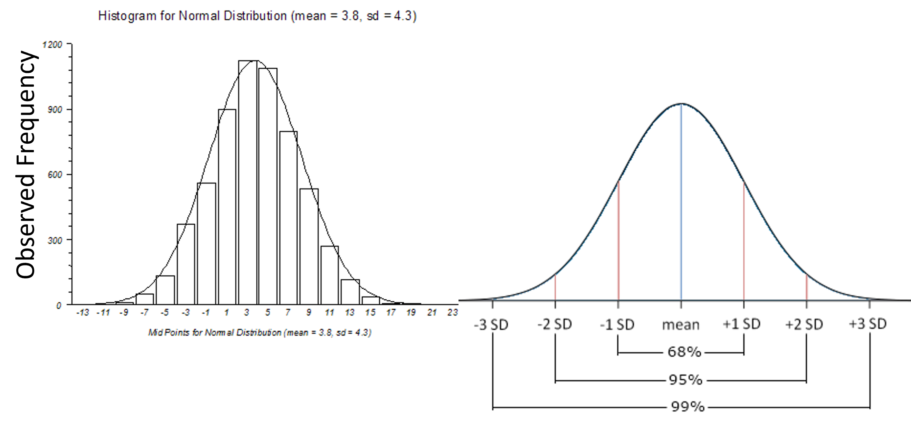
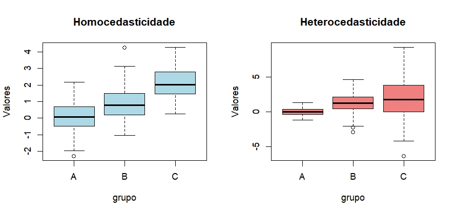
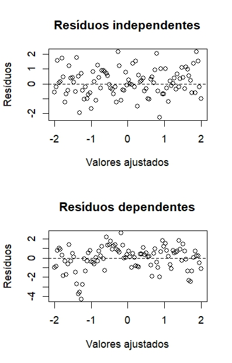
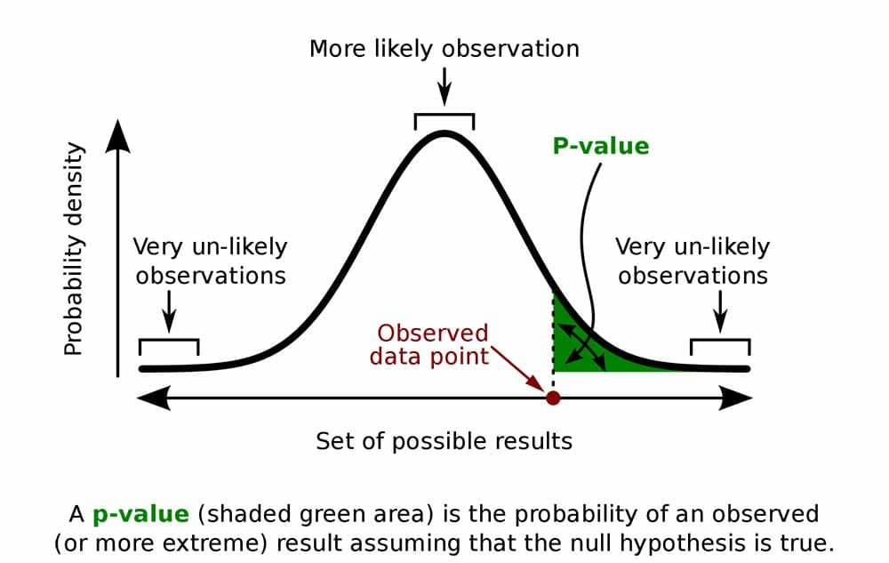
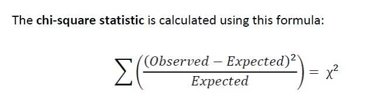
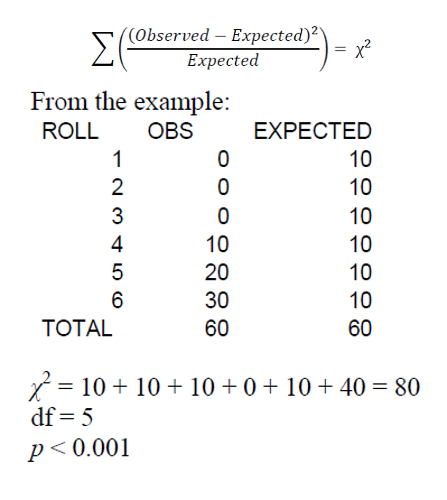
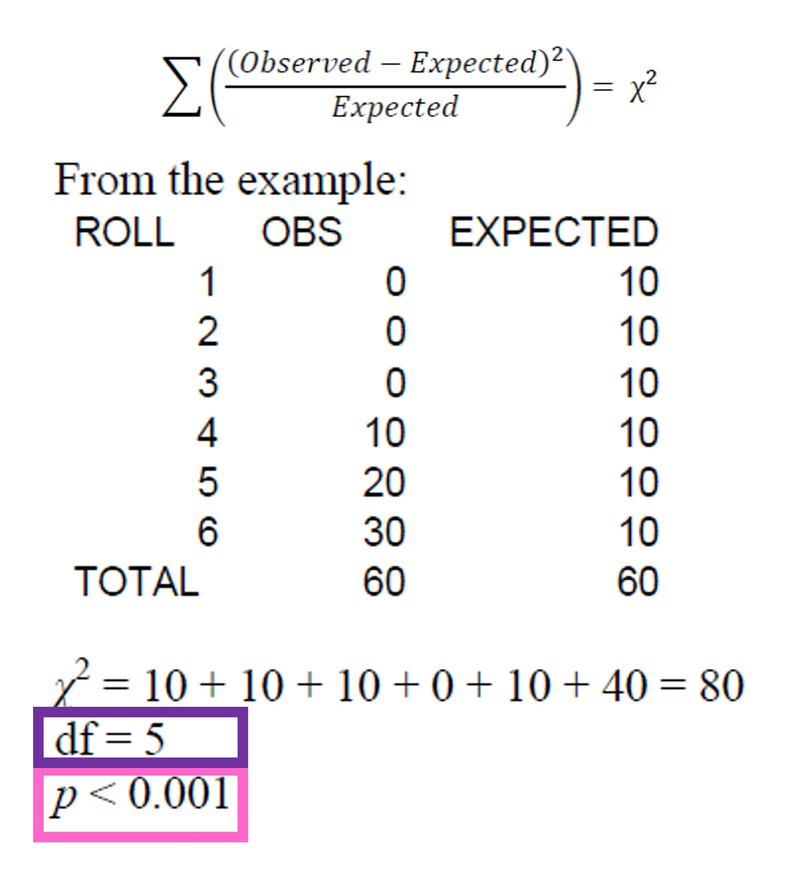
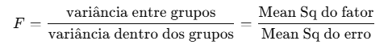

## Análises Estatísticas - Pressupostos

::: {style="font-size: 70%"}
**O que é?**

-   Fazer **inferências** sobre uma **população** a partir de uma **amostra**

-   Testar **hipóteses** sobre diferenças entre grupos

-   Avaliar se as diferenças observadas são **estatisticamente significativas**

-   **Testes paramétricos**: assumem distribuição normal dos dados

-   **Testes não-paramétricos**: não assumem distribuição específica
:::

## Análises Estatísticas - Pressupostos

#### Pressupostos dos testes paramétricos

::: {style="font-size: 70%"}
**Antes de rodar os testes, devemos verificar:**
:::

## Análises Estatísticas - Pressupostos

#### Pressupostos dos testes paramétricos

::: {style="font-size: 70%"}
**Antes de rodar os testes, devemos verificar:**

1.  **Normalidade**: os dados seguem distribuição normal? Os valores se concentram no meio e diminuem de forma simétrica para os extremos.
:::

## Análises Estatísticas - Pressupostos

#### Pressupostos dos testes paramétricos

::: {style="font-size: 70%"}
**Antes de rodar os testes, devemos verificar:**

1.  **Normalidade**: os dados seguem distribuição normal? Os valores se concentram no meio e diminuem de forma simétrica para os extremos.

2.  **Homogeneidade de variâncias** (homocedasticidade): as variâncias são iguais entre grupos? Os grupos têm níveis parecidos de variabilidade, mesmo que as médias sejam diferentes.
:::

## Análises Estatísticas - Pressupostos

#### Pressupostos dos testes paramétricos

::: {style="font-size: 70%"}
**Antes de rodar os testes, devemos verificar:**

1.  **Normalidade**: os dados seguem distribuição normal? Os valores se concentram no meio e diminuem de forma simétrica para os extremos.

2.  **Homogeneidade de variâncias** (homocedasticidade): as variâncias são iguais entre grupos? Os grupos têm níveis parecidos de variabilidade, mesmo que as médias sejam diferentes.

3.  **Independência**: as observações são independentes? Observações independentes são medidas coletadas de forma que cada uma representa uma unidade distinta, sem relação direta entre si.
:::

## Análises Estatísticas - Pressupostos

#### Pressupostos dos testes paramétricos

::: {style="font-size: 70%"}
**Antes de rodar os testes, devemos verificar:**

1.  **Normalidade**: os dados seguem distribuição normal? Os valores se concentram no meio e diminuem de forma simétrica para os extremos.

2.  **Homogeneidade de variâncias** (**`homocedasticidade`**): as variâncias são iguais entre grupos? Os grupos têm níveis parecidos de variabilidade, mesmo que as médias sejam diferentes.

3.  **Independência**: as observações são independentes? Observações independentes são medidas coletadas de forma que cada uma representa uma unidade distinta, sem relação direta entre si.

4.  **Ausência de outliers extremos**
:::

## Análises Estatísticas - Pressupostos

#### E se os dados não forem paramétricos?

## Análises Estatísticas - Pressupostos

#### E se os dados não forem paramétricos? Não Paramétricos

{fig-align="center"}

## Análises Estatísticas - Pressupostos

#### E se os dados não forem paramétricos? Não Paramétricos

::: {style="font-size: 70%"}
Estatísticas `não parametricas` exigem:

1.  **Não exigem normalidade**

2.  **Robustos à heterocedasticidade**: Não exigem variâncias iguais entre grupos.

3.  **Independência ainda importante**: as observações devem ser independentes.

4.  **Menos sensíveis a outliers**: Como dependem de ordens e medianas em vez de médias, os outliers extremos têm menos impacto.
:::

## Análises Estatísticas - Pressupostos

#### Por que verificar pressupostos?

::: {style="font-size: 55%"}
**1. Normalidade:** Uma curva de normalidade (ou curva de Gauss/distribuição normal) é uma distribuição de **probabilidade simétrica**, em forma de sino, onde os **valores mais frequentes ficam no centro** e as probabilidades **diminuem** igualmente para **ambos os lados.**

É definida por dois parâmetros: a **média** (localização do pico) e o **desvio padrão** (largura da curva).

-   Testes paramétricos (t-test, ANOVA) **assumem** distribuição normal
-   Se violada: taxa de **erro Tipo I** inflada (falsos positivos)
-   **Consequência**: podemos encontrar diferenças que não existem!
-   **Solução**: transformação de dados ou testes não-paramétricos

{fig-align="center" width="700"}
:::

## Análises Estatísticas - Pressupostos

#### Por que verificar pressupostos?

::: {style="font-size: 55%"}
**2. Homocedasticidade**: os grupos apresentam variações semelhantes

-   Variâncias **desiguais** afetam a estimativa do erro padrão
-   **Consequência**: intervalos de confiança e p-values **incorretos**
-   Grupos com maior variância têm influência desproporcional
-   **Solução**: correção de Welch, transformação ou testes robustos

{fig-align="center" width="700"}
:::

## Análises Estatísticas - Pressupostos

#### Por que verificar pressupostos?

::: {style="font-size: 50%"}
**3. Independência:** pressupõe que o valor observado em uma unidade amostral **não influencia** nem é **influenciado** pelos valores das demais.
:::

:::::: {style="font-size: 50%"}
::::: columns
::: {.column width="70%"}
:::

::: {.column width="30%"}
:::
:::::
::::::

## Análises Estatísticas - Pressupostos

#### Por que verificar pressupostos?

::: {style="font-size: 50%"}
**3. Independência:** pressupõe que o valor observado em uma unidade amostral **não influencia** nem é **influenciado** pelos valores das demais.
:::

:::::: {style="font-size: 50%"}
::::: columns
::: {.column width="70%"}
Quando essa suposição é violada, a **lógica** inferencial do teste é **comprometida**.

-   Exemplos de dependência: **Medidas repetidas** no mesmo indivíduo (ex.: várias medições ao longo do tempo).

-   **Consequência**: subestimação do erro padrão → p-values artificialmente baixos

    -   Os pressupostos estatísticos **não são sobre os dados brutos,** mas **sobre os *erros* do modelo.**

    -   Como eles são desconhecidos, usamos **os resíduos** como sua melhor aproximação.

        -   O modelo captura o **padrão sistemático** dos dados, mas **não explica** toda a **variabilidade observada**.

        -   O **resíduo** carrega o que **não foi explicado** pelo modelo — ruído natural e variáveis não modeladas
:::

::: {.column width="30%"}
:::
:::::
::::::

## Análises Estatísticas - Pressupostos

#### Por que verificar pressupostos?

::: {style="font-size: 50%"}
**3. Independência:** pressupõe que o valor observado em uma unidade amostral **não influencia** nem é **influenciado** pelos valores das demais.
:::

:::::: {style="font-size: 50%"}
::::: columns
::: {.column width="70%"}
Quando essa suposição é violada, a **lógica** inferencial do teste é **comprometida**.

-   Exemplos de dependência: **Medidas repetidas** no mesmo indivíduo (ex.: várias medições ao longo do tempo).

-   **Consequência**: subestimação do erro padrão → p-values artificialmente baixos

    -   Os pressupostos estatísticos **não são sobre os dados brutos,** mas **sobre os *erros* do modelo.**

    -   Como eles são desconhecidos, usamos **os resíduos** como sua melhor aproximação.

        -   O modelo captura o **padrão sistemático** dos dados, mas **não explica** toda a **variabilidade observada**.

        -   O **resíduo** carrega o que **não foi explicado** pelo modelo — ruído natural e variáveis não modeladas
:::

::: {.column width="30%"}
{fig-align="center"}
:::
:::::
::::::

## Análises Estatísticas - Pressupostos

#### Por que verificar pressupostos?

::: {style="font-size: 70%"}
**4. Outliers extremos**

-   Valores **extremos** podem distorcer médias e aumentar variância
-   **Consequência**: perda de poder estatístico, resultados enviesados
-   Podem indicar **erros de medição** ou **processos biológicos distintos**
-   **Solução**: investigar, transformar dados ou usar métodos robustos
:::

## Análises Estatísticas - Pressupostos

#### Por que verificar pressupostos?

::: {style="font-size: 70%"}
**4. Outliers extremos**

-   Valores **extremos** podem distorcer médias e aumentar variância
-   **Consequência**: perda de poder estatístico, resultados enviesados
-   Podem indicar **erros de medição** ou **processos biológicos distintos**
-   **Solução**: investigar, transformar dados ou usar métodos robustos

### Pressupostos **garantem** que os testes façam o que **prometem**!
:::

## Análises Estatísticas - Pressupostos

#### Entendendo Distribuições

::: {style="font-size: 55%"}
**O que é uma distribuição?**

-   **`Aplicasse a variável resposta, a qual deve seguir uma distribuição.`**

-   Descreve como os **valores** de uma variável estão **distribuídos**

-   Mostra a **frequência** de cada valor ou intervalo

-   Fundamental para escolher o **teste estatístico adequado**

-   **Diferentes `processos biológicos` geram diferentes distribuições**

    -   Simétricas ou assimétricas

-   Distribuições famosas:

    -   **Familias**:

        ::::: {.columns style="font-size: 80%"}
        ::: {.column width="50%"}
        -   **Gaussian** (`contínuo`): Simétrica em forma de sino - *Média = mediana = moda*

        -   **Poisson** (`discreto`): inteiros ≥ 0 e assimétrica à direita - *média = variância*

        -   **Binomial** (`discreto`): Pode ser simétrica ou assimétrica e Depende de p (probabilidade de sucesso)
        :::

        ::: {.column width="50%"}
        -   **Binomial Negativa** (`discreto`):inteiros ≥ 0 e assimétrica à direita mais dispersa que a Poisson - *variância \> média (overdispersion)*

        -   **Exponencial** (`contínuo`): valores \> 0 com forte assimetria à direita

        -   **Gamma** (`contínuo`): valores \> 0 assimétrica sinuosa à direita próxima a quase normal
        :::
        :::::
:::

## Análises Estatísticas - Pressupostos

#### Entendendo Distribuições

::: {style="font-size: 55%"}
**O que é uma distribuição?**

-   **`Aplicasse a variável resposta, a qual deve seguir uma distribuição.`**

-   Descreve como os **valores** de uma variável estão **distribuídos**

-   Mostra a **frequência** de cada valor ou intervalo

-   Fundamental para escolher o **teste estatístico adequado**

-   **Diferentes `processos biológicos` geram diferentes distribuições**

    -   Simétricas ou assimétricas

    #### Usaremos:

    -   **Familias**:

        :::: {.columns style="font-size: 80%"}
        ::: {.column width="50%"}
        -   **Gaussian** (`contínuo`): Simétrica em forma de sino - *Média = mediana = moda*

        -   **Poisson** (`discreto`): inteiros ≥ 0 e assimétrica à direita - *média = variância*

        -   **Binomial** (`discreto`): Pode ser simétrica ou assimétrica e Depende de p (probabilidade de sucesso)
        :::
        ::::
:::

## Análises Estatísticas - Pressupostos

#### Distribuição Normal (`Gaussian`)

::: {style="font-size: 50%"}
**Características:** Simétrica, forma de sino, `média = mediana = moda` .

Em uma distribuição normal perfeita, os três coincidem no mesmo ponto central, porque a simetria garante que não há deslocamento da média e a **concentração de valores no centro** define moda e mediana iguais.

**Exemplos**: Altura de plantas, peso de animais, diâmetro de árvores, tamanho de folhas ou frutos
:::

::: {style="font-size: 60%"}
```{r}
#| echo: false
#| fig-width: 6
#| fig-height: 4
if(!require(tidyverse)) install.packages("tidyverse")     # Manipulação e visualização
if(!require(car)) install.packages("car")                 # Testes de pressupostos
if(!require(corrplot)) install.packages("corrplot")       # Matriz de correlação
if(!require(ggcorrplot)) install.packages("ggcorrplot")   # Heatmap de correlação
if(!require(qqplotr)) install.packages("qqplotr")         # Plota intervalo de confiança do qqplot
if(!require(nortest)) install.packages("nortest")         # teste de normalidade shapiro-francia
if(!require(report)) install.packages("report")           # cria sumário dos resultados dos modelos
if(!require(rstatix)) install.packages("rstatix")         # Testes estatísticos
if(!require(effectsize)) install.packages("effectsize")   # Tamanho de efeito
if(!require(emmeans)) install.packages("emmeans")         # Médias marginais e post-hoc
if(!require(sjPlot)) install.packages("sjPlot")           # Visualização de modelos
if(!require(ggeffects)) install.packages("ggeffects")     # Efeitos de modelos
if(!require(see)) install.packages("see")                 # Necessário para Performance
if(!require(performance)) install.packages("performance") # Diagnóstico de modelos
if(!require(DHARMa)) install.packages("DHARMa")           # Diagnóstico de GLMs
if(!require(fmsb)) install.packages("fmsb")               # Calcula pseudo r2

set.seed(123)
dados_normal <- tibble(valor = rnorm(1000, mean = 100, sd = 15))
ggplot(dados_normal, aes(x = valor)) +
  geom_histogram(aes(y = after_stat(density)), bins = 30, 
                 fill = "steelblue", alpha = 0.7) +
  geom_density(color = "red", size = 1.5) +
  theme_minimal() +
  labs(title = "Distribuição Normal (Curva em Sino)",
       x = "Valor", y = "Densidade") +
  annotate("text", x = 100, y = 0.025, 
           label = "Simétrica\nMédia = Mediana = Moda",
           size = 5, color = "darkblue")
```
:::

## Análises Estatísticas - Pressupostos

#### Distribuição de `Poisson`

::: {style="font-size: 50%"}
Discreta, **assimétrica à direita**, definida por um único parâmetro (λ), usada para eventos raros. Para valores **pequenos de λ**, a distribuição é fortemente **assimétrica à direita**, com muitos valores baixos e poucos valores altos: **Moda \< Mediana \< Média**

-   À medida que **λ aumenta**, a distribuição torna-se **mais simétrica**, e **média, mediana e moda se aproximam**, podendo se comportar de forma semelhante a uma distribuição normal.

**Exemplos:** Número de espécies por parcela, contagem de sementes, avistamentos de animais

```{r}
#| echo: false
#| fig-width: 6
#| fig-height: 3

set.seed(123)
dados_poisson <- tibble(valor = rpois(1000, lambda = 5))

ggplot(dados_poisson, aes(x = valor)) +
  geom_histogram(aes(y = after_stat(density)), bins = 15, 
                 fill = "steelblue", alpha = 0.7) +
  geom_density(color = "red", size = 1.5) +
  theme_minimal() +
  labs(title = "Distribuição de Poisson",
       subtitle = "Para dados de contagem",
       x = "Contagem", y = "Densidade") +
  annotate("text", x = 10, y = 0.15, 
           label = "Valores discretos (inteiros)\nNúmero de eventos\nMédia ≈ Variância",
           size = 5, color = "darkblue")
```
:::

## Análises Estatísticas - Pressupostos

#### Distribuição `Binomial`

::: {style="font-size: 50%"}
Discreta, número finito de resultados possíveis, pode ser **simétrica ou assimétrica**, depende dos parâmetros. Descreve o **número de sucessos** em *n* tentativas independentes, cada uma com a mesma probabilidade de sucesso *p*.

Quando **p = 0,5**, a distribuição é **simétrica**, e **média ≈ mediana ≈ moda**, pois sucessos e fracassos têm a mesma probabilidade, concentrando os valores no centro.

-   Quando **p ≠ 0,5**, a distribuição torna-se **assimétrica** (*p* pequeno → assimetria à direita. *p* grande → assimetria à esquerda).

    -   Nesses casos, **média, mediana e moda não coincidem**, pois a probabilidade desigual desloca a concentração dos valores para um dos lados.

**Exemplos**: Sobrevivência de indivíduos, presença/ausência de espécies, sucesso de germinação, ocorrência de ninhos

```{r}
#| echo: false
#| fig-width: 6
#| fig-height: 3
set.seed(123)
dados_binomial <- tibble(valor = rbinom(1000, size = 20, prob = 0.9))
ggplot(dados_binomial, aes(x = valor)) +
  geom_bar(aes(y = after_stat(count)/sum(after_stat(count))), 
           fill = "steelblue", alpha = 0.7) +
  geom_density(color = "red", size = 1.5) +
  theme_minimal() +
  labs(title = "Distribuição Binomial",
       subtitle = "Número de sucessos em n tentativas independentes",
       x = "Número de Sucessos", y = "Probabilidade") +
  annotate("text", x = 8, y = 0.20, 
           label = "Usada para \ncontagens binárias \nprobabilidade de sucesso: μ=n*p",
           size = 4, color = "darkblue", hjust = 0)
```
:::

## Análises Estatísticas - Pressupostos

#### Teste de Hipóteses

::: {.columns style="font-size: 55%"}
`H0`: **hipótese nula - sem efeito e** `H1`: **hipótese alternativa - existe efeito**
:::

## Análises Estatísticas - Pressupostos

#### Teste de Hipóteses

::: {.columns style="font-size: 55%"}
`H0`: **hipótese nula - sem efeito e** `H1`: **hipótese alternativa - existe efeito**

Sempre testamos se a **H~0~** é **verdadeira**, se for, não há efeito e paramos de analisar, concluindo que nossa **H~1~** não pode ser **corroborada**

No entanto, se podemos rejeitar a **H~0~** com um **erro muito pequeno** (digamos, \< 5%), podemos assumir que **H~1~** é verdadeira e explica o fato que estamos observando
:::

## Análises Estatísticas - Pressupostos

#### Teste de Hipóteses

::: {.columns style="font-size: 55%"}
`H0`: **hipótese nula - sem efeito e** `H1`: **hipótese alternativa - existe efeito**

Sempre testamos se a **H~0~** é **verdadeira**, se for, não há efeito e paramos de analisar, concluindo que nossa **H~1~** não pode ser **corroborada**

No entanto, se podemos rejeitar a **H~0~** com um **erro muito pequeno** (digamos, \< 5%), podemos assumir que **H~1~** é verdadeira e explica o fato que estamos observando

{fig-align="center" width="600"}
:::

## Análises Estatísticas - Pressupostos

#### Teste de Hipóteses

::: {.columns style="font-size: 80%"}
***Utilizamos o P-value (probability value)***

-   se `P-value < 0.05 (5%)` **rejeitamos** a hipótese nula (`h0`) e **aceitamos** hipótese alternativa (`h1`) (diferença/efeito **é estatisticamente** **significativo**)
:::

## Análises Estatísticas - Pressupostos

#### Teste de Hipóteses

::: {.columns style="font-size: 80%"}
***Utilizamos o P-value (probability value)***

-   se `P-value < 0.05 (5%)` **rejeitamos** a hipótese nula (`h0`) e **aceitamos** hipótese alternativa (`h1`) (diferença/efeito **é estatisticamente** **significativo**)

-   se `P-value > 0.05 (5%)` não **rejeitamos** a hipótese nula (`h0`) (diferença/efeito **não é estatisticamente significativo**)
:::

## RECAPITULANDO

#### Até agora...

:::::: {.columns style="font-size: 65%"}
#### Análises Estatísticas - Pressupostos

::::: columns
::: {.column width="50%"}
-   Pressupostos de testes `paramétricos`

    -   Normalidade

    -   Homocedasticidade

    -   Independência

    -   Ausência de outliers extremos

-   Pressupostos de testes

    `não paramétricos`

    -   Oposto ao paramétrico

    -   Também exige Independência
:::

::: {.column width="50%"}
-   Tipos de `familias`

    -   **Gaussian**

    -   **Poisson**

    -   **Binomial**

-   Teste de `hipótese`

    -   **Valor de P**
:::
:::::
::::::

## Análises Estatísticas

#### Pacotes necessários

::: {style="font-size: 65%"}
```{r}
if(!require(tidyverse)) install.packages("tidyverse")     # Manipulação e visualização
if(!require(car)) install.packages("car")                 # Testes de pressupostos
if(!require(corrplot)) install.packages("corrplot")       # Matriz de correlação
if(!require(ggcorrplot)) install.packages("ggcorrplot")   # Heatmap de correlação
if(!require(qqplotr)) install.packages("qqplotr")         # Plota intervalo de confiança do qqplot
if(!require(nortest)) install.packages("nortest")         # teste de normalidade shapiro-francia
if(!require(report)) install.packages("report")           # cria sumário dos resultados dos modelos
if(!require(rstatix)) install.packages("rstatix")         # Testes estatísticos
if(!require(effectsize)) install.packages("effectsize")   # Tamanho de efeito
if(!require(emmeans)) install.packages("emmeans")         # Médias marginais e post-hoc
if(!require(sjPlot)) install.packages("sjPlot")           # Visualização de modelos
if(!require(ggeffects)) install.packages("ggeffects")     # Efeitos de modelos
if(!require(see)) install.packages("see")                 # Necessário para Performance
if(!require(performance)) install.packages("performance") # Diagnóstico de modelos
if(!require(DHARMa)) install.packages("DHARMa")           # Diagnóstico de GLMs
if(!require(fmsb)) install.packages("fmsb")               # Calcula pseudo r2

```
:::

## Análises Estatísticas - (χ²)

#### Chi-Quadrado

::: columns
Existem dois testes\
\
**Goodness-of-Fit Test:** Os dados observados seguem uma distribuição esperada?

**Independence Test:** Duas variáveis categóricas estão associadas entre si?
:::

## Análises Estatísticas - (χ²)

#### Chi-Quadrado

::: columns
#### Nós usaremos apenas:

\
**Goodness-of-Fit Test:** Os dados observados seguem uma distribuição esperada?
:::

## Análises Estatísticas - (χ²)

#### Chi-Quadrado

::: {.columns style="font-size: 70%"}
**Quando usar?**

-   Teste **não paramétrico**

-   Testar associação entre **duas variáveis categóricas**

-   Testar se as **frequências observadas** são significativamente **diferetes** das **esperadas**

**Pressupostos:**

-   Variáveis `categóricas` podem ser `nominais` ou `ordinais`

-   Observações **independentes**
:::

## Análises Estatísticas - (χ²)

#### Chi-Quadrado

:::::: {.columns style="font-size: 60%"}
Utiliza uma `tabela de contingência` que contabiliza a quantidade de **observações** para cada **grupo** de amostragem (ex: quantidade de espécies de floresta e savana em cada matriz de amostragem)

::::: columns
::: {.column width="50%"}

:::

::: {.column width="50%"}
{width="300"}
:::
:::::
::::::

## Análises Estatísticas - (χ²)

#### Chi-Quadrado

:::::: {.columns style="font-size: 60%"}
Utiliza uma `tabela de contingência` que contabiliza a quantidade de **observações** para cada **grupo** de amostragem (ex: quantidade de espécies de floresta e savana em cada matriz de amostragem)

::::: columns
::: {.column width="50%"}

:::

::: {.column width="50%"}
{width="300"}

**Degrees of Freedom (`df`):** quantidade de informação independente disponível para **estimar variabilidade** (**`1-N`**).
:::
:::::
::::::

## Análises Estatísticas - (χ²)

#### Chi-Quadrado

<div>

::::: {.columns style="font-size: 60%"}
::: {.column width="60%" style="font-size: 100%"}
Criando uma **condição categórica**

```{r}
dados_iris <- iris %>% 
  dplyr::mutate(
    Tamanho = dplyr::case_when(
      Sepal.Length < 5.5 ~ "Pequena",
      Sepal.Length < 6.5 ~ "Média",
      TRUE ~ "Grande"))
head(dados_iris, n = 15)
dim(dados_iris)
```
:::

::: {.column width="40%" style="font-size: 100%"}
```         
```
:::
:::::

</div>

## Análises Estatísticas - (χ²)

#### Chi-Quadrado

<div>

::::: {.columns style="font-size: 60%"}
::: {.column width="60%" style="font-size: 100%"}
Criando uma **condição categórica**

```{r}
dados_iris <- iris %>% 
  dplyr::mutate(
    Tamanho = dplyr::case_when(
      Sepal.Length < 5.5 ~ "Pequena",
      Sepal.Length < 6.5 ~ "Média",
      TRUE ~ "Grande"))
head(dados_iris, n = 15)
dim(dados_iris)
```
:::

::: {.column width="40%" style="font-size: 100%"}
Contando a **frequência de observações** para cada grupo, `Tamanho` por cada `Species`

```{r}
tabela <- table(dados_iris$Species, dados_iris$Tamanho)
tabela
```
:::
:::::

</div>

## Análises Estatísticas - (χ²)

#### Chi-Quadrado

::: {style="font-size: 60%"}
Utilizamos a função `chisq.test()` para calcular o **χ²**
:::

::: {style="font-size: 90%"}
```{r}
teste_chi <- chisq.test(tabela)
teste_chi
```
:::

## Análises Estatísticas - (χ²)

#### Chi-Quadrado

::: {style="font-size: 60%"}
Utilizamos a função `chisq.test()` para calcular o **χ²**
:::

::: {style="font-size: 90%"}
```{r}
teste_chi <- chisq.test(tabela)
teste_chi
```
:::

::: {style="font-size: 60%"}
**Interpretação:** Existe associação significativa entre espécie e tamanho de sépala:

-   `χ² = 118.56`, tamanho da **discrepância** entre observado e esperado, **positivo** e **alto**

-   `df = (3−1) × (3−1) = 2 × 2 = 4`, quantidade de células podem variar livremente

-   `P-value = 0.001`, hipótese nula rejeitada (usamos 0,001 quando p-value \< 2.2e-16)
:::

## Análises Estatísticas - (χ²)

#### Chi-Quadrado

::: {style="font-size: 70%"}
```{r}
#| output-location: column
#| fig-width: 5
#| fig-height: 4
dados_iris %>% 
  count(Species, Tamanho) %>% 
  ggplot(aes(x = Species, y = n, fill = Tamanho)) +
  geom_col(position = "dodge") +
  theme_minimal() +
  labs(y = "Frequência", 
       x = "Espécies",
       fill = "Tamanho da Sépala")
```
:::

## Teste t (t-test)

#### `Student's t-test` vs Welch's t-test

::: {style="font-size: 70%"}
**Quando usar?** - `Student's t-test` (variâncias homogêneas)

-   Comparar **médias** de **dois grupos (Two Sample t-test)**

**Pressupostos:**

-   Variável resposta **contínua**

-   Distribuição **normal** dos dados (**paramétrico**)

-   **Homogeneidade de variâncias**

-   Observações **independentes**
:::

## Teste t (t-test)

#### Student's t-test vs `Welch's t-test`

::: {style="font-size: 70%"}
**Quando usar?** - `Welch's t-test` (variâncias heterogêneas)

-   Comparar **médias** de **dois grupos (Two Sample t-test)**

**Pressupostos:**

-   Variável resposta **contínua**

-   Distribuição não **normal** dos dados (**não paramétrico**)

-   **Heterogeneidade de variâncias**

-   Observações **independentes**
:::

## Teste t (t-test)

::: {.columns style="font-size: 70%"}
O que seria “o mais correto” para um **t-test ideal**:

-   Verificações **a priori** dos pressupostos do modelo

    -   **Normalidade por grupo**: `Shapiro` + `QQ-plot`

    -   **Homogeneidade de variâncias**: `levene_test()`

    -   **Independência das observações**: O valor de uma observação **não influencia** nem é influenciado por outra.

-   Verificações **a posteriori** dos resultados do modelo

    -   `Cohen’s test()`

    -   Visualização dos dados por **Boxplot**
:::

## Teste de Normalidade

#### Shapiro-Francia Test

:::::::: {style="font-size: 60%"}
**Interpretação (não intuitiva** 💀**):**

-   `H0`: os dados seguem distribuição normal
-   `Se p > 0.05`: **não rejeitamos H0** (dados são normais)
-   `Se p < 0.05`: **rejeitamos H0** (dados não são normais)
-   **`W ≈ 1`** → dados **muito próximos** de uma **normal**

::::::: columns
:::: {.column width="50%"}
::: {.columns style="font-size: 110%"}
```{r}


```
:::
::::

:::: {.column width="50%"}
::: {.columns style="font-size: 110%"}
```{r}

```
:::
::::
:::::::
::::::::

## Teste de Normalidade

#### Shapiro-Francia Test

:::::::: {style="font-size: 60%"}
**Interpretação (não intuitiva** 💀**):**

-   `H0`: os dados seguem distribuição normal
-   `Se p > 0.05`: **não rejeitamos H0** (dados são normais)
-   `Se p < 0.05`: **rejeitamos H0** (dados não são normais)
-   **`W ≈ 1`** → dados **muito próximos** de uma **normal**

::::::: columns
:::: {.column width="50%"}
Vamos trabalhar com a variável `Sepal.Length`

Usamos a função `sf.test()`

::: {.columns style="font-size: 110%"}
```{r}
nortest::sf.test(iris$Sepal.Length)

```
:::
::::

:::: {.column width="50%"}
::: {.columns style="font-size: 110%"}
```{r}

```
:::
::::
:::::::
::::::::

## Teste de Normalidade

#### Shapiro-Francia Test

:::::::: {style="font-size: 60%"}
**Interpretação (não intuitiva** 💀**):**

-   `H0`: os dados seguem distribuição normal
-   `Se p > 0.05`: **não rejeitamos H0** (dados são normais)
-   `Se p < 0.05`: **rejeitamos H0** (dados não são normais)
-   **`W ≈ 1`** → dados **muito próximos** de uma **normal**

::::::: columns
:::: {.column width="50%"}
Vamos trabalhar com a variável `Sepal.Length`

Usamos a função `sf.test()`

::: {.columns style="font-size: 110%"}
```{r}
nortest::sf.test(iris$Sepal.Length)

```
:::
::::

:::: {.column width="50%"}
Teste de normalidade para cada espécie

::: {.columns style="font-size: 110%"}
```{r}
iris %>% 
  dplyr::group_by(Species) %>% 
  dplyr::summarise(
    p_value = nortest::sf.test(Sepal.Length)$p.value,
    w_value = nortest::sf.test(Sepal.Length)$statistic
    )
```
:::
::::
:::::::
::::::::

## Teste de Normalidade

#### Q–Q plot (Quantile–Quantile plot)

::: {style="font-size: 60%"}
Compara os quantis dos seus dados com os quantis de uma **distribuição teórica** para avaliar visualmente se os dados seguem uma **distribuição normal** e em que medida se **desviam** dela.

**Pontos próximos à linha vermelha** indicam distribuição normal

```{r}

```
:::

## Teste de Normalidade

#### Q–Q plot (Quantile–Quantile plot)

::: {style="font-size: 60%"}
Compara os quantis dos seus dados com os quantis de uma **distribuição teórica** para avaliar visualmente se os dados seguem uma **distribuição normal** e em que medida se **desviam** dela.

**Pontos próximos à linha vermelha** indicam distribuição normal

```{r}
#| fig-width: 8
#| fig-height: 3
ggplot(iris, aes(sample = Sepal.Length)) +
  qqplotr::stat_qq_band(conf = 0.95, alpha = 0.4) + # intervalo de confiança
  stat_qq_line(color = "darkred") + # linha
  stat_qq_point() + # pontos
  facet_wrap(~Species) +
  theme_minimal() +
  labs(title = "Q-Q Plot - Avaliação da Normalidade")
```
:::

## Teste de Homogeneidade

::: {style="font-size: 60%"}
**Homogeneidade de Variâncias**

Selecionamos os **2 grupos** que queremos comparar as médias

**Interpretação:**

-   Usamos a função `leveneTest()`
-   H0: as variâncias são homogêneas entre grupos

**Se houver heterocedasticidade:** usar correção de `Welch's t-test` ou transformação de dados
:::

## Teste de Homogeneidade

::: {style="font-size: 60%"}
**Homogeneidade de Variâncias**

Selecionamos os **2 grupos** que queremos comparar as médias

**Interpretação:**

-   Usamos a função `leveneTest()`
-   H0: as variâncias são homogêneas entre grupos

**Se houver heterocedasticidade:** usar correção de `Welch's t-test` ou transformação de dados
:::

::: {style="font-size: 90%"}
```{r}
# Filtrar apenas duas espécies
dados_2sp <- iris %>% 
  dplyr::filter(Species %in% c("setosa", "versicolor"))

car::leveneTest(Sepal.Length ~ Species, data = dados_2sp)
```
:::

## Teste t

#### Comparando duas espécies

::: {style="font-size: 60%"}
-   Todos os **pressupsotos foram atendidos**, seguimos com `Student's t-test`

    -   se qualque pressuposto fosse violado, teriamos de usar `Welch's t-test`

-   Usamos a função `t.test()`

    -   se `Student's t-test` usar parâmetro `var.equal = TRUE`

    -   se `Welch's t-test` usar parâmetro `var.equal = FALSE`
:::

## Teste t

#### Comparando duas espécies

::: {style="font-size: 60%"}
-   Todos os **pressupsotos foram atendidos**, seguimos com `Student's t-test`

    -   se qualque pressuposto fosse violado, teriamos de usar `Welch's t-test`

-   Usamos a função `t.test()`

    -   se `Student's t-test` usar parâmetro `var.equal = TRUE`

    -   se `Welch's t-test` usar parâmetro `var.equal = FALSE`
:::

:::::: {style="font-size: 70%"}
::::: columns
::: {.column width="50%" style="font-size: 90%"}
**Interpretação:** Diferença significativa no comprimento de sépala entre setosa e versicolor (**`t = -10,521, p < 0.001`**)
:::

::: {.column width="50%"}
```{r}
teste_t <- t.test(Sepal.Length ~ Species, 
                  data = dados_2sp,
                  var.equal = TRUE)
teste_t

```
:::
:::::
::::::

## Teste t

#### Tamanho de efeito (Cohen's d)

::: {style="font-size: 60%"}
Quão grande é essa difença?

**Interpretação do Cohen's d:**

-   `0.2` = efeito **pequeno**
-   `0.5` = efeito **médio**
-   `0.8` = efeito **grande**

```         
```
:::

## Teste t

#### Tamanho de efeito (Cohen's d)

::: {style="font-size: 60%"}
Quão grande é essa difença?

**Interpretação do Cohen's d:**

-   `0.2` = efeito **pequeno**
-   `0.5` = efeito **médio**
-   `0.8` = efeito **grande**
:::

::: {style="font-size: 80%"}
Efeito **grande** (`d = -2.10`) - diferença biologicamente relevante, com valores menores no **grupo de referência**!

```{r}
effectsize::cohens_d(Sepal.Length ~ Species, data = dados_2sp)
```
:::

## Teste t

#### Visualização dos dados

::: {style="font-size: 70%"}
```{r}
#| output-location: column
#| fig-width: 5
#| fig-height: 3

ggplot(dados_2sp, aes(x = Species, 
                      y = Sepal.Length, 
                      fill = Species)) +
  geom_violin(alpha = 0.5) +
  geom_boxplot(width = 0.2, alpha = 0.7) +
  geom_jitter(width = 0.1, alpha = 0.3) +
  theme_minimal() +
  labs(x = "Espécie", 
       y = "Comprimento da Sépala (cm)") +
  theme(legend.position = "none")
```
:::

## ANOVA (Análise de Variância)

::: columns
Existem dois testes\
\
**one-way ANOVA:** Possui **um único fator** (variável independente/preditora)

**two-way ANOVA:** Possui **dois fatores** (variáveis independentes/preditoras) e permite testar também a interação entre eles
:::

## ANOVA (Análise de Variância)

#### Só usaremos:

::: columns
\
**one-way ANOVA:** Possui **um único fator** (variável independente/preditora)
:::

## ANOVA (Análise de Variância)

::: {style="font-size: 60%"}
**Quando usar?**

-   Comparar **médias** de **três ou mais grupos**

-   Extensão do teste t para **múltiplos grupos**
:::

## ANOVA (Análise de Variância)

::: {style="font-size: 60%"}
**Quando usar?**

-   Comparar **médias** de **três ou mais grupos**

-   Extensão do teste t para **múltiplos grupos**

**Pressupostos:**

-   Variável resposta **contínua**

-   Distribuição **normal** dos resíduos

-   **Homogeneidade de variâncias**

-   Observações **independentes**
:::

## ANOVA (Análise de Variância)

::: {style="font-size: 60%"}
**Quando usar?**

-   Comparar **médias** de **três ou mais grupos**

-   Extensão do teste t para **múltiplos grupos**

**Pressupostos:**

-   Variável resposta **contínua**

-   Distribuição **normal** dos resíduos

-   **Homogeneidade de variâncias**

-   Observações **independentes**

**Tipos:**

-   **One-way ANOVA**: um fator

    -   se o fator for categórico com 2 níveis, então um **test-t** é realizado no lugar.

-   **Two-way ANOVA**: dois fatores
:::

## ANOVA (Análise de Variância)

::: {.columns style="font-size: 70%"}
O que seria "o mais correto" para uma **ANOVA ideal de um fator**:

-   Verificações **a priori** dos pressupostos do modelo

    -   **Homogeneidade de variâncias:** `levene_test()`

    -   **Normalidade dos resíduos**: `Shapiro nos resíduos` do modelo + `QQ-plot`

    -   **Independência das observações:** O valor de uma observação **não influencia** nem é influenciado por outra.

-   Verificações a posteriori dos resultados do modelo

    -   **Tamanho de efeito:** `eta_squared()`

    -   **Testes post-hoc** (se significativo): `TukeyHSD()`

    -   Visualização dos dados por **Boxplot**
:::

## ANOVA (Análise de Variância)

::: {.columns style="font-size: 70%"}
Introdução da **estatística F,** o ❤️ da ANOVA**:**
:::

## ANOVA (Análise de Variância)

::: {.columns style="font-size: 70%"}
Introdução da **estatística F,** o ❤️ da ANOVA**:**

**A diferença entre as médias dos grupos é grande em relação à variabilidade dentro dos grupos?**

{fig-align="center" width="700"}
:::

## ANOVA (Análise de Variância)

#### Realizando a ANOVA

::: {style="font-size: 70%"}
Vamos usar um dataset fake com medidas de anfíbios

-   variável respotas: `tam_medio_femur`

-   variável preditora: `matriz` (**cana, eucalipto e pasto**)

```{r}
dados.anf <- read_csv("../01_dados/dados_anfibios.csv")
glimpse(dados.anf)
```
:::

## ANOVA (Análise de Variância)

#### Realizando a ANOVA

::: {style="font-size: 70%"}
Testando a **homogeneidade** devariâncias **das matrizes**

-   H0: as variâncias são homogêneas entre grupos

```{r}
car::leveneTest(tam_medio_femur ~ matriz,
                data = dados.anf)
```
:::

## ANOVA (Análise de Variância)

#### Realizando a ANOVA

::: {style="font-size: 70%"}
Usamos a função `aov()`

-   informamos variável `resposta` em função (`~`) da `preditoria` e a origem dos `dados`

    -   `aov(respostas~preditora, dados)`

    -   usamos a função `summary()` para acessar os resultados
:::

## ANOVA (Análise de Variância)

#### Realizando a ANOVA

::: {style="font-size: 60%"}
Usamos a função `aov()`

-   informamos variável `resposta` em função (`~`) da `preditoria` e a origem dos `dados`

    -   `aov(respostas~preditora, dados)`

    -   usamos a função `summary()` para acessar os resultados
:::

::: {.columns style="font-size: 60%"}
:::

::: {.columns style="font-size: 80%"}
```{r}
modelo_anova <- aov(tam_medio_femur ~ matriz,
    data = dados.anf)
summary(modelo_anova)

```
:::

## ANOVA (Análise de Variância)

#### Realizando a ANOVA

::: {style="font-size: 60%"}
Usamos a função `aov()`

-   informamos variável `resposta` em função (`~`) da `preditoria` e a origem dos `dados`

    -   `aov(respostas~preditora, dados)`

    -   usamos a função `summary()` para acessar os resultados
:::

::: {.columns style="font-size: 60%"}
Resultado é **significativo**, mas nada disso **importa** se a distribuição dos **resíduos** não forem normais
:::

::: {.columns style="font-size: 80%"}
```{r}
modelo_anova <- aov(tam_medio_femur ~ matriz,
    data = dados.anf)
summary(modelo_anova)

```
:::

## ANOVA (Análise de Variância)

#### Realizando a ANOVA

::: {.columns style="font-size: 60%"}
Resultado é **significativo**, mas nada disso **importa** se a distribuição dos **resíduos** não forem normais

-   H0: os dados seguem uma distribuição normal

-   Vamos observar essa distribuição usando `boxplot()`
:::

:::::: {.columns style="font-size: 70%"}
::::: columns
::: {.column width="50%"}
```{r}
modelo_anova <- aov(tam_medio_femur ~ matriz,
    data = dados.anf)
summary(modelo_anova)

shapiro.test(modelo_anova$residuals)
```
:::

::: {.column width="50%"}
```{r}

```
:::
:::::
::::::

## ANOVA (Análise de Variância)

#### Realizando a ANOVA

::: {.columns style="font-size: 60%"}
Resultado é **significativo**, mas nada disso **importa** se a distribuição dos **resíduos** não forem normais

-   H0: os dados seguem uma distribuição normal

-   Vamos observar essa distribuição usando `boxplot()`
:::

:::::: {.columns style="font-size: 70%"}
::::: columns
::: {.column width="50%"}
```{r}
modelo_anova <- aov(tam_medio_femur ~ matriz,
    data = dados.anf)
summary(modelo_anova)

shapiro.test(modelo_anova$residuals)
```
:::

::: {.column width="50%"}
```{r}
boxplot(modelo_anova$residuals ~ dados.anf$matriz)
```
:::
:::::
::::::

## ANOVA (Análise de Variância)

#### Realizando a ANOVA

::: {.columns style="font-size: 60%"}
Resultado é **significativo**, mas nada disso **importa** se a distribuição dos **resíduos** não forem normais

-   H0: os dados seguem uma distribuição normal

-   Vamos observar essa distribuição usando `boxplot()`
:::

:::::: {.columns style="font-size: 70%"}
::::: columns
::: {.column width="50%"}
```{r}
modelo_anova <- aov(tam_medio_femur ~ matriz,
    data = dados.anf)
summary(modelo_anova)

shapiro.test(modelo_anova$residuals)
```
:::

::: {.column width="50%"}
```{r}
boxplot(modelo_anova$residuals ~ dados.anf$matriz)
```
:::
:::::

Os dados **são normais** e **variabilidade** semelhante entre grupos, podemos seguir!
::::::

## ANOVA (Análise de Variância)

#### Realizando a ANOVA

::: {style="font-size: 55%"}
Usamos a função `aov()`

-   informamos variável `resposta` em função (`~`) da `preditoria` e a origem dos `dados`

    -   `aov(respostas~preditora, dados)`

    -   usamos a função `summary()` para acessar os resultados
:::

::: {style="font-size: 50%"}
-   **Resultado F**: A **variância** entre as médias das matrizes

    -   é **13.67 vezes maior** do que a variância esperada apenas pelo erro aleatório dentro dos grupos.
:::

::: {.columns style="font-size: 65%"}
```{r}
#| output-location: column
modelo_anova <- aov(tam_medio_femur ~ matriz,
    data = dados.anf)
summary(modelo_anova)

```
:::

## ANOVA (Análise de Variância)

#### Realizando a ANOVA

::: {style="font-size: 55%"}
Usamos a função `aov()`

-   informamos variável `resposta` em função (`~`) da `preditoria` e a origem dos `dados`

    -   `aov(respostas~preditora, dados)`

    -   usamos a função `summary()` para acessar os resultados
:::

::: {style="font-size: 45%"}
-   **Resultado F**: A **variância** entre as médias das matrizes

    -   é **13.67 vezes maior** do que a variância esperada apenas pelo erro aleatório dentro dos grupos.

-   Use a função `eta_squared()` para acessar a **proporção da variância** total da resposta **explicada pelo fator**.

    -   60% da variância da variável resposta é explicada pelo fator `matriz`.
:::

::: {.columns style="font-size: 65%"}
```{r}
#| output-location: column
modelo_anova <- aov(tam_medio_femur ~ matriz,
    data = dados.anf)
summary(modelo_anova)
```

```{r}
#| output-location: column
effectsize::eta_squared(modelo_anova)
```
:::

## ANOVA (Análise de Variância)

#### Realizando a ANOVA

::: {style="font-size: 55%"}
Usamos a função `aov()`

-   informamos variável `resposta` em função (`~`) da `preditoria` e a origem dos `dados`

    -   `aov(respostas~preditora, dados)`

    -   usamos a função `summary()` para acessar os resultados
:::

::: {style="font-size: 50%"}
-   **Resultado F**: A **variância** entre as médias das matrizes

    -   é **13.67 vezes maior** do que a variância esperada apenas pelo erro aleatório dentro dos grupos.

-   Use a função `eta_squared()` para acessar a **proporção da variância** total da resposta **explicada pelo fator**.

    -   60% da variância da variável resposta é explicada pelo fator `matriz`.
:::

::: {style="font-size: 70%"}
```{r}
report::report(modelo_anova)
```
:::

## ANOVA (Análise de Variância)

#### Testes Post-hoc

::: {style="font-size: 70%"}
**Por quê?**

-   ANOVA apenas indica que **existe** diferença entre grupos

-   Não diz **quais grupos** diferem entre si

-   Testes post-hoc fazem **comparações múltiplas** controlando erro tipo I

**Testes comuns:**

-   Proporções explicadas pelas variáveis `eta_squared()`

-   **Tukey HSD**: ***Honestly Significant Difference*** usado para identificar quais pares de **médias diferem entre si**, controlando o erro do Tipo I.

-   Visualização **Boxplot**
:::

## ANOVA (Análise de Variância)

#### Teste de Tukey

::: {style="font-size: 55%"}
-   Entre **quais grupos** exatamente estão as **diferenças** detectadas pela **ANOVA**?

    -   calcula a **diferença entre as médias**

    -   estima o **erro padrão compartilhado** (usando o erro residual da ANOVA)

    -   compara essa diferença com um **valor crítico da distribuição do intervalo**

-   Usamos a função `TunkeyHSD()`

-   Visualizamos usando **boxplot**
:::

::::: {style="font-size: 60%"}
:::: columns
::: {.column width="50%"}
```{r}
tukey_result <- stats::TukeyHSD(modelo_anova)
tukey_result

```
:::
::::
:::::

## ANOVA (Análise de Variância)

#### Teste de Tukey

::: {style="font-size: 55%"}
-   Entre **quais grupos** exatamente estão as **diferenças** detectadas pela **ANOVA**?

    -   calcula a **diferença entre as médias**

    -   estima o **erro padrão compartilhado** (usando o erro residual da ANOVA)

    -   compara essa diferença com um **valor crítico da distribuição do intervalo**

-   Usamos a função `TunkeyHSD()`

-   Visualizamos usando **boxplot**
:::

:::::: {style="font-size: 60%"}
::::: columns
::: {.column width="50%"}
```{r}
tukey_result <- stats::TukeyHSD(modelo_anova)
tukey_result

```
:::

::: {.column width="50%"}
```{r}
#| fig-width: 5
#| fig-height: 3
ggplot(dados.anf, aes(x = matriz, y = tam_medio_femur)) +
  geom_boxplot(aes(fill = matriz), alpha = 0.5) +
  theme_minimal() +
  labs(y = "Tamanho médio do fêmur (cm)", x = "Espécie") +
  theme(legend.position = "none")
```
:::
:::::
::::::

## Kruskal–Wallis test

::: {.columns style="font-size: 70%"}
**Alternativa** não paramétrica à one-way ANOVA

O que seria "o mais correto" para uma **Kruskal–Wallis test** **ideal de um fator**:

-   Verificações **a priori** dos pressupostos do modelo

    -   **Homogeneidade de variâncias:** `levene_test()`

    -   **Independência das observações:** O valor de uma observação **não influencia** nem é influenciado por outra.

-   Verificações a posteriori dos resultados do modelo (se modelo for significativo)

    -   **Tamanho de efeito:** `kruskal_effsize()`

    -   **Testes post-hoc** (se significativo): `dunn_test()`

    -   Visualização dos dados por **Boxplot**
:::

## Kruskal–Wallis test

#### Realizando o Kruskal–Wallis

::: {style="font-size: 70%"}
Vamos usar um dataset fake com medidas de anfíbios

-   variável respotas: `tam_torax_medio`

-   variável preditora: `matriz` (**cana, eucalipto e pasto**)

```{r}
dados.anf <- read_csv("../01_dados/dados_anfibios.csv")
glimpse(dados.anf)

```
:::

## Kruskal–Wallis test

#### Realizando o Kruskal–Wallis

::: {style="font-size: 70%"}
Testando a **homogeneidade** devariâncias **das matrizes**

-   H0: as variâncias são homogêneas entre grupos

```{r}
car::leveneTest(tam_torax_medio ~ matriz,
                data = dados.anf)
```
:::

## Kruskal–Wallis test

#### Realizando o Kruskal–Wallis

::: {style="font-size: 70%"}
Usamos a função `kruskal.test()`

-   informamos variável `resposta` em função (`~`) da `preditoria` e a origem dos `dados`

    -   `kruskal.test(respostas~preditora, dados)`
:::

## Kruskal–Wallis test

#### Realizando o Kruskal–Wallis

::: {style="font-size: 60%"}
Usamos a função `kruskal.test()`

-   informamos variável `resposta` em função (`~`) da `preditoria` e a origem dos `dados`

    -   `kruskal.test(respostas~preditora, dados)`
:::

::: {.columns style="font-size: 80%"}
```{r}
modelo_kruskal <- kruskal.test(tam_torax_medio ~ matriz,
    data = dados.anf)
modelo_kruskal

```
:::

## Kruskal–Wallis test

::: {.columns style="font-size: 70%"}
**Alternativa** não paramétrica à one-way ANOVA

O que seria "o mais correto" para uma **Kruskal–Wallis test** **ideal de um fator**:

-   Verificações **a priori** dos pressupostos do modelo

    -   **Homogeneidade de variâncias:** `levene_test()`

    -   **Independência das observações:** O valor de uma observação **não influencia** nem é influenciado por outra.

-   Verificações a posteriori dos resultados do modelo (se modelo for significativo)

    -   **Tamanho de efeito:** `kruskal_effsize()`

    -   **Testes post-hoc** (se significativo): `dunn_test()`

    -   Visualização dos dados por **Boxplot**
:::

## Exercícios

::: columns
{fig-align="center" width="400"}
:::

## Exercícios

::: {.columns style="font-size: 60%"}
1.  Carregue o banco de dados `biota_plant_traits.csv`
2.  Veja se existe diferenças estatística entre a **`média`** de **`leaf_damage`** por **`tratamento`**
3.  Qual o tamanho do efeito?
4.  Faça um `boxplot()`
:::

## Exercícios

::: {.columns style="font-size: 60%"}
1.  Carregue o banco de dados `biota_plant_traits.csv`

```{r}
dados.biota.pt <- readr::read_csv("../01_dados/biota_plant_traits.csv")
```
:::

## Exercícios

:::::: {.columns style="font-size: 60%"}
2.  Veja se existe diferenças estatística entre a **`média`** de **`leaf_damage`** por **`tratamento`**

::::: columns
::: {.column width="50%"}
```{r}
dados.biota.pt.slc <- dados.biota.pt %>%    
  dplyr::select(c(4,12)) %>% 
  drop_na()

car::leveneTest(leaf_damage ~ Treatment, data = dados.biota.pt)

sf.test(dados.biota.pt$leaf_damage)
```
:::

::: {.column width="50%"}
```{r}
dados.biota.pt.slc.test <- t.test(leaf_damage ~ Treatment, data = dados.biota.pt)
dados.biota.pt.slc.test
```
:::
:::::
::::::

## Exercícios

::: {.columns style="font-size: 60%"}
3.  Qual o tamanho do efeito?

```{r}
effectsize::cohens_d(leaf_damage ~ Treatment, data = dados.biota.pt)

```
:::

## Exercícios

::: {.columns style="font-size: 60%"}
4.  Faça um `boxplot()`

```{r}
#| output-location: column
#| fig-width: 5
#| fig-height: 3

ggplot(dados.biota.pt, aes(x = Treatment, 
                      y = leaf_damage, 
                      fill = Treatment)) +
  geom_violin(alpha = 0.5) +
  geom_boxplot(width = 0.2, alpha = 0.7) +
  geom_jitter(width = 0.1, alpha = 0.3) +
  theme_minimal() +
  labs(x = "Tratamento", 
       y = "Dano foliar")
```
:::
##
