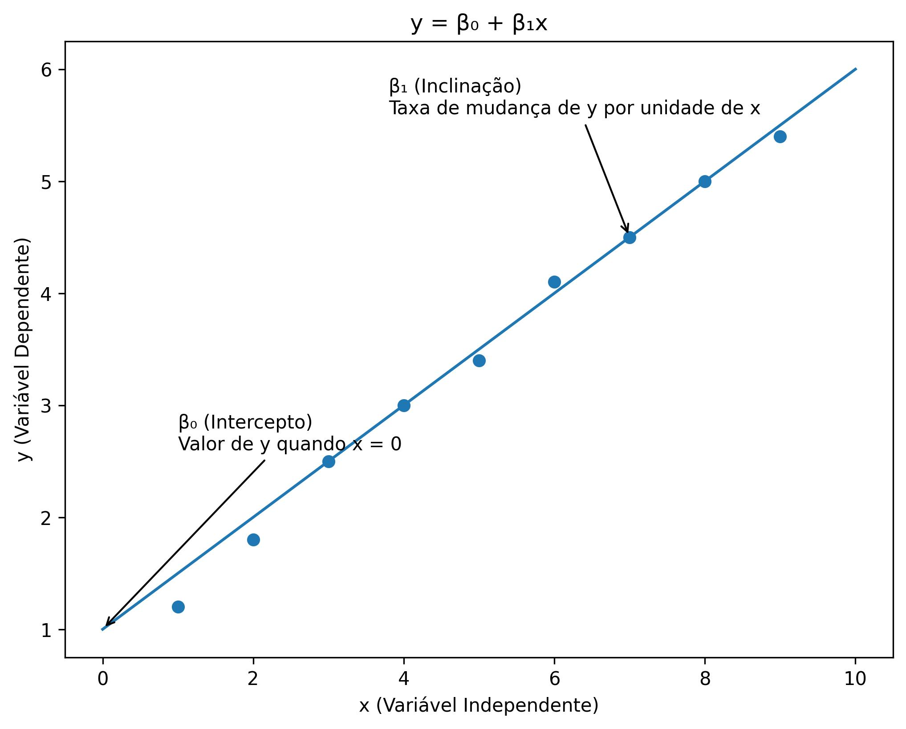
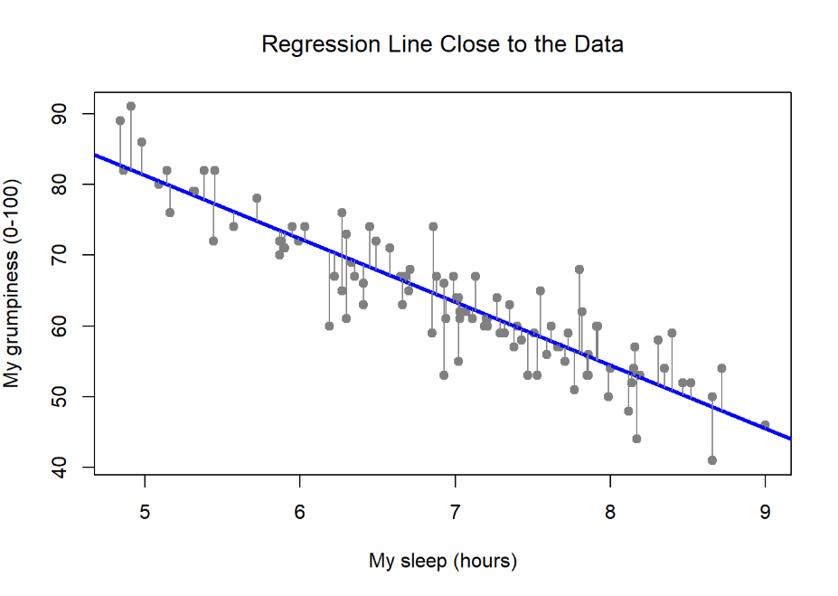
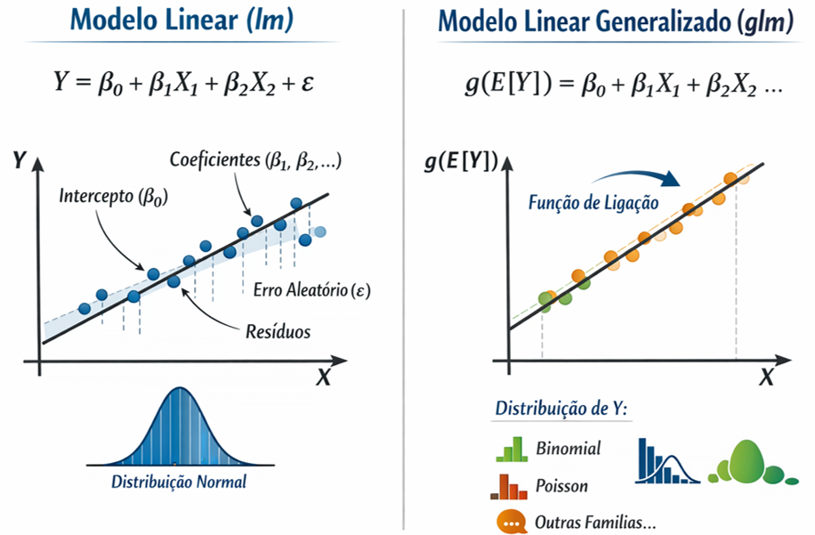
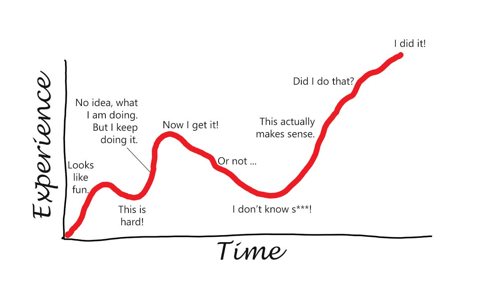

## RECAPITULANDO

#### Até agora...

::::::: {.columns style="font-size: 60%"}
:::::: columns
::: {.column width="35%"}
-   **Pressupostos de testes** `paramétricos`

    -   Normalidade

    -   Homocedasticidade

    -   Independência

    -   Ausência de outliers extremos

-   **Pressupostos de testes**

    `não paramétricos`

    -   Oposto ao paramétrico

    -   Também exige Independência
:::

::: {.column width="35%"}
-   **Tipos de** `familias`

    -   **Gaussian**

    -   **Poisson**

    -   **Binomial**

-   Teste de `hipótese`

    -   **Valor de P**
:::

::: {.columns width="30%"}
-   **Testes Estatísticos**

    -   `X²`
    -   **t-test**
        -   `Student's t-test`
        -   `Welch's t-test`
    -   **ANOVA**
        -   `One Way Anova`
        -   `Kruskal–Wallis`
:::
::::::
:::::::

## Análises Estatísticas

#### Pacotes necessários

::: {style="font-size: 65%"}
```{r}
if(!require(tidyverse)) install.packages("tidyverse")     # Manipulação e visualização
if(!require(car)) install.packages("car")                 # Testes de pressupostos
if(!require(corrplot)) install.packages("corrplot")       # Matriz de correlação
if(!require(ggcorrplot)) install.packages("ggcorrplot")   # Heatmap de correlação
if(!require(qqplotr)) install.packages("qqplotr")         # Plota intervalo de confiança do qqplot
if(!require(nortest)) install.packages("nortest")         # teste de normalidade shapiro-francia
if(!require(report)) install.packages("report")           # cria sumário dos resultados dos modelos
if(!require(rstatix)) install.packages("rstatix")         # Testes estatísticos
if(!require(effectsize)) install.packages("effectsize")   # Tamanho de efeito
if(!require(emmeans)) install.packages("emmeans")         # Médias marginais e post-hoc
if(!require(sjPlot)) install.packages("sjPlot")           # Visualização de modelos
if(!require(ggeffects)) install.packages("ggeffects")     # Efeitos de modelos
if(!require(see)) install.packages("see")                 # Necessário para Performance
if(!require(performance)) install.packages("performance") # Diagnóstico de modelos
if(!require(DHARMa)) install.packages("DHARMa")           # Diagnóstico de GLMs
if(!require(fmsb)) install.packages("fmsb")               # Calcula pseudo r2

```
:::

## Análises Estatísticas Inferenciais

#### `Correlação` entre variáveis

::: {style="font-size: 55%"}
**Correlação** mede o **grau de associação** entre duas variáveis `numéricas`.

-   Quando **X aumenta**, **Y tende a aumentar ou diminuir**?
-   Essa relação é **forte**, **fraca** ou **inexistente**?

Quando você tem **mais de duas variáveis**, calcular correlação par a par gera uma **`matriz de correlação`**.

-   Usa a função **cor()** do pacote stats

    -   Se informa o método usado,

        -   `pearson`: relação linear e todas variáveis paramétricas (`normal`)

        -   `spearman`: relação monotônica, lineares ou com curvas, não-paramétricas (`não normal`)
:::

## Análises Estatísticas Inferenciais

#### `Correlação` entre variáveis

::: {style="font-size: 60%"}
**Todas** as variáveis **estão correlacionadas** em certo ponto, mas **quanto é isso**?\
\
Vamos testar para **aspectos das pétalas** do dataset `iris`

Testamos a normalidade primeiro usando o teste de `Shapiro-Francia`

Se forem todas normais vamos de `Pearson`, se não vamos de `Spearman`

```         
```
:::

## Análises Estatísticas Inferenciais

#### `Correlação` entre variáveis

::: {style="font-size: 60%"}
**Todas** as variáveis **estão correlacionadas** em certo ponto, mas **quanto é isso**?\
\
Vamos testar para **aspectos das pétalas** do dataset `iris`

Testamos a normalidade primeiro usando o teste de `Shapiro-Francia`

Se forem todas normais vamos de `Pearson`, se não vamos de `Spearman`
:::

<div>

::::: {.columns style="font-size: 80%"}
::: {.column width="50%"}
```{r}
nortest::sf.test(iris$Sepal.Length)
nortest::sf.test(iris$Sepal.Width)
```
:::

::: {.column width="50%"}
```{r}
nortest::sf.test(iris$Petal.Length)
nortest::sf.test(iris$Petal.Width)
```
:::
:::::

</div>

## Análises Estatísticas Inferenciais

#### `Correlação` entre variáveis e `Heatmap`

::: {style="font-size: 50%"}
**Todas** as variáveis **estão correlacionadas** em certo ponto, mas **quanto é isso**?\
\
Vamos testar para **aspectos das pétalas** do dataset `iris`

Função `cor()` testa a correlação
:::

::: {style="font-size: 65%"}
```{r}
#| output-location: column
cor_matrix <- iris %>% 
  dplyr::select(where(is.numeric)) %>% 
  stats::cor(method = "spearman",)

cor_matrix

```
:::

::: {style="font-size: 65%"}
```{r}
#| output-location: column
#| fig-width: 4
#| fig-height: 3
ggcorrplot(cor_matrix, 
           lab = TRUE,
           lab_size = 4,
           colors = c("#6D9EC1", #valor -1 a 0.0
                      "white", # valor 0
                      "#E46726")) #valor 0 a 1.0
```
:::

## Análises Estatísticas Inferenciais

#### `Teste` de correlação entre vaviáveis

::: {style="font-size: 70%"}
Usamos a função `cor.test()` para testar a hipótese de correlação

```{r}
#| output-location: column
stats::cor.test(iris$Sepal.Length, 
                iris$Petal.Length, 
                method = "spearman")
```
:::

:::::: columns
::::: {style="font-size: 50%"}
:::: columns
::: {.column width="50%"}
:::
::::
:::::
::::::

## Análises Estatísticas Inferenciais

#### `Teste` de correlação entre vaviáveis

::: {style="font-size: 70%"}
Usamos a função `cor.test()` para testar a hipótese de correlação

```{r}
#| output-location: column
stats::cor.test(iris$Sepal.Length, 
                iris$Petal.Length, 
                method = "spearman")
```
:::

::::::: columns
:::::: {style="font-size: 50%"}
::::: columns
::: {.column width="50%"}
**Interpretação:** Correlação **forte e positiva** (rho = 0.87) entre comprimento de sépala e pétala (p \< 0.001)

**IMPORTANTE:** Correlação ≠ Causação! Pode haver variáveis confundidoras.
:::

::: {.column width="50%"}
:::
:::::
::::::
:::::::

## Análises Estatísticas Inferenciais

#### `Teste` de correlação entre vaviáveis

::: {style="font-size: 70%"}
Usamos a função `cor.test()` para testar a hipótese de correlação

```{r}
#| output-location: column
stats::cor.test(iris$Sepal.Length, 
                iris$Petal.Length, 
                method = "spearman")
```
:::

::::::: columns
:::::: {style="font-size: 50%"}
::::: columns
::: {.column width="50%"}
**Interpretação:** Correlação **forte e positiva** (rho = 0.87) entre comprimento de sépala e pétala (p \< 0.001)

**IMPORTANTE:** Correlação ≠ Causação! Pode haver variáveis confundidoras.
:::

::: {.column width="50%"}
**Coeficiente de correlação (`r` ou `rho`): *`Golden rule`***

-   `r/rho = 1`: correlação positiva perfeita
-   `r/rho = 0`: sem correlação linear
-   `r/rho = -1`: correlação negativa perfeita
-   `|r/rho| > 0.7`: correlação forte
-   `|r/rho| = 0.3-0.7`: correlação moderada
-   `|r/rho| < 0.3`: correlação fraca
:::
:::::
::::::
:::::::

## Resumo Estatística Inferencial

#### Testes Paramétricos vs Não-Paramétricos

::: {style="font-size: 60%"}
| Situação           | Paramétrico | Não-Paramétrico           |
|--------------------|-------------|---------------------------|
| Comparar 2 grupos  | t-test      | Mann-Whitney U (Wilcoxon) |
| Comparar 3+ grupos | ANOVA       | Kruskal-Wallis            |
| Correlação         | Pearson     | Spearman / Kendall        |

**Quando usar não-paramétricos?**

-   Dados **não-normais** (mesmo após transformação)
-   **Outliers** extremos
-   **Amostras pequenas** (n \< 30)

**Vantagens paramétricos:** Mais **poder estatístico** quando pressupostos são atendidos

**Vantagens não-paramétricos:** Mais **robustos** a violações
:::

## Estatística Preditiva

::: {style="font-size: 70%"}
**O que é?**

-   **Modelar relações** lineares entre variáveis

-   **Predizer** valores de uma variável resposta a partir de preditoras

-   Entender **quanto** cada preditor influencia a resposta

**Modelos:**

-   **Regressão Linear (lm)**: resposta contínua, relação linear

-   **Modelos Lineares Generalizados (glm)**: diferentes distribuições da resposta
:::

## Regressão Linear

::: {style="font-size: 70%"}
Baseado na equacao geral da reta:

`y = β0 + β1 * x`
:::

:::::: {style="font-size: 70%"}
::::: columns
::: {.column width="50%"}
-   `y` → variável resposta (dependente)

-   `x` → variável explicativa (independente)

-   `β0` → intercepto (valor esperado de y quando x=0)

-   `β1` → inclinação da reta (quanto y muda, em média, para cada 1 unidade de x)
:::

::: {.column width="50%"}
{width="700"}
:::
:::::
::::::

## Regressão Linear (lm)

#### Parâmetros estimados através do **Método dos Mínimos Quadrados (MMQ)**

:::: columns
::: {style="font-size: 70%"}
Encontra o **melhor ajuste** para um conjunto de dados **tentando minimizar** a soma dos quadrados das diferenças entre o **valor estimado** e os **dados observados**
:::

{fig-align="center" width="600" height="420"}
::::

## Regressão Linear (lm)

::: {style="font-size: 65%"}
**Quando usar?**

-   Variável resposta **contínua**

-   Relação **linear** entre preditoras e resposta

    -   `uma preditora` = **regressão linear simples**

    -   `duas ou mais` = **regressão linear multipla**

-   Resíduos com distribuição **normal**

**Pressupostos:**

1.  **Linearidade**: relação linear entre X e Y

2.  **Normalidade dos resíduos**

3.  **Homocedasticidade**: variância constante dos resíduos

4.  **Independência** dos resíduos

5.  **Ausência de multicolinearidade** (entre preditoras)
:::

## Regressão Linear - Simples

::: {.columns style="font-size: 60%"}
Na regressão linear, você precisa **ajustar o modelo primeiro** para então verificar a maioria dos pressupostos

O que seria "o mais correto" para uma regressão `linear simples`:

1.  **Ajustar o modelo:** `lm(y ~ x1, data = dados)`

2.  **Normalidade dos resíduos**: `Shapiro nos resíduos` do modelo + `QQ-plot`

3.  **Homocedasticidade**: **Breusch–Pagan**, testa se variância dos resíduos é constante

4.  **Independência das observações:** O valor de uma observação **não influencia** nem é influenciado por outra.

5.  **Tamanho de efeito**: `R²` simples, mostra em % quanto do fenômeno é explicado pelo modelo

6.  **Visualização Gráfica da relação linear**

7.  **Interpretação dos coeficientes**
:::

## 1. Regressão Linear Simples

:::::::::: {style="font-size: 70%"}
::::::::: columns
::::: {.column width="50%"}
```{r}
dados.anf <- read_csv("../01_dados/dados_anfibios.csv")


```

:::: columns
::: {.column width="100%"}
:::
::::
:::::

::::: {.column width="50%"}
```{r}

```

:::: columns
::: {.column width="100%"}
```{r}


```
:::
::::
:::::
:::::::::
::::::::::

## 1. Regressão Linear Simples

:::::::::: {style="font-size: 70%"}
::::::::: columns
::::: {.column width="50%"}
```{r}
dados.anf <- read_csv("../01_dados/dados_anfibios.csv")

anf.lm <- lm(n_sp ~ pct_flo,
             data = dados.anf)
anf.lm
```

:::: columns
::: {.column width="100%"}
:::
::::
:::::

::::: {.column width="50%"}
```{r}

```

:::: columns
::: {.column width="100%"}
```{r}


```
:::
::::
:::::
:::::::::
::::::::::

## 1. Regressão Linear Simples

:::::::::: {style="font-size: 70%"}
::::::::: columns
::::: {.column width="50%"}
```{r}
dados.anf <- read_csv("../01_dados/dados_anfibios.csv")

anf.lm <- lm(n_sp ~ pct_flo,
             data = dados.anf)
anf.lm
```

:::: columns
::: {.column width="100%"}
:::
::::
:::::

::::: {.column width="50%"}
```{r}
summary(anf.lm)
```

:::: columns
::: {.column width="100%"}
```{r}


```
:::
::::
:::::
:::::::::
::::::::::

## 2. Regressão Linear Simples

:::::::::: {style="font-size: 70%"}
::::::::: columns
::::: {.column width="50%"}
```{r}
dados.anf <- read_csv("../01_dados/dados_anfibios.csv")

anf.lm <- lm(n_sp ~ pct_flo,
             data = dados.anf)
anf.lm
```

:::: columns
::: {.column width="100%"}
:::
::::
:::::

::::: {.column width="50%"}
```{r}
summary(anf.lm)
```

:::: columns
::: {.column width="100%"}
```{r}
shapiro.test(anf.lm$residuals)

```
:::
::::
:::::
:::::::::
::::::::::

## 2. Regressão Linear Simples

:::::::::: {style="font-size: 70%"}
::::::::: columns
::::: {.column width="50%"}
```{r}
dados.anf <- read_csv("../01_dados/dados_anfibios.csv")

anf.lm <- lm(n_sp ~ pct_flo,
             data = dados.anf)
anf.lm
```

:::: columns
::: {.column width="100%"}
Modelo **significativo** e com distribuição dos **resíduos normais**.
:::
::::
:::::

::::: {.column width="50%"}
```{r}
summary(anf.lm)
```

:::: columns
::: {.column width="100%"}
```{r}
shapiro.test(anf.lm$residuals)

```
:::
::::
:::::
:::::::::
::::::::::

## 2. Regressão Linear Simples

:::::::::: {style="font-size: 70%"}
::::::::: columns
::::: {.column width="50%"}
```{r}
dados.anf <- read_csv("../01_dados/dados_anfibios.csv")

anf.lm <- lm(n_sp ~ pct_flo,
             data = dados.anf)
anf.lm
```

:::: columns
::: {.column width="100%"}
Modelo **significativo** e com distribuição dos **resíduos normais**.

**E a homocedasticidade????**
:::
::::
:::::

::::: {.column width="50%"}
```{r}
summary(anf.lm)
```

:::: columns
::: {.column width="100%"}
```{r}
shapiro.test(anf.lm$residuals)

```
:::
::::
:::::
:::::::::
::::::::::

## 2. Regressão Linear Simples

::: {style="font-size: 55%"}
Função `check_model()` faz checagem do **QQ-Plot** e muito **mais**
:::

::: {style="font-size: 70%"}
```{r}
#| fig-width: 12
#| fig-height: 6.7
performance::check_model(anf.lm)
```
:::

## 3. Regressão Linear Simples

#### Teste da homocedasticidade

::: {style="font-size: 60%"}
-   **H₀ (hipótese nula)**: a variância dos resíduos é constante\
    → **homocedasticidade**

-   **H₁**: a variância dos resíduos não é constante\
    → **heterocedasticidade**
:::

## 3. Regressão Linear Simples

#### Teste da homocedasticidade

::: {style="font-size: 60%"}
Função `bptest()`, **Breusch–Pagan:**

-   **H₀ (hipótese nula)**: a variância dos resíduos é constante\
    → **homocedasticidade**

-   **H₁**: a variância dos resíduos não é constante\
    → **heterocedasticidade**

    -   O BP mede o quanto a **variância** dos resíduos depende das variáveis **explicativas**.
        -   **Muito pequeno** (`≈ 0`): Forte evidência a favor da **homocedasticidade**
:::

## 3. Regressão Linear Simples

#### Teste da homocedasticidade

::: {style="font-size: 60%"}
Função `bptest()`, **Breusch–Pagan:**

-   **H₀ (hipótese nula)**: a variância dos resíduos é constante\
    → **homocedasticidade**

-   **H₁**: a variância dos resíduos não é constante\
    → **heterocedasticidade**

    -   O BP mede o quanto a **variância** dos resíduos depende das variáveis **explicativas**.
        -   **Muito pequeno** (`≈ 0`): Forte evidência a favor da **homocedasticidade**
:::

::: {style="font-size: 90%"}
```{r}

lmtest::bptest(anf.lm)
```
:::

## 5. Regressão Linear Simples

#### Tamanho de efeito `R²`

:::::: {style="font-size: 70%"}
**R²** mede **quanto da variação da variável resposta (Y)** é explicada pelo modelo de regressão

::::: {.columns style="font-size: 100%"}
::: {.column width="50%"}
-   **0** → o modelo não explica nada

-   **1** → o modelo explica toda a variação de Y

-   Quanto menores os resíduos, **maior o R²**
:::

::: {.column width="50%" style="font-size: 100%"}
```{r}
summary(anf.lm)

```
:::
:::::
::::::

## 5. Regressão Linear Simples

#### Tamanho de efeito `R²`

:::::: {style="font-size: 70%"}
**R²** mede **quanto da variação da variável resposta (Y)** é explicada pelo modelo de regressão

::::: {.columns style="font-size: 100%"}
::: {.column width="50%"}
-   **0** → o modelo não explica nada

-   **1** → o modelo explica toda a variação de Y

-   Quanto menores os resíduos, **maior o R²**

Apenas **\~24,4%** da variação ficou nos **resíduos** (erro) **e 75,6% é explicado** por cobertura florestal
:::

::: {.column width="50%" style="font-size: 100%"}
```{r}
summary(anf.lm) 
```
:::
:::::
::::::

## 6. Regressão Linear Simples

#### Visualização do modelo

::: {style="font-size: 70%"}
```{r}
#| output-location: column
#| fig-width: 4
#| fig-height: 4
ggplot(dados.anf, aes(x = pct_flo, y = tam_medio_femur)) +
  geom_point(size = 3, alpha = 0.6) +
  geom_smooth(method = "lm", se = TRUE, color = "black") +
  theme_minimal() +
  labs(x = "Cobertura Florestal (%)",
       y = "Tamanho médio do fêmur")
```
:::

## 7. Regressão Linear Simples

#### Interpretação dos coeficientes

## 7. Regressão Linear Simples

#### Interpretação dos coeficientes

:::::: {style="font-size: 60%"}
::::: columns
::: {.column width="50%"}
-   **Intercept (3.20):** Quando **pct_flo = 0**, o número esperado de espécies (**n_sp**) é **≈ 3.2**.
:::

::: {.column width="50%" style="font-size: 110%"}
`y = β0 + β1 * x`

`n_sp = 3.20 + 0.089 × pct_flo`

```{r}
summary(anf.lm) 
```
:::
:::::
::::::

## 7. Regressão Linear Simples

#### Interpretação dos coeficientes

:::::: {style="font-size: 60%"}
::::: columns
::: {.column width="50%"}
-   **Intercept (3.20):** Quando **pct_flo = 0**, o número esperado de espécies (**n_sp**) é **≈ 3.2**.

-   **Coeficiente angular** de **pct_flo (0.089):** Para **cada aumento de 1 unidade em `pct_flo`**, o número esperado de espécies (**n_sp**) **aumenta em 0.089**, em média.
:::

::: {.column width="50%" style="font-size: 110%"}
`y = β0 + β1 * x`

`n_sp = 3.20 + 0.089 × pct_flo`

```{r}
summary(anf.lm) 
```
:::
:::::
::::::

## 7. Regressão Linear Simples

#### Interpretação dos coeficientes

:::::: {style="font-size: 60%"}
::::: columns
::: {.column width="50%"}
-   **Intercept (3.20):** Quando **pct_flo = 0**, o número esperado de espécies (**n_sp**) é **≈ 3.2**.

-   **Coeficiente angular** de **pct_flo (0.089):** Para **cada aumento de 1 unidade em `pct_flo`**, o número esperado de espécies (**n_sp**) **aumenta em 0.089**, em média.

-   `R²` : O modelo explica **75.6%** da variação observada no número de espécies (n_sp).
:::

::: {.column width="50%" style="font-size: 110%"}
`y = β0 + β1 * x`

`n_sp = 3.20 + 0.089 × pct_flo`

```{r}
summary(anf.lm) 
```
:::
:::::
::::::

## 7. Regressão Linear Simples

#### Interpretação dos coeficientes

:::::: {style="font-size: 60%"}
::::: columns
::: {.column width="50%"}
-   **Intercept (3.20):** Quando **pct_flo = 0**, o número esperado de espécies (**n_sp**) é **≈ 3.2**.

-   **Coeficiente angular** de **pct_flo (0.089):** Para **cada aumento de 1 unidade em `pct_flo`**, o número esperado de espécies (**n_sp**) **aumenta em 0.089**, em média.

-   `R²` : O modelo explica **75.6%** da variação observada no número de espécies (n_sp).

-   p-value (\< 0.001): indicando que o efeito de `pct_flo` sobre `n_sp` é **estatisticamente significativo**.
:::

::: {.column width="50%" style="font-size: 110%"}
`y = β0 + β1 * x`

`n_sp = 3.20 + 0.089 × pct_flo`

```{r}
summary(anf.lm) 
```
:::
:::::
::::::

## 7. Regressão Linear Simples

#### Interpretação dos coeficientes

:::::: {style="font-size: 60%"}
::::: columns
::: {.column width="50%"}
-   **Intercept (3.20):** Quando **pct_flo = 0**, o número esperado de espécies (**n_sp**) é **≈ 3.2**.

-   **Coeficiente angular** de **pct_flo (0.089):** Para **cada aumento de 1 unidade em `pct_flo`**, o número esperado de espécies (**n_sp**) **aumenta em 0.089**, em média.

-   `R²` : O modelo explica **75.6%** da variação observada no número de espécies (n_sp).

-   p-value (\< 0.001): indicando que o efeito de `pct_flo` sobre `n_sp` é **estatisticamente significativo**.

-   `Estatística F` (F = 58.84): modelo linear é significativamente **melhor do que** um modelo **sem preditore;** F muito grande (ex.: 10, 50, 100…)
:::

::: {.column width="50%" style="font-size: 110%"}
`y = β0 + β1 * x`

`n_sp = 3.20 + 0.089 × pct_flo`

```{r}
summary(anf.lm) 
```
:::
:::::
::::::

## Regressão Linear - Múltipla

::: {.columns style="font-size: 55%"}
Na regressão linear, você precisa **ajustar o modelo primeiro** para então verificar a maioria dos pressupostos

O que seria "o mais correto" para uma regressão `linear múltipla`:

1.  **Ajustar o modelo:** `lm(y ~ x1 + x2, data = dados)`

2.  **Normalidade dos resíduos**: `Shapiro nos resíduos` do modelo + `QQ-plot`

3.  **Homocedasticidade**: **Breusch–Pagan**, testa se variância dos resíduos é constante

4.  **Independência das observações:** O valor de uma observação **não influencia** nem é influenciado por outra.

5.  **Multicolinearidade**: duas ou mais variáveis preditoras estão fortemente correlacionadas entre si.

    -   não é um pressuposto do modelo linear, mas afeta interpretação dos coeficientes

    -   **`vif()`** mede o quanto a variância do coeficiente β está inflada por causa da correlação com outras preditoras

6.  **Significância dos coeficientes:** “Para cada aumento de 1 unidade em X, Y muda em β unidades, mantendo as outras variáveis constantes.”

7.  **Tamanho de efeito**: **`R² adjusted`**, mostra em % quanto do fenômeno é explicado pelo modelo

8.  **Comparar com um modelo mais simples**

9.  **Interpretação dos coeficientes**
:::

## 1. Regressão Linear Múltipla

::::::::::: {style="font-size: 70%"}
:::::::::: columns
:::::: {.column width="50%"}
```{r}
anf.lm2 <- lm(n_sp ~ pct_flo + conect,
             data = dados.anf)
anf.lm2
```

::::: columns
:::: {.column width="100%"}
::: {.column width="100%"}
:::
::::
:::::
::::::

::::: {.column width="50%"}
```         
```

:::: columns
::: {.column width="100%"}
```         
```
:::
::::
:::::
::::::::::
:::::::::::

## 1. Regressão Linear Múltipla

::::::::::: {style="font-size: 70%"}
:::::::::: columns
:::::: {.column width="50%"}
```{r}
anf.lm2 <- lm(n_sp ~ pct_flo + conect,
             data = dados.anf)
anf.lm2
```

::::: columns
:::: {.column width="100%"}
::: {.column width="100%"}
:::
::::
:::::
::::::

::::: {.column width="50%"}
```{r}
summary(anf.lm2)
```

:::: columns
::: {.column width="100%"}
```         
```
:::
::::
:::::
::::::::::
:::::::::::

## 2. Regressão Linear Múltipla

:::::::::: {style="font-size: 70%"}
::::::::: columns
::::: {.column width="50%"}
```{r}
anf.lm2 <- lm(n_sp ~ pct_flo + conect,
             data = dados.anf)
anf.lm2
```

:::: columns
::: {.column width="100%"}
Modelo **significativo** e com distribuição dos **resíduos normais**.
:::
::::
:::::

::::: {.column width="50%"}
```{r}
summary(anf.lm2)
```

:::: columns
::: {.column width="100%"}
```{r}
shapiro.test(anf.lm2$residuals) 
```
:::
::::
:::::
:::::::::
::::::::::

## 2. Regressão Linear Múltipla

:::::::::: {style="font-size: 70%"}
::::::::: columns
::::: {.column width="50%"}
```{r}
anf.lm2 <- lm(n_sp ~ pct_flo + conect,
             data = dados.anf)
anf.lm2
```

:::: columns
::: {.column width="100%"}
Modelo **significativo** e com distribuição dos **resíduos normais**.

**E a homocedasticidade????**
:::
::::
:::::

::::: {.column width="50%"}
```{r}
summary(anf.lm2)
```

:::: columns
::: {.column width="100%"}
```{r}
shapiro.test(anf.lm2$residuals) 
```
:::
::::
:::::
:::::::::
::::::::::

## 2. Regressão Linear Múltipla

::: {style="font-size: 55%"}
Função `check_model()` faz checagem do **QQ-Plot** e muito **mais**
:::

::: {style="font-size: 70%"}
```{r}
#| fig-width: 12 
#| fig-height: 6.7 
performance::check_model(anf.lm2)
```
:::

## 3. Regressão Linear Simples

#### Teste da homocedasticidade

::: {style="font-size: 60%"}
Função `bptest()`, **Breusch–Pagan:**

-   **H₀ (hipótese nula)**: a variância dos resíduos é constante\
    → **homocedasticidade**

-   **H₁**: a variância dos resíduos não é constante\
    → **heterocedasticidade**

    -   O BP mede o quanto a **variância** dos resíduos depende das variáveis **explicativas**.
        -   **Muito pequeno** (`≈ 0`): Forte evidência a favor da **homocedasticidade**
:::

::: {style="font-size: 90%"}
```{r}
lmtest::bptest(anf.lm2)
```
:::

## 5. Regressão Linear Múltipla

#### Verificar multicolinearidade

::: {style="font-size: 70%"}
**`vif()`** mede o quanto a variância do coeficiente β está inflada por causa da correlação com outras preditoras:

-   duas ou mais variáveis preditoras estão fortemente correlacionadas entre si?

    -   **VIF \< 5**: Não há problema de multicolinearidade

    -   **VIF \> 10**: Multicolinearidade alta - considerar remover variáveis
:::

## 5. Regressão Linear Múltipla

#### Verificar multicolinearidade

::: {style="font-size: 70%"}
**`vif()`** mede o quanto a variância do coeficiente β está inflada por causa da correlação com outras preditoras:

-   duas ou mais variáveis preditoras estão fortemente correlacionadas entre si?

    -   **VIF \< 5**: Não há problema de multicolinearidade

    -   **VIF \> 10**: Multicolinearidade alta - considerar remover variáveis
:::

::: {style="font-size: 100%"}
```{r}
car::vif(anf.lm2)
```
:::

## 6. Regressão Linear Múltipla

#### Significância dos coeficientes

<div>

::::: {.columns style="font-size: 70%"}
::: {.column width="50%"}
Quais coeficientes (`βx`) foram significativos

-   Quais variáveis preditoras **contribuem** de forma estatisticamente relevante para **explicar** a variável resposta.

    -   A significância de cada coeficiente é testada por meio do teste t:

        -   avalia o efeito isolado de cada preditor, controlando os demais.

**Nenhuma variável isolada explica bem o `n_sp`**
:::

::: {.column width="50%"}
```{r}
summary(anf.lm2) 

```
:::
:::::

</div>

## 7. Regressão Linear Múltipla

#### Tamanho de efeito `Adjusted R²`

:::::: {style="font-size: 70%"}
**Adjusted R²** mede **quanto da variação da variável resposta (Y)** é explicada pelo modelo de regressão

::::: {.columns style="font-size: 90%"}
::: {.column width="50%"}
Comparar modelos com diferentes números de preditores

Penaliza adição de variáveis que não melhoram muito o ajuste

-   O **Adjusted R²** corrige o R² levando em conta:

    -   Número de preditores no modelo

    -   Tamanho da amostra

Apenas **\~25,2%** da variação ficou nos **resíduos** (erro) **e 74,8% é explicado** por cobertura florestal e conectividade
:::

::: {.column width="50%" style="font-size: 110%"}
```{r}
summary(anf.lm2) 
```
:::
:::::
::::::

## 8. Regressão Linear Múltipla

#### Comparação de modelos

:::::: {style="font-size: 50%"}
::::: columns
::: {.column width="50%"}
**ANOVA de modelos aninhados**

-   Compara modelos onde um é **subconjunto** do outro

-   Testa se adicionar variáveis melhora significativamente o modelo

-   Se p \< 0.05: modelo mais complexo é **significativamente melhor**
:::

::: {.column width="50%"}
:::
:::::
::::::

:::::: {style="font-size: 80%"}
::::: columns
::: {.column width="50%"}
```{r}
anova(anf.lm, anf.lm2)
```
:::

::: {.column width="50%"}
```         
```
:::
:::::
::::::

## 8. Regressão Linear Múltipla

#### Comparação de modelos

:::::: {style="font-size: 50%"}
::::: columns
::: {.column width="50%"}
**ANOVA de modelos aninhados**

-   Compara modelos onde um é **subconjunto** do outro

-   Testa se adicionar variáveis melhora significativamente o modelo

-   Se p \< 0.05: modelo mais complexo é **significativamente melhor**
:::

::: {.column width="50%"}
**AIC (Akaike Information Criterion): comparar modelos**

-   Mede o **balanço** entre ajuste do modelo e complexidade

-   **Penaliza** modelos com muitos parâmetros (evita overfitting)

-   **Menor AIC = melhor modelo**

-   Regra prática: ΔAIC \> 2 indica diferença relevante
:::
:::::
::::::

:::::: {style="font-size: 80%"}
::::: columns
::: {.column width="50%"}
```{r}
anova(anf.lm, anf.lm2)
```
:::

::: {.column width="50%"}
```{r}
AIC(anf.lm, anf.lm2)
```
:::
:::::
::::::

## 9. Regressão Linear Múltipla

#### Interpretação dos coeficientes

<div>

:::::: columns
::::: {.columns style="font-size: 55%"}
::: {.column width="50%"}
-   **Intercept (2.4):** Quando **`pct_flo` = 0**, o número esperado de espécies (**n_sp**) é **≈ 2.4**.

-   **Coeficiente angular** de **`pct_flo` (0.05):** Para **cada aumento de 1 unidade em `pct_flo`**, o número esperado de espécies (**n_sp**) **aumenta em 0.05**, em média.

-   **Coeficiente angular** de **`conect` (0.04):** Para **cada aumento de 1 unidade em** `conect`, o número esperado de espécies (**n_sp**) **aumenta em 0.04**, em média.

-   `R²` : O modelo explica **74.8%** da variação observada no número de espécies (n_sp).

-   p-value (\< 0.001): indicando que o efeito de **ambas** sobre `n_sp` é **estatisticamente significativo**.

-   `Estatística F` (F = 30.63): modelo linear é significativamente **melhor do que** um modelo **sem preditore;** F muito grande (ex.: 10, 50, 100…)
:::

::: {.column width="50%" style="font-size: 125%"}
```{r}
summary(anf.lm2)

```
:::
:::::
::::::

</div>

## Modelos Lineares Generalizados

::::::::: {.columns style="font-size: 50%"}
::::::: {.column width="50%"}
**Modelos lineares**

:::: columns
`Y` → resposta contínua

`β0`→ intercepto

`βi`→ coeficiente da variável `Xi`

`ε` → erro normalmente distribuído

::: {.column width="50%"}
**`Y=β0+β1*X1+β2*X2+⋯+ε`**
:::
::::

:::: columns
::: {.column width="50%"}
**`g(E[Y])=β0+β1*X1+β2*X2+…`**
:::
::::
:::::::

::: {.column width="50%"}
{fig-align="center" width="916"}
:::
:::::::::

## Modelos Lineares Generalizados

::::::::: {.columns style="font-size: 50%"}
::::::: {.column width="50%"}
**Modelos lineares**

:::: columns
`Y` → resposta contínua

`β0`→ intercepto

`βi`→ coeficiente da variável `Xi`

`ε` → erro normalmente distribuído

::: {.column width="50%"}
**`Y=β0+β1*X1+β2*X2+⋯+ε`**
:::
::::

**Modelo Linear Generalizado**

:::: columns
`Y` → resposta que pode ser **contínua, binomial, Poisson etc**.

`g()`→ função de ligação (**link function**), ex.: logit, log, identity

`β0,βi` → mesmos conceitos, mas interpretados no espaço da **função de ligação**

Não há `ε` explícito, a distribuição de `Y` é definida (familia: `binomial`, `poisson`...)

::: {.column width="50%"}
**`g(E[Y])=β0+β1*X1+β2*X2+…`**
:::
::::
:::::::

::: {.column width="50%"}
{fig-align="center" width="916"}
:::
:::::::::

## Modelos Lineares Generalizados

::: {style="font-size: 70%"}
**Quando usar?**

-   Quando a **variável resposta** não segue distribuição normal

-   **Dados de contagem**: `Poisson`, `Binomial Negativa`

-   **Dados binários**: `Logística`

-   **Dados de proporção**: `Binomial`

**Componentes do GLM:**

1.  **Distribuição** da família exponencial (Normal, Poisson, Binomial, etc.)

2.  **Função de ligação** (`link function`)

3.  **Preditor linear** (combinação linear das variáveis explicativas)
:::

## Modelos Lineares Generalizados

#### Função de Ligação (Link Function)

::: {style="font-size: 60%"}
**O que é?**

-   **Conecta** a média da variável resposta com o preditor linear

-   Garante que as **predições** estejam no intervalo válido

-   Permite modelar **relações não-lineares** entre X e Y
:::

## Modelos Lineares Generalizados

#### Função de Ligação (Link Function)

::: {style="font-size: 60%"}
**O que é?**

-   **Conecta** a média da variável resposta com o preditor linear

-   Garante que as **predições** estejam no intervalo válido

-   Permite modelar **relações não-lineares** entre X e Y

**Exemplos práticos:**

-   **Log link** (Poisson): garante contagens **positivas**
    -   `log(μ) = β₀ + β₁X → μ = exp(β₀ + β₁X)`
-   **Logit link** (Binomial): garante probabilidades entre **0 e 1**
    -   `logit(p) = β₀ + β₁X → p = 1/(1 + exp(-(β₀ + β₁X)))`
-   **Identity link** (Normal): relação **direta e linear**
    -   `μ = β₀ + β₁X (regressão linear tradicional)`

**Por que importa?** A escolha errada pode gerar predições impossíveis (ex: contagens negativas)!
:::

## GLM - Distribuições comuns

::: {style="font-size: 70%"}
| Distribuição | Tipo de Dados     | Função de Ligação | Exemplo           |
|--------------|-------------------|-------------------|-------------------|
| Gaussian     | Contínua          | Identity          | Altura            |
| Poisson      | Contagem          | Log               | N° de espécies    |
| Binomial     | Binária           | Logit             | Presença/Ausência |
| Binomial     | Proporção         | Logit             | Taxa de sucesso   |
| Gamma        | Contínua positiva | Log               | Biomassa          |
:::

## GLM - Poisson

#### Dados de contagem

::: {.columns style="font-size: 55%"}
Na GLM você precisa **ajustar o modelo primeiro** para então verificar a maioria dos pressupostos

O que seria "o mais correto" para uma regressão `GLM Poisson`:

1.  **Ajustar o modelo:** `glm(y ~ x1 + x2, data = dados, family = poisson(link = "log"))`

2.  **Dispersão dos resíduos e homodecasticidade: DHARMa testes**

3.  **Independência das observações:** O valor de uma observação **não influencia** nem é influenciado por outra.

4.  **Testes de adequação do modelo** - **DHARMa testes:** dispersão, outliers, inflação de zero

5.  **Significância dos coeficientes:** “Para cada aumento de 1 unidade em X, Y muda em β unidades, mantendo as outras variáveis constantes.”

6.  **Tamanho de efeito**: **`R² adjusted`**, mostra em % quanto do fenômeno é explicado pelo modelo

7.  **Comparar com um modelo mais simples**

8.  **Visualização**
:::

## GLM - Poisson

#### Dados de contagem

::: {style="font-size: 70%"}
```{r}

dados_count <- read_csv("../01_dados/dados_count_poisson.csv")
dados_count
```
:::

## 1. GLM - Poisson

#### Ajustar o modelo

::: {style="font-size: 60%"}
**Interpretação:**

-   Para cada 1°C de aumento na temperatura, a contagem **aumenta** em 11% (exp(0.091) = 1.09)

-   Para cada 1% de aumento na umidade, a contagem **aumenta** em 2% (exp(0.015) = 1.01)
:::

::: {style="font-size: 70%"}
```{r}
#| output-location: column
# Modelo Poisson
modelo_poisson <- stats::glm(contagem ~ temperatura + umidade,
                             data = dados_count,
                             family = poisson(link = "log"))

summary(modelo_poisson)
```
:::

## 2. GLM - Poisson

#### Verificação de pressupostos - DHARMa

::::: {style="font-size: 50%"}
**Dispersão dos resíduos e homodecasticidade**

:::: columns
::: {.column width="40%"}
Usa função `simulateResiduals()`

-   Simula resíduos padronizados a partir do modelo ajustado

<!-- -->

-    Permite testar se os resíduos seguem **uma distribuição uniforme**

-   `Dispersion test > 0.05`, não há **overdispersion** nem **underdispersion**

-   **Linha praticamente horizontal (flat)** → indica que os resíduos **não dependem do valor previsto**, ou seja:

    -   **Homoscedasticidade**: variância constante dos resíduos

    -   **Função de ligação adequada**: o modelo captura corretamente a relação entre X e Y
:::
::::
:::::

## 2. GLM - Poisson

#### Verificação de pressupostos - DHARMa

:::::: {style="font-size: 50%"}
**Dispersão dos resíduos e homodecasticidade**

::::: columns
::: {.column width="40%"}
Usa função `simulateResiduals()`

-   Simula resíduos padronizados a partir do modelo ajustado

<!-- -->

-    Permite testar se os resíduos seguem **uma distribuição uniforme**

-   `Dispersion test > 0.05`, não há **overdispersion** nem **underdispersion**

-   **Linha praticamente horizontal (flat)** → indica que os resíduos **não dependem do valor previsto**, ou seja:

    -   **Homoscedasticidade**: variância constante dos resíduos

    -   **Função de ligação adequada**: o modelo captura corretamente a relação entre X e Y
:::

::: {.column width="60%"}
```{r}
simulacao <- DHARMa::simulateResiduals(modelo_poisson, plot = TRUE)
```
:::
:::::
::::::

## 3. GLM - Poisson

#### Testes de adequação do modelo - DHARMa

::::: columns
::: {.column width="50%" style="font-size: 60%"}
**Dispersion test**: se o modelo tem **overdispersion** ou **underdispersion**

-   `p = 0.552`: O modelo não apresenta problemas de dispersão.
:::

::: {.column width="50%" style="font-size: 80%"}
```{r}
DHARMa::testDispersion(simulacao)

```
:::
:::::

## 3. GLM - Poisson

#### Testes de adequação do modelo - DHARMa

::::: columns
::: {.column width="50%" style="font-size: 60%"}
**Dispersion test**: se o modelo tem **overdispersion** ou **underdispersion**

-   `p = 0.552`: O modelo não apresenta problemas de dispersão.

**Bootstrapped outlier test**: se há **outliers extremos** nos resíduos simulados

-   **0 outliers detectados**, p = 1, nenhum problema estatisticamente significativo
:::

::: {.column width="50%" style="font-size: 70%"}
```{r}
DHARMa::testOutliers(simulacao)

```
:::
:::::

## 3. GLM - Poisson

#### Testes de adequação do modelo - DHARMa

::::: columns
::: {.column width="50%" style="font-size: 60%"}
**Dispersion test**: se o modelo tem **overdispersion** ou **underdispersion**

-   `p = 0.552`: O modelo não apresenta problemas de dispersão.

**Bootstrapped outlier test**: se há **outliers extremos** nos resíduos simulados

-   **0 outliers detectados**, p = 1, nenhum problema estatisticamente significativo

**Zero-inflation test**: **excesso de zeros** comparado à expectativa do modelo

-   r**atioObsSim = 0.73**, os zeros observados são **aproximadamente consistentes** com os **zeros esperados** pelo modelo
:::

::: {.column width="50%" style="font-size: 80%"}
```{r}
DHARMa::testZeroInflation(simulacao)
```
:::
:::::

## 3. GLM - Poisson

#### Testes de adequação do modelo - DHARMa

::::: columns
::: {.column width="50%" style="font-size: 60%"}
**Dispersion test**: se o modelo tem **overdispersion** ou **underdispersion**

-   `p = 0.552`: O modelo não apresenta problemas de dispersão.

**Bootstrapped outlier test**: se há **outliers extremos** nos resíduos simulados

-   **0 outliers detectados**, p = 1, nenhum problema estatisticamente significativo

**Zero-inflation test**: **excesso de zeros** comparado à expectativa do modelo

-   r**atioObsSim = 0.73**, os zeros observados são **aproximadamente consistentes** com os **zeros esperados** pelo modelo

**O modelo parece muito bem ajustado**: dispersão ok, sem outliers e sem excesso de zeros
:::

::: {.column width="50%" style="font-size: 80%"}
**O modelo parece muito bem ajustado**: dispersão ok, sem outliers e sem excesso de zeros
:::
:::::

## 5. GLM - Poisson

#### Interpretação dos coeficientes

:::::: {.columns style="font-size: 60%"}
**Z-value:** `Estimates/SE`: quantos `SD` o coeficiente estimado está de zero

Fazemos uma comparação de modelo para saber se ele é significativo.

::::: columns
::: {.column width="50%"}
```{r}
summary(modelo_poisson) 
```
:::

::: {.column width="50%"}
```{}
```

```{}
```
:::
:::::
::::::

## 5. GLM - Poisson

#### Interpretação dos coeficientes

:::::: {.columns style="font-size: 60%"}
**Z-value:** `Estimates/SE`: quantos `SD` o coeficiente estimado está de zero

Fazemos uma comparação de modelo para saber se ele é significativo.

::::: columns
::: {.column width="50%"}
```{r}
summary(modelo_poisson) 
```
:::

::: {.column width="50%"}
```{r}
modelo_null <- glm(contagem ~ 1, 
                   family = poisson, 
                   data = dados_count)
```

```{r}
anova(modelo_null, modelo_poisson, test = "Chisq")
```
:::
:::::
::::::

## 7. GLM - Poisson

#### Tamanho do efeito

::: {.columns style="font-size: 70%"}
Usamos `Nagelkerke's R²`para determinar quanto o **modelo explicou** de contagem.

-   **Pseudo-R²** → equivalente ao R² da regressão linear, mas para GLMs (não assume normalidade dos resíduos

-   96% do modelo foi explicado pelo conjunto de variáveis

```{r}
fmsb::NagelkerkeR2(modelo_poisson)
```
:::

## 8. GLM - Poisson, Visualização 

#### Efeitos marginais

::: {style="font-size: 60%"}
**`plot_model()`** mostra **como a variável resposta** Y muda quando você altera uma variável **preditora** X, mantendo as outras variáveis constantes em certos valores.

O gráfico mostra **como a variável Y muda com a temperatura**, e como essa relação muda dependendo de **umidade**.

-   Definir o parâmetro: `type = "pred"` → quer dizer **gráfico de predição / efeitos marginais**.
:::

::: {style="font-size: 60%"}
```{r}
#| fig-width: 5
#| fig-height: 3.5
#| output-location: column
sjPlot::plot_model(modelo_poisson, 
                   type = "pred", 
                   terms = c("temperatura", "umidade [50, 70, 90]"),
                   title = "Efeitos Marginais")
```
:::

## GLM - Poisson, Report

::: columns
Usar a função `report()` para obter uma descrição do modelo

```{r}
report::report(modelo_poisson)

```
:::

## Como Escolher o Teste Estatístico?

::: {style="font-size: 60%"}
**Fluxograma de decisão:**

1.  **Tipo de variáveis?**
    -   Categórica vs Categórica → **Chi-quadrado**
    -   Contínua vs Categórica (2 grupos) → **t-test**
    -   Contínua vs Categórica (3+ grupos) → **ANOVA**
    -   Contínua vs Contínua → **Correlação / Regressão**
2.  **Objetivo?**
    -   Comparar com o esperado → **Chi-quadrado**
    -   Comparar grupos → ANOVA, t-test
    -   Predizer valores → Regressão, GLM
3.  **Pressupostos atendidos?**
    -   Sim → Teste **paramétrico**
    -   Não → Teste **não-paramétrico** ou transformação
:::

## Fluxo de Análise

:::::: {style="font-size: 70%"}
::::: columns
::: {.column width="50%"}
**Exploração dos dados**

-   Estatística descritiva
-   Visualizações
-   Correlações

**2. Escolha do teste/modelo**

-   Tipo de variável resposta
-   Tipo de preditoras
-   Objetivo da análise
:::

::: {.column width="50%"}
**3. Verificação de pressupostos**

-   Normalidade, homocedasticidade, etc.
-   Transformação se necessário

**4. Ajuste do modelo**

**5. Diagnóstico**

**6. Interpretação e visualização**
:::
:::::
::::::

## Boas Práticas

:::::: {style="font-size: 70%"}
::::: columns
::: {.column width="50%"}
**Sempre:**

✓ Visualize seus dados **antes** de modelar

✓ Verifique **pressupostos** dos testes

✓ Reporte **tamanho de efeito**, não apenas p-value

✓ Use **gráficos** para comunicar resultados

✓ Interprete resultados no **contexto biológico**
:::

::: {.column width="50%"}
**Evite:**

✗ Confiar cegamente em p-values

✗ Ignorar pressupostos violados

✗ "P-hacking" (testar múltiplos modelos até achar significância)

✗ Extrapolar além dos dados
:::
:::::
::::::

## Don't give up!!!

::::: columns
::: {.column width="30%"}
{fig-align="center"}
:::

::: {.column width="70%"}
{fig-align="center"}
:::
:::::

## Obrigado!

::: {style="font-size: 80%"}
**Dúvidas?**

Email: [seu.email\@email.com](mailto:seu.email@email.com)

Website: [souzayuri.github.io](https://souzayuri.github.io/)

**Materiais do curso:**

GitHub: [seu-repositorio](https://github.com/seu-usuario/seu-repo)
:::

## Exercícios

::: columns
{fig-align="center" width="400"}
:::

## Exercícios

##