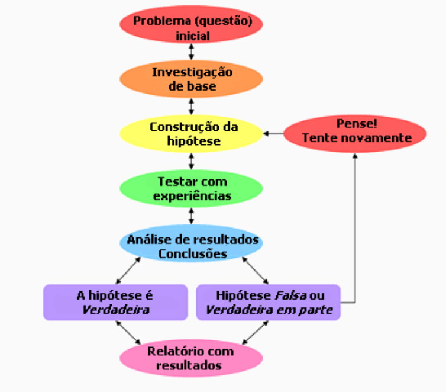
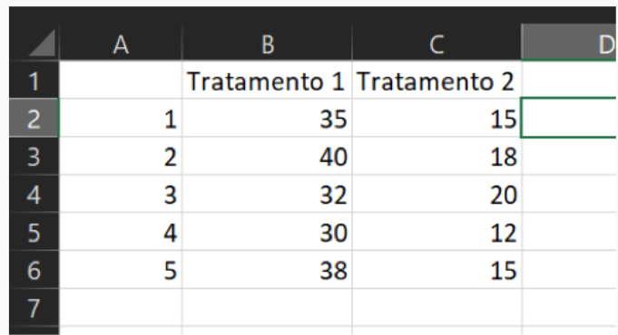
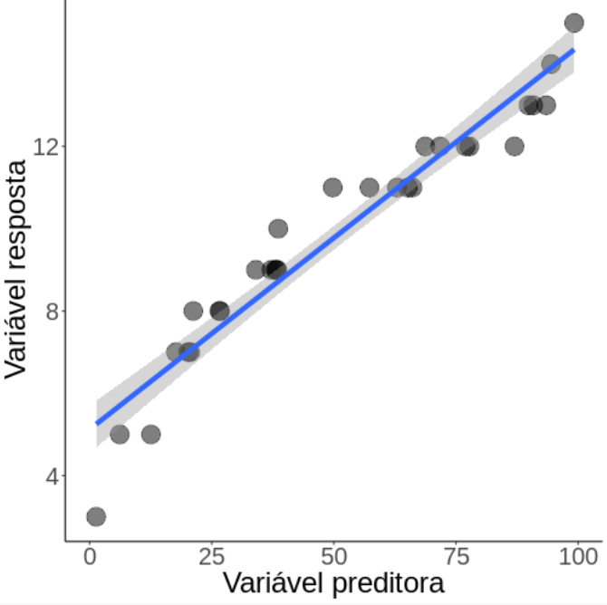
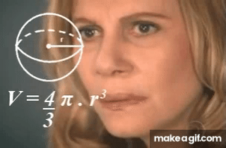
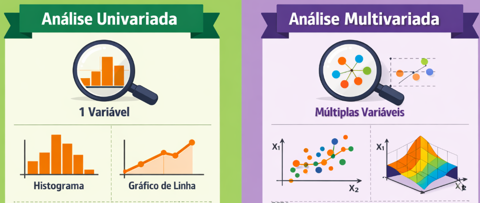
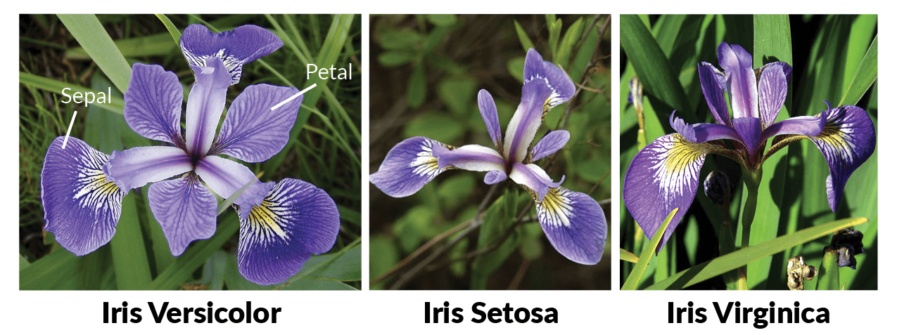
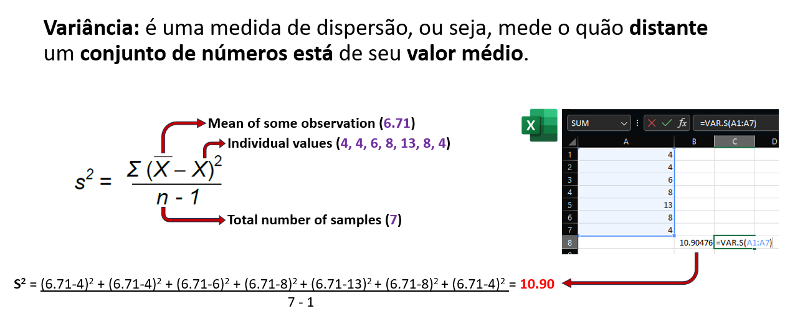

## Método Científico

::: columns
-   **Indutivo**: chegar a uma **lei geral** por meio da observação de certos **casos particulares**

-   **Dedutivo**: parte de **teorias e leis consideradas gerais** buscando explicar a ocorrência de **fenômenos particulares**

-   **Hipotético-dedutivo**:

    1.  problema ou lacuna de conhecimento

    2.  formulação de **hipóteses**

    3.  inferência dedutiva (**teste das hipóteses** para os casos particulares - tentativa de **falseamento ou refutação**)

    4.  corroboração

-   **Dialético**: leva em conta o constante movimento dos **fenômenos históricos-sociais** para o entendimento da totalidade
:::

## Método Científico

::: columns
-   **Hipotético-dedutivo**:

    1.  problema ou lacuna de conhecimento

    2.  formulação de **hipóteses**

    3.  inferência dedutiva (**teste das hipóteses** para os casos particulares - tentativa de **falseamento ou refutação**)

    4.  corroboração
:::

## Método Científico

{fig-align="center"}

## Método Científico

::: columns
**1. Pergunta:** Como as **modificações da paisagem** (perda e fragmentação de habitat) **afetam** as comunidades de **mamíferos**?

{fig-align="center"}
:::

## Método Científico

:::::: {.columns style="font-size: 60%"}
::::: columns
::: {.column width="70%"}
**2. Coleta dos dados**

Ir para campo, anotar e/ou medir diversas variáveis, caderno de campo, instrumentos, sorte, mosquitos, carrapatos....
:::

::: {.column width="30%"}
{fig-align="center" width="300"}
:::
:::::
::::::

## Método Científico

::::: {.columns style="font-size: 60%"}
:::: columns
::: {.column width="70%"}
**2. Coleta dos dados**

Ir para campo, anotar e/ou medir diversas variáveis, caderno de campo, instrumentos, sorte, mosquitos, carrapatos....

Voltar do campo, com cadernos, planilhas, câmeras...

Planilhar dados, visualizar fotos, identificar os bichos, e café, muito, café...
:::

{fig-align="center" width="400"}
::::
:::::

## Método Científico

::::: {.columns style="font-size: 60%"}
:::: columns
::: {.column width="70%"}
**2. Coleta dos dados**

Ir para campo, anotar e/ou medir diversas variáveis, caderno de campo, instrumentos, sorte, mosquitos, carrapatos....

Voltar do campo, com cadernos, planilhas, câmeras...

Planilhar dados, visualizar fotos, identificar os bichos, e café, muito, café...
:::

{fig-align="center" width="400"}
::::
:::::

## Método Científico

:::::::: {.columns style="font-size: 60%"}
::::::: columns
::: {.column width="70%"}
**3. Modelos estatísticos**
:::

::::: columns
::: {.column width="50%"}
{width="400"}
:::

::: {.column width="50%"}
{fig-align="center"}
:::
:::::
:::::::
::::::::

## Método Científico

::: {.columns style="font-size: 60%"}
**3. Modelos estatísticos**

E por que eu preciso fazer um **modelo estatístico**?
:::

## Método Científico

::: {.columns style="font-size: 60%"}
**3. Modelos estatísticos**

E por que eu preciso fazer um **modelo estatístico**?

É possível **coletar todos os dados** em campo?
:::

## Método Científico

::: {.columns style="font-size: 60%"}
**3. Modelos estatísticos**

E por que eu preciso fazer um **modelo estatístico**?

É possível **coletar todos os dados** em campo?

Nunca!

Não há **recursos financeiros**, **tempo** ou **pessoal** para fazer **censos** em campo (salvo algumas exceções)
:::

## Método Científico

::: {.columns style="font-size: 60%"}
**3. Modelos estatísticos**

E por que eu preciso fazer um **modelo estatístico**?

É possível **coletar todos os dados** em campo?

Nunca!

Não há **recursos financeiros**, **tempo** ou **pessoal** para fazer **censos** em campo (salvo algumas exceções)
:::

::: {.columns style="font-size: 100%"}
**`Por isso estimamos`**
:::

::: {.columns style="font-size: 60%"}
Usamos uma parcela da realidade para **tentar** definir a ralidade em si
:::

## Análises Estatísticas

#### População, amostra e variável

::: {.columns style="font-size: 60%"}
**População (estatística)**\
É o **conjunto de todos os indivíduos ou elementos** sobre os quais queremos tirar conclusões em um estudo.

**Amostra**\
É uma **parte da população**, escolhida para ser estudada, que **representa bem a população**.

**Variável (aleatória ou estatística)**\
É uma **característica** que **observamos** ou **medimos** nos indivíduos do estudo e que pode assumir **diferentes valores**.
:::

## Análises Estatísticas

#### População, amostra e variável

::: {.columns style="font-size: 60%"}
**Variável preditora \[independente\] (X)**: varia independentemente e é coletada com o intuito de explicar a variável resposta

**Variável resposta \[dependente\] (Y)**: espera-se que varie, i.e., seja dependente, da(s) variável(is) preditoras
:::

## Análises Estatísticas

#### População, amostra e variável

:::: {.columns style="font-size: 60%"}
**Variável preditora \[independente\] (X)**: varia independentemente e é coletada com o intuito de explicar a variável resposta

**Variável resposta \[dependente\] (Y)**: espera-se que varie, i.e., seja dependente, da(s) variável(is) preditoras

::: {.columns style="font-size: 130%"}
***Modelo estatístico**: é a tentativa de explicar a variação de **variáveis respostas (Y)** em **função de variáveis preditoras (X)***
:::

{fig-align="center" width="400"}
::::

## Análises Estatísticas

#### Modelo estatístico

::: {.columns style="font-size: 60%"}
E o que garante que podemos **concluir nossas hipóteses** a respeito da **população** a partir das **amostras**?
:::

## Análises Estatísticas

#### Modelo estatístico

:::::: {.columns style="font-size: 60%"}
E o que garante que podemos **concluir nossas hipóteses** a respeito da **população** a partir das **amostras**?

::: {.columns style="font-size: 150%"}
**`O delineamento amostral!!!`**
:::

-   Conjunto de **métodos e decisões** que garantam que a **amostra** seja **parte representativa** da **população estatística**

:::: {.column width="50%"}
::: {.column width="50%"}
:::
::::
::::::

## Análises Estatísticas

#### Modelo estatístico

::::::: {.columns style="font-size: 60%"}
E o que garante que podemos **concluir nossas hipóteses** a respeito da **população** a partir das **amostras**?

::: {.columns style="font-size: 150%"}
**`O delineamento amostral!!!`**
:::

-   Conjunto de **métodos e decisões** que garantam que a **amostra** seja **parte representativa** da **população estatística**

### Depende de:

::::: columns
::: {.column width="50%"}
1.  Pergunta

2.  Grupo de pesquisa

3.  Métodos de amostragem (parcela, transecto, busca ativa, cameras, pitfall)

4.  Área de amostragem
:::

::: {.column width="50%"}
5.  Tamanho da amostra

6.  Esforço de amostragem

7.  Autocorrelação espacial e temporal

8.  Pseudo-réplica
:::
:::::
:::::::

## Análises Estatísticas

#### Univariada vs Multivariada

::: {.columns style="font-size: 60%"}
**Univariada**

-   É a análise estatística de **uma** única **variável resposta** por vez.\
    Foca em descrever seu comportamento isolado, como **distribuição**, **tendência central** (média, mediana), **dispersão** (variância, desvio-padrão) e **frequência**.

**Multivariada**

-   É a análise estatística de **duas ou mais variáveis repostas** simultaneamente. Busca entender **relações, associações, padrões ou estruturas** entre variáveis.

{fig-align="center" width="600"}
:::

## Análises Estatísticas

#### Nosso foco: Univariada

::: {.columns style="font-size: 60%"}
É a análise estatística de **uma** única **variável resposta** por vez.\
Foca em descrever seu comportamento isolado, como **distribuição**, **tendência central** (média, mediana), **dispersão** (variância, desvio-padrão) e **frequência**.

{fig-align="center" width="400"}
:::

## Análises Estatísticas

#### Pacotes necessários

::: {style="font-size: 70%"}
```{r}
library(tidyverse)      # Manipulação e visualização
library(car)            # Testes de pressupostos
library(corrplot)       # Matriz de correlação
library(ggcorrplot)     # Heatmap de correlação
library(nortest)        # teste de normalidade shapiro-francia
library(rstatix)        # Testes estatísticos
library(effectsize)     # Tamanho de efeito
library(emmeans)        # Médias marginais e post-hoc
library(sjPlot)         # Visualização de modelos
library(ggeffects)      # Efeitos de modelos
library(performance)    # Diagnóstico de modelos
library(DHARMa)         # Diagnóstico de GLMs
```
:::

## Três Tipos de Análise Estatística

::: {style="font-size: 55%"}
**1. Estatística Descritiva** 📊

-   **Objetivo**: Resumir e **descrever** os dados

-   **Pergunta**: "Como são meus dados?"

-   **Ferramentas**: `Medidas de tendência central`, `Medidas de dispersão` e `Correlação`

-   **Exemplo**: "A altura média das árvores é 15m com DP de 3m"
:::

## Três Tipos de Análise Estatística

::: {style="font-size: 55%"}
**1. Estatística Descritiva** 📊

-   **Objetivo**: Resumir e **descrever** os dados

-   **Pergunta**: "Como são meus dados?"

-   **Ferramentas**: `Medidas de tendência central`, `Medidas de dispersão` e `Correlação`

-   **Exemplo**: "A altura média das árvores é 15m com DP de 3m"

**2. Estatística Inferencial** 🔍

-   **Objetivo**: **Generalizar** da amostra para a população

-   **Pergunta**: "Existem diferenças entre grupos?"

-   **Ferramentas**: `t-test`, `ANOVA`, `Chi-quadrado`

-   **Exemplo**: "Área protegida tem mais espécies que área desmatada (p\<0.001)"
:::

## Três Tipos de Análise Estatística

::: {style="font-size: 55%"}
**1. Estatística Descritiva** 📊

-   **Objetivo**: Resumir e **descrever** os dados

-   **Pergunta**: "Como são meus dados?"

-   **Ferramentas**: `Medidas de tendência central`, `Medidas de dispersão`

-   **Exemplo**: "A altura média das árvores é 15m com DP de 3m"

**2. Estatística Inferencial** 🔍

-   **Objetivo**: **Generalizar** da amostra para a população

-   **Pergunta**: "Existem diferenças entre grupos?"

-   **Ferramentas**: `t-test`, `ANOVA`, `Chi-quadrado,` e `Correlação`

-   **Exemplo**: "Área protegida tem mais espécies que área desmatada (p\<0.001)"

**3. Estatística Preditiva** 🎯

-   **Objetivo**: **Modelar relações** e fazer predições

-   **Pergunta**: "Como X influencia Y?" ou "Qual valor de Y esperamos para X=10?"

-   **Ferramentas**: `Regressão linear`, `GLM`

-   **Exemplo**: "Cada 1°C aumenta em 12% a abundância de espécies"
:::

## Três Tipos de Análise Estatística

::: {style="font-size: 55%"}
**1. Estatística Descritiva** 📊

-   **Objetivo**: Resumir e **descrever** os dados

-   **Pergunta**: "Como são meus dados?"

-   **Ferramentas**: `Medidas de tendência central`, `Medidas de dispersão` e `Correlação`

    -   Medidas de **tendência central**: `minimo`, `máximo`, `média`, `mediana` e `moda`

    -   Medidas de **dispersão**: `variância`, `desvio padrão` e `erro padrão`
:::

## Análises Estatísticas Descritivas

#### `Iris` dataset

{fig-align="center" width="400"}

## Análises Estatísticas Descritivas

#### `Iris` dataset

::: {.columns style="font-size: 70%"}
{fig-align="center" width="700"}

```{r}
head(iris, n = 5)

```
:::

## Análises Estatísticas Descritivas

#### Minimo, Máximo, Média, Mediana, Moda

::: {style="font-size: 60%"}
**Menor** e **maior** valor no conjunto de dados:

-   `min()` e `max()` - Valores Extremos
:::

::: {style="font-size: 70%"}
```{r}
min(iris$Sepal.Length)
max(iris$Sepal.Length)
```
:::

## Análises Estatísticas Descritivas

#### Minimo, Máximo, Média, Mediana, Moda

::: {style="font-size: 60%"}
A **média** é a soma de todos os valores dividida pelo número de observações.

-   `mean()`
:::

::: {style="font-size: 70%"}
```{r}
mean(iris$Sepal.Length)
```
:::

::: {style="font-size: 60%"}
A **mediana** é o valor central quando os dados estão ordenados.

-   `median()`
:::

::: {style="font-size: 70%"}
```{r}
median(iris$Sepal.Length)
```
:::

::: {style="font-size: 60%"}
A **moda** é o valor mais frequente na amostra

-   **Não existe** uma função **no R,** por isso **adaptamos**

    -   `which.max(table())`
:::

::: {style="font-size: 70%"}
```{r}
names(which.max(table(iris$Sepal.Length)))
```
:::

## Análises Estatísticas Descritivas

#### Medidas de tendência central e dispersão

::: {.columns style="font-size: 60%"}
A **variância** mede o quão espalhados os dados estão **em relação à média**, mas em `unidades ao quadrado`.

-   Quanto maior a variância, mais dispersos estão os dados.

-   Útil para cálculos matemáticos e estatísticos avançados.
:::

::: {.columns style="font-size: 80%"}
```{r}
var(iris$Sepal.Length)
```
:::

## Análises Estatísticas Descritivas

#### Medidas de tendência central e dispersão

::: {.columns style="font-size: 60%"}
A **variância** mede o quão espalhados os dados estão **em relação à média**, mas em `unidades ao quadrado`.

-   Quanto maior a variância, mais dispersos estão os dados.

-   Útil para cálculos matemáticos e estatísticos avançados.
:::

::: {.columns style="font-size: 80%"}
{fig-align="center" width="800"}
:::

## Análises Estatísticas Descritivas

#### Medidas de tendência central e dispersão

::: {.columns style="font-size: 60%"}
A **variância** mede o quão espalhados os dados estão **em relação à média**, mas em `unidades ao quadrado`.

-   Quanto maior a variância, mais dispersos estão os dados.

-   Útil para cálculos matemáticos e estatísticos avançados.
:::

::: {.columns style="font-size: 80%"}
```{r}
var(iris$Sepal.Length)
```

{fig-align="center" width="800"}
:::

## Análises Estatísticas Descritivas

#### Medidas de tendência central e dispersão

::: {.columns style="font-size: 50%"}
O **desvio padrão** é a raiz quadrada da variância, retornando às unidades originais dos dados. Mede o quão espalhados os dados estão **em relação à média**

-   Para descrever a variabilidade dentro da sua amostra.
:::

::: {.columns style="font-size: 50%"}
O **erro padrão** mede a incerteza da média em um grupo ou entre grupos de amostragem

-   Não existe uma formula no R
-   À medida que **n aumenta**, o erro padrão **diminui**
:::

::: {.columns style="font-size: 80%"}
{fig-align="center" width="850"}
:::

## Estatística Descritiva

#### Medidas de tendência central e dispersão

::: {.columns style="font-size: 55%"}
O **desvio padrão** é a raiz quadrada da variância, retornando às unidades originais dos dados. Mede o quão espalhados os dados estão **em relação à média**

-   Para descrever a variabilidade dentro da sua amostra.
:::

::: {.columns style="font-size: 80%"}
```{r}
sd(iris$Sepal.Length)
```
:::

::: {.columns style="font-size: 55%"}
O **erro padrão** mede a incerteza da média em um grupo ou entre grupos de amostragem

-   Não existe uma formula no R
-   À medida que **n aumenta**, o erro padrão **diminui**
:::

::: {.columns style="font-size: 80%"}
```{r}
sd(iris$Sepal.Length) /sqrt(length(iris$Sepal.Length)) 
```
:::

## Análises Estatísticas Descritivas

#### No `tidyverse`: Minimo, Máximo, Média, Mediana, Moda

::: {style="font-size: 70%"}
```{r}
# Estatísticas descritivas por grupo
iris %>% 
  dplyr::summarise(
    n = n(),
    min_sepala = min(Sepal.Length),
    max_sepala = max(Sepal.Length),
    media_sepala = mean(Sepal.Length),
    mediana_sepala = median(Sepal.Length),
    var_sepala = var(Sepal.Length),
    dp_sepala = sd(Sepal.Length),
    se_sepala = (sd(Sepal.Length) / sqrt(n()))
    )
```
:::

## Análises Estatísticas Descritivas

#### No `tidyverse`: Minimo, Máximo, Média, Mediana, Moda

#### agrupando por espécies

::: {style="font-size: 70%"}
```{r}
# Estatísticas descritivas por grupo
iris %>% 
  dplyr::group_by(Species) %>% 
  dplyr::summarise(
    n = n(),
    min_sepala = min(Sepal.Length),
    max_sepala = max(Sepal.Length),
    media_sepala = mean(Sepal.Length),
    mediana_sepala = median(Sepal.Length),
    var_sepala = var(Sepal.Length),
    dp_sepala = sd(Sepal.Length),
    se_sepala = (sd(Sepal.Length) / sqrt(n()))
    ) %>% 
    dplyr::ungroup()
```
:::

## Análises Estatísticas Descritivas

#### Visualização - Histograma

::: {style="font-size: 70%"}
-   Quais classes de valores são mais infladas

-   Quais são os valores extremos, e quão abundante eles são

```         
```
:::

## Análises Estatísticas Descritivas

#### Visualização - Histograma

::: {style="font-size: 70%"}
-   Quais classes de valores são mais infladas

-   Quais são os valores extremos, e quão abundante eles são

```{r}
#| fig-width: 6
#| fig-height: 3
ggplot(iris, aes(x = Sepal.Length)) +
  geom_histogram(bins = 20, fill = "steelblue", alpha = 0.7) +
  facet_wrap(~Species) +
  theme_minimal() +
  labs(x = "Comprimento da Sépala (cm)", 
       y = "Frequência")
```
:::

## Análises Estatísticas Inferenciais

#### `Correlação` entre variáveis

::: {style="font-size: 55%"}
**Correlação** mede o **grau de associação** entre duas variáveis `numéricas`.

-   Quando **X aumenta**, **Y tende a aumentar ou diminuir**?
-   Essa relação é **forte**, **fraca** ou **inexistente**?

Quando você tem **mais de duas variáveis**, calcular correlação par a par gera uma **`matriz de correlação`**.

-   Usa a função **cor()** do pacote stats

    -   Se informa o método usado,

        -   `pearson`: relação linear e todas variáveis paramétricas (`normal`)

        -   `spearman`: relação monotônica, lineares ou com curvas, não-paramétricas (`não normal`)
:::

## Análises Estatísticas Inferenciais

#### `Correlação` entre variáveis e `Heatmap`

::: {style="font-size: 60%"}
**Todas** as variáveis **estão correlacionadas** em certo ponto, mas **quanto é isso**?\
\
Vamos testar para **aspectos das pétalas** do dataset `iris`

Testamos a normalidade primeiro usando o teste de `Shapiro-Francia`

Se forem todas normais vamos de `Pearson`, se não vamos de `Spearman`

```{}
```
:::

## Análises Estatísticas Inferenciais

#### `Correlação` entre variáveis e `Heatmap`

::: {style="font-size: 60%"}
**Todas** as variáveis **estão correlacionadas** em certo ponto, mas **quanto é isso**?\
\
Vamos testar para **aspectos das pétalas** do dataset `iris`

Testamos a normalidade primeiro usando o teste de `Shapiro-Francia`

Se forem todas normais vamos de `Pearson`, se não vamos de `Spearman`
:::

<div>

::::: {.columns style="font-size: 80%"}
::: {.column width="50%"}
```{r}
nortest::sf.test(iris$Sepal.Length)
nortest::sf.test(iris$Sepal.Width)
```
:::

::: {.column width="50%"}

```{r}
nortest::sf.test(iris$Petal.Length)
nortest::sf.test(iris$Petal.Width)
```
:::
:::::

</div>

## Análises Estatísticas Inferenciais

#### `Correlação` entre variáveis e `Heatmap`

::: {style="font-size: 50%"}
**Todas** as variáveis **estão correlacionadas** em certo ponto, mas **quanto é isso**?\
\
Vamos testar para **aspectos das pétalas** do dataset `iris`

Função `cor()` testa a correlação
:::

::: {style="font-size: 65%"}
```{r}
#| output-location: column
cor_matrix <- iris %>% 
  dplyr::select(where(is.numeric)) %>% 
  stats::cor(method = "spearman",)

cor_matrix

```
:::

::: {style="font-size: 65%"}
```{r}
#| output-location: column
#| fig-width: 4
#| fig-height: 3
ggcorrplot(cor_matrix, 
           lab = TRUE,
           lab_size = 4,
           colors = c("#6D9EC1", #valor -1 a 0.0
                      "white", # valor 0
                      "#E46726")) #valor 0 a 1.0
```
:::

## Análises Estatísticas Inferenciais

#### `Teste` de correlação entre vaviáveis

::: {style="font-size: 70%"}
Usamos a função `cor.test()` para testar a hipótese de correlação

```{r}
#| output-location: column
stats::cor.test(iris$Sepal.Length, 
                iris$Petal.Length, 
                method = "spearman")
```
:::

:::::: columns
::::: {style="font-size: 50%"}
:::: columns
::: {.column width="50%"}
:::
::::
:::::
::::::

## Análises Estatísticas Inferenciais

#### `Teste` de correlação entre vaviáveis

::: {style="font-size: 70%"}
Usamos a função `cor.test()` para testar a hipótese de correlação

```{r}
#| output-location: column
stats::cor.test(iris$Sepal.Length, 
                iris$Petal.Length, 
                method = "pearson")
```
:::

::::::: columns
:::::: {style="font-size: 50%"}
::::: columns
::: {.column width="50%"}
**Interpretação:** Correlação **forte e positiva** (r = 0.87) entre comprimento de sépala e pétala (p \< 0.001)

**IMPORTANTE:** Correlação ≠ Causação! Pode haver variáveis confundidoras.
:::

::: {.column width="50%"}
:::
:::::
::::::
:::::::

## Análises Estatísticas Inferenciais

#### `Teste` de correlação entre vaviáveis

::: {style="font-size: 70%"}
Usamos a função `cor.test()` para testar a hipótese de correlação

```{r}
#| output-location: column
stats::cor.test(iris$Sepal.Length, 
                iris$Petal.Length, 
                method = "pearson")
```
:::

::::::: columns
:::::: {style="font-size: 50%"}
::::: columns
::: {.column width="50%"}
**Interpretação:** Correlação **forte e positiva** (r = 0.87) entre comprimento de sépala e pétala (p \< 0.001)

**IMPORTANTE:** Correlação ≠ Causação! Pode haver variáveis confundidoras.
:::

::: {.column width="50%"}
**Coeficiente de correlação (`r` ou `rho`): *`Golden rule`***

-   `r/rho = 1`: correlação positiva perfeita
-   `r/rho = 0`: sem correlação linear
-   `r/rho = -1`: correlação negativa perfeita
-   `|r/rho| > 0.7`: correlação forte
-   `|r/rho| = 0.3-0.7`: correlação moderada
-   `|r/rho| < 0.3`: correlação fraca
:::
:::::
::::::
:::::::

## 

## Como Escolher o Teste Estatístico?

::: {style="font-size: 70%"}
**Fluxograma de decisão:**

1.  **Quantas variáveis?**
    -   1 variável → Teste de uma amostra
    -   2 variáveis → Teste de associação/comparação
    -   3+ variáveis → Modelos multivariados
2.  **Tipo de variáveis?**
    -   Categórica vs Categórica → **Chi-quadrado**
    -   Contínua vs Categórica (2 grupos) → **t-test**
    -   Contínua vs Categórica (3+ grupos) → **ANOVA**
    -   Contínua vs Contínua → **Correlação / Regressão**
3.  **Pressupostos atendidos?**
    -   Sim → Teste **paramétrico**
    -   Não → Teste **não-paramétrico** ou transformação
4.  **Objetivo?**
    -   Comparar grupos → ANOVA, t-test
    -   Predizer valores → Regressão, GLM
:::

## Testes Paramétricos vs Não-Paramétricos

::: {style="font-size: 70%"}
| Situação           | Paramétrico    | Não-Paramétrico           |
|--------------------|----------------|---------------------------|
| Comparar 2 grupos  | t-test         | Mann-Whitney U (Wilcoxon) |
| Comparar 3+ grupos | ANOVA          | Kruskal-Wallis            |
| Dados pareados     | t-test pareado | Wilcoxon signed-rank      |
| Correlação         | Pearson        | Spearman / Kendall        |

**Quando usar não-paramétricos?**

-   Dados **não-normais** (mesmo após transformação)
-   **Outliers** extremos
-   **Amostras pequenas** (n \< 30)
-   Dados **ordinais** (ex: escala Likert)

**Vantagens paramétricos:** Mais **poder estatístico** quando pressupostos são atendidos

**Vantagens não-paramétricos:** Mais **robustos** a violações
:::

## Estatística Inferencial

::: {style="font-size: 70%"}
**O que é?**

-   Fazer **inferências** sobre uma **população** a partir de uma **amostra**

-   Testar **hipóteses** sobre diferenças entre grupos

-   Avaliar se as diferenças observadas são **estatisticamente significativas**

-   **Testes paramétricos**: assumem distribuição normal dos dados

-   **Testes não-paramétricos**: não assumem distribuição específica
:::

## Estatística Inferencial

#### Pressupostos dos testes paramétricos

::: {style="font-size: 70%"}
**Antes de rodar os testes, devemos verificar:**

1.  **Normalidade**: os dados seguem distribuição normal?

2.  **Homogeneidade de variâncias** (homocedasticidade): as variâncias são iguais entre grupos?

3.  **Independência**: as observações são independentes?

4.  **Ausência de outliers extremos**
:::

## Por que verificar pressupostos?

::: {style="font-size: 70%"}
**1. Normalidade**

-   Testes paramétricos (t-test, ANOVA) **assumem** distribuição normal
-   Se violada: taxa de **erro Tipo I** inflada (falsos positivos)
-   **Consequência**: podemos encontrar diferenças que não existem!
-   **Solução**: transformação de dados ou testes não-paramétricos

**2. Homocedasticidade**

-   Variâncias **desiguais** afetam a estimativa do erro padrão
-   **Consequência**: intervalos de confiança e p-values **incorretos**
-   Grupos com maior variância têm influência desproporcional
-   **Solução**: correção de Welch, transformação ou testes robustos
:::

## Por que verificar pressupostos?

::: {style="font-size: 70%"}
**3. Independência**

-   Observações **não independentes** violam a lógica dos testes
-   Exemplos de dependência: medidas repetidas, hierarquia espacial/temporal
-   **Consequência**: subestimação do erro padrão → p-values artificialmente baixos
-   **Solução**: modelos mistos, análises de séries temporais

**4. Outliers extremos**

-   Valores **extremos** podem distorcer médias e aumentar variância
-   **Consequência**: perda de poder estatístico, resultados enviesados
-   Podem indicar **erros de medição** ou **processos biológicos distintos**
-   **Solução**: investigar, transformar dados ou usar métodos robustos

**Resumo:** Pressupostos garantem que os testes façam o que prometem!
:::

## Entendendo Distribuições

::: {style="font-size: 70%"}
**O que é uma distribuição?**

-   Descreve como os **valores** de uma variável estão **distribuídos**

-   Mostra a **frequência** de cada valor ou intervalo

-   Fundamental para escolher o **teste estatístico adequado**

-   Diferentes processos biológicos geram diferentes distribuições
:::

## Distribuição Normal (Gaussiana)

::: {style="font-size: 70%"}
```{r}
#| fig-width: 10
#| fig-height: 5
set.seed(123)
dados_normal <- tibble(valor = rnorm(1000, mean = 100, sd = 15))

ggplot(dados_normal, aes(x = valor)) +
  geom_histogram(aes(y = after_stat(density)), bins = 30, 
                 fill = "steelblue", alpha = 0.7) +
  geom_density(color = "red", size = 1.5) +
  theme_minimal() +
  labs(title = "Distribuição Normal (Curva em Sino)",
       x = "Valor", y = "Densidade") +
  annotate("text", x = 100, y = 0.025, 
           label = "Simétrica\nMédia = Mediana = Moda",
           size = 5, color = "darkblue")
```

**Características:** Simétrica, forma de sino, média = mediana = moda
:::

## Distribuição Assimétrica à Direita

::: {style="font-size: 70%"}
```{r}
#| fig-width: 10
#| fig-height: 5
set.seed(123)
dados_direita <- tibble(valor = rexp(1000, rate = 0.5))

ggplot(dados_direita, aes(x = valor)) +
  geom_histogram(aes(y = after_stat(density)), bins = 30, 
                 fill = "coral", alpha = 0.7) +
  geom_density(color = "red", size = 1.5) +
  theme_minimal() +
  labs(title = "Distribuição Assimétrica à Direita (Positive Skew)",
       subtitle = "Cauda longa para a direita",
       x = "Valor", y = "Densidade") +
  annotate("text", x = 6, y = 0.3, 
           label = "Média > Mediana\nDados concentrados à esquerda\nValores extremos à direita",
           size = 4.5, color = "darkred")
```

**Exemplos:** Renda, tamanho corporal de espécies, contagem de sementes dispersas
:::

## Distribuição Assimétrica à Esquerda

::: {style="font-size: 70%"}
```{r}
#| fig-width: 10
#| fig-height: 5
set.seed(123)
dados_esquerda <- tibble(valor = 10 - rexp(1000, rate = 0.5))

ggplot(dados_esquerda, aes(x = valor)) +
  geom_histogram(aes(y = after_stat(density)), bins = 30, 
                 fill = "mediumpurple", alpha = 0.7) +
  geom_density(color = "red", size = 1.5) +
  theme_minimal() +
  labs(title = "Distribuição Assimétrica à Esquerda (Negative Skew)",
       subtitle = "Cauda longa para a esquerda",
       x = "Valor", y = "Densidade") +
  annotate("text", x = 4, y = 0.3, 
           label = "Média < Mediana\nDados concentrados à direita\nValores extremos à esquerda",
           size = 4.5, color = "purple4")
```

**Exemplos:** Taxa de sobrevivência (próxima de 100%), idade de morte (muitos morrem velhos)
:::

## Distribuição Bimodal

::: {style="font-size: 70%"}
```{r}
#| fig-width: 10
#| fig-height: 5
set.seed(123)
dados_bimodal <- tibble(
  valor = c(rnorm(500, mean = 50, sd = 5), 
            rnorm(500, mean = 80, sd = 5))
)

ggplot(dados_bimodal, aes(x = valor)) +
  geom_histogram(aes(y = after_stat(density)), bins = 30, 
                 fill = "forestgreen", alpha = 0.7) +
  geom_density(color = "red", size = 1.5) +
  theme_minimal() +
  labs(title = "Distribuição Bimodal",
       subtitle = "Dois picos distintos",
       x = "Valor", y = "Densidade") +
  annotate("text", x = 65, y = 0.05, 
           label = "Indica presença de\nDOIS GRUPOS distintos",
           size = 5, color = "darkgreen")
```

**Exemplos:** Dimorfismo sexual (machos e fêmeas), dados de duas populações misturadas
:::

## Distribuição Uniforme

::: {style="font-size: 70%"}
```{r}
#| fig-width: 10
#| fig-height: 5
set.seed(123)
dados_uniforme <- tibble(valor = runif(1000, min = 0, max = 100))

ggplot(dados_uniforme, aes(x = valor)) +
  geom_histogram(aes(y = after_stat(density)), bins = 30, 
                 fill = "gold", alpha = 0.7) +
  geom_density(color = "red", size = 1.5) +
  theme_minimal() +
  labs(title = "Distribuição Uniforme",
       subtitle = "Todos os valores têm probabilidade igual",
       x = "Valor", y = "Densidade") +
  annotate("text", x = 50, y = 0.012, 
           label = "Sem padrão aparente\nTodos valores igualmente prováveis",
           size = 5, color = "darkorange")
```

**Exemplos:** Números aleatórios, direção de movimento de animais sem preferência
:::

## Distribuição de Poisson

::: {style="font-size: 70%"}
```{r}
#| fig-width: 10
#| fig-height: 5
set.seed(123)
dados_poisson <- tibble(valor = rpois(1000, lambda = 5))

ggplot(dados_poisson, aes(x = valor)) +
  geom_histogram(aes(y = after_stat(density)), bins = 15, 
                 fill = "skyblue", alpha = 0.7) +
  theme_minimal() +
  labs(title = "Distribuição de Poisson",
       subtitle = "Para dados de contagem",
       x = "Contagem", y = "Densidade") +
  annotate("text", x = 10, y = 0.15, 
           label = "Valores discretos (inteiros)\nNúmero de eventos\nMédia ≈ Variância",
           size = 5, color = "darkblue")
```

**Exemplos:** Número de espécies por parcela, contagem de sementes, avistamentos de animais
:::

## Implicações das Distribuições

::: {style="font-size: 70%"}
| Distribuição | Usar | Evitar | Solução se Violado |
|------------------|------------------|------------------|------------------|
| **Normal** | t-test, ANOVA, LM | \- | Transformação, testes não-paramétricos |
| **Assimétrica** | \- | Testes paramétricos | Log-transformação, GLM |
| **Bimodal** | \- | Qualquer teste simples | Analisar grupos separadamente |
| **Poisson** | GLM Poisson | LM, t-test | Binomial Negativa se overdispersion |

**Dica:** Sempre visualize seus dados ANTES de escolher o teste!
:::

## Teste de Normalidade

#### Shapiro-Wilk Test

::: {style="font-size: 70%"}
```{r}
# Teste de normalidade para cada espécie
iris %>% 
  group_by(Species) %>% 
  shapiro_test(Sepal.Length)
```

**Interpretação:**

-   H0: os dados seguem distribuição normal
-   Se p \> 0.05: **não rejeitamos H0** (dados são normais)
-   Se p \< 0.05: **rejeitamos H0** (dados não são normais)
:::

## Teste de Normalidade

#### Q-Q Plot

::: {style="font-size: 70%"}
```{r}
#| fig-width: 10
#| fig-height: 5
ggplot(iris, aes(sample = Sepal.Length)) +
  stat_qq() +
  stat_qq_line(color = "red") +
  facet_wrap(~Species) +
  theme_minimal() +
  labs(title = "Q-Q Plot - Avaliação da Normalidade")
```

**Pontos próximos à linha vermelha** indicam distribuição normal
:::

## Teste de Homogeneidade de Variâncias

#### Levene's Test

::: {style="font-size: 70%"}
```{r}
# Teste de Levene
leveneTest(Sepal.Length ~ Species, data = iris)
```

**Interpretação:**

-   H0: as variâncias são homogêneas entre grupos
-   Se p \> 0.05: **não rejeitamos H0** (variâncias homogêneas)
-   Se p \< 0.05: **rejeitamos H0** (variâncias heterogêneas - heterocedasticidade)

**Se houver heterocedasticidade:** usar correção de Welch ou transformação de dados
:::

## Chi-Quadrado (χ²)

::: {style="font-size: 70%"}
**Quando usar?**

-   Testar associação entre **duas variáveis categóricas**

-   Testar se as **frequências observadas** diferem das **esperadas**

**Pressupostos:**

-   Variáveis categóricas

-   Frequências esperadas ≥ 5 em cada célula

-   Observações independentes
:::

## Chi-Quadrado (χ²)

#### Exemplo: Teste de independência

::: {style="font-size: 70%"}
```{r}
# Criar dados categóricos - tamanho de sépala
dados_cat <- iris %>% 
  mutate(Tamanho = case_when(
    Sepal.Length < 5.5 ~ "Pequena",
    Sepal.Length < 6.5 ~ "Média",
    TRUE ~ "Grande"
  ))

# Tabela de contingência
tabela <- table(dados_cat$Species, dados_cat$Tamanho)
tabela
```
:::

## Chi-Quadrado (χ²)

#### Teste e interpretação

::: {style="font-size: 70%"}
```{r}
# Teste Chi-quadrado
teste_chi <- chisq.test(tabela)
teste_chi
```

**Interpretação:** Existe associação significativa entre espécie e tamanho de sépala (χ² = `r round(teste_chi$statistic, 2)`, p \< 0.001)
:::

## Chi-Quadrado (χ²)

#### Visualização

::: {style="font-size: 70%"}
```{r}
#| fig-width: 10
#| fig-height: 5
dados_cat %>% 
  count(Species, Tamanho) %>% 
  ggplot(aes(x = Species, y = n, fill = Tamanho)) +
  geom_col(position = "dodge") +
  theme_minimal() +
  labs(y = "Frequência", 
       x = "Espécie",
       fill = "Tamanho da Sépala",
       title = "Distribuição de tamanho de sépala por espécie")
```
:::

## Teste t (t-test)

::: {style="font-size: 70%"}
**Quando usar?**

-   Comparar **médias** de **dois grupos**

-   Teste t de Student (variâncias homogêneas)

-   Teste t de Welch (variâncias heterogêneas)

**Pressupostos:**

-   Variável resposta **contínua**

-   Distribuição **normal** dos dados

-   **Homogeneidade de variâncias** (teste de Student)

-   Observações **independentes**
:::

## Teste t

#### Exemplo: Comparando duas espécies

::: {style="font-size: 70%"}
```{r}
# Filtrar apenas duas espécies
dados_2sp <- iris %>% 
  filter(Species %in% c("setosa", "versicolor"))

# Verificar normalidade
dados_2sp %>% 
  group_by(Species) %>% 
  shapiro_test(Sepal.Length)
```
:::

## Teste t

#### Verificação de pressupostos

::: {style="font-size: 70%"}
```{r}
# Teste de Levene
leveneTest(Sepal.Length ~ Species, data = dados_2sp)
```

**Pressupostos atendidos!** Podemos usar o teste t de Student
:::

## Teste t

#### Realizando o teste

::: {style="font-size: 70%"}
```{r}
# Teste t
teste_t <- t.test(Sepal.Length ~ Species, 
                  data = dados_2sp,
                  var.equal = TRUE)
teste_t
```

**Interpretação:** Diferença significativa no comprimento de sépala entre setosa e versicolor (t = `r round(teste_t$statistic, 2)`, p \< 0.001)
:::

## Teste t

#### Tamanho de efeito (Cohen's d)

::: {style="font-size: 70%"}
```{r}
# Calcular tamanho de efeito
cohens_d(Sepal.Length ~ Species, data = dados_2sp)
```

**Interpretação do Cohen's d:**

-   0.2 = efeito pequeno
-   0.5 = efeito médio
-   0.8 = efeito grande

Efeito **grande** (d = 2.10) - diferença biologicamente relevante!
:::

## Teste t

#### Visualização

::: {style="font-size: 70%"}
```{r}
#| fig-width: 8
#| fig-height: 5
ggplot(dados_2sp, aes(x = Species, y = Sepal.Length, fill = Species)) +
  geom_violin(alpha = 0.5) +
  geom_boxplot(width = 0.2, alpha = 0.7) +
  geom_jitter(width = 0.1, alpha = 0.3) +
  theme_minimal() +
  labs(x = "Espécie", 
       y = "Comprimento da Sépala (cm)",
       title = "Comparação entre duas espécies") +
  theme(legend.position = "none")
```
:::

## ANOVA (Análise de Variância)

::: {style="font-size: 70%"}
**Quando usar?**

-   Comparar **médias** de **três ou mais grupos**

-   Extensão do teste t para múltiplos grupos

**Pressupostos:**

-   Variável resposta **contínua**

-   Distribuição **normal** dos resíduos

-   **Homogeneidade de variâncias**

-   Observações **independentes**

**Tipos:**

-   **One-way ANOVA**: um fator

-   **Two-way ANOVA**: dois fatores (+ interação)
:::

## ANOVA

#### Verificação de pressupostos

::: {style="font-size: 70%"}
```{r}
# Normalidade por grupo
iris %>% 
  group_by(Species) %>% 
  shapiro_test(Sepal.Length)

# Homogeneidade de variâncias
leveneTest(Sepal.Length ~ Species, data = iris)
```

**Pressupostos atendidos!** Podemos prosseguir com ANOVA
:::

## ANOVA

#### Realizando a ANOVA

::: {style="font-size: 70%"}
```{r}
# Modelo ANOVA
modelo_anova <- aov(Sepal.Length ~ Species, data = iris)

# Resultados
summary(modelo_anova)
```

**Interpretação:** Existe diferença significativa no comprimento de sépala entre as espécies (F = 119.3, p \< 0.001)
:::

## ANOVA

#### Diagnóstico dos resíduos

::: {style="font-size: 70%"}
```{r}
#| fig-width: 10
#| fig-height: 6
par(mfrow = c(2, 2))
plot(modelo_anova)
```
:::

## ANOVA - Testes Post-hoc

::: {style="font-size: 70%"}
**Por quê?**

-   ANOVA apenas indica que **existe** diferença entre grupos

-   Não diz **quais grupos** diferem entre si

-   Testes post-hoc fazem **comparações múltiplas** controlando erro tipo I

**Testes comuns:**

-   **Tukey HSD**: comparações entre todos os pares

-   **Bonferroni**: mais conservador

-   **Dunnett**: comparar grupos vs. controle
:::

## ANOVA - Teste de Tukey

::: {style="font-size: 70%"}
```{r}
# Teste de Tukey HSD
tukey_result <- TukeyHSD(modelo_anova)
tukey_result
```
:::

## ANOVA - Teste de Tukey

#### Visualização

::: {style="font-size: 70%"}
```{r}
#| fig-width: 8
#| fig-height: 5
plot(tukey_result)
```

**Todas as comparações são significativas** (intervalos não cruzam zero)
:::

## ANOVA - Teste de Tukey

#### Visualização com letras

::: {style="font-size: 70%"}
```{r}
#| fig-width: 8
#| fig-height: 5
# Calcular médias e grupos
tukey_letras <- iris %>% 
  tukey_hsd(Sepal.Length ~ Species) %>% 
  add_significance() %>% 
  add_xy_position()

ggplot(iris, aes(x = Species, y = Sepal.Length)) +
  geom_boxplot(aes(fill = Species), alpha = 0.5) +
  stat_summary(fun = mean, geom = "point", shape = 23, 
               size = 3, fill = "red") +
  theme_minimal() +
  labs(y = "Comprimento da Sépala (cm)", x = "Espécie") +
  theme(legend.position = "none")
```
:::

## ANOVA - Two-way

#### Com dois fatores

::: {style="font-size: 70%"}
```{r}
# Criar segundo fator (exemplo didático)
dados_2way <- iris %>% 
  mutate(Tratamento = rep(c("Controle", "Tratado"), length.out = n()))

# ANOVA two-way
modelo_2way <- aov(Sepal.Length ~ Species * Tratamento, 
                   data = dados_2way)
summary(modelo_2way)
```
:::

## ANOVA - Two-way

#### Gráfico de interação

::: {style="font-size: 70%"}
```{r}
#| fig-width: 10
#| fig-height: 5
dados_2way %>% 
  group_by(Species, Tratamento) %>% 
  summarise(media = mean(Sepal.Length),
            se = sd(Sepal.Length)/sqrt(n())) %>% 
  ggplot(aes(x = Species, y = media, color = Tratamento, group = Tratamento)) +
  geom_point(size = 3) +
  geom_line() +
  geom_errorbar(aes(ymin = media - se, ymax = media + se), width = 0.2) +
  theme_minimal() +
  labs(y = "Comprimento da Sépala (cm)", 
       x = "Espécie",
       title = "Interação entre Espécie e Tratamento")
```
:::

## Estatística Preditiva

::: {style="font-size: 70%"}
**O que é?**

-   **Modelar relações** entre variáveis

-   **Predizer** valores de uma variável resposta a partir de preditoras

-   Entender **quanto** cada preditor influencia a resposta

**Modelos:**

-   **Regressão Linear (lm)**: resposta contínua, relação linear

-   **Modelos Lineares Generalizados (glm)**: diferentes distribuições da resposta
:::

## Regressão Linear (lm)

::: {style="font-size: 70%"}
**Quando usar?**

-   Variável resposta **contínua**

-   Relação **linear** entre preditoras e resposta

-   Resíduos com distribuição **normal**

**Pressupostos:**

1.  **Linearidade**: relação linear entre X e Y

2.  **Normalidade dos resíduos**

3.  **Homocedasticidade**: variância constante dos resíduos

4.  **Independência** dos resíduos

5.  **Ausência de multicolinearidade** (entre preditoras)
:::

## Regressão Linear

#### Modelo simples

::: {style="font-size: 70%"}
```{r}
# Regressão linear simples
modelo_lm <- lm(Petal.Length ~ Sepal.Length, data = iris)
summary(modelo_lm)
```
:::

## Regressão Linear

#### Interpretação dos coeficientes

::: {style="font-size: 70%"}
**Equação do modelo:**

Petal.Length = -7.10 + 1.86 × Sepal.Length

**Interpretação:**

-   **Intercepto** (-7.10): valor de Y quando X = 0 (nem sempre tem interpretação biológica)

-   **Coeficiente** (1.86): para cada 1 cm de aumento na sépala, a pétala aumenta 1.86 cm

-   **R²** (0.76): o modelo explica 76% da variação nos dados

    -   R² = 1: modelo perfeito (explicação total)
    -   R² = 0: modelo não explica nada (predição = média)
    -   R² \> 0.7: considerado bom em ecologia

-   **p-value** (\< 0.001): o modelo é significativo

    -   Probabilidade de observar esses dados se não houvesse relação
    -   p \< 0.05: evidência contra a hipótese nula (sem efeito)
:::

## Entendendo o p-value

::: {style="font-size: 70%"}
**O que é o p-value?**

-   **Probabilidade** de obter os dados observados (ou mais extremos) **se a hipótese nula fosse verdadeira**

-   **NÃO** é a probabilidade da hipótese ser verdadeira!

**Interpretação:**

-   **p \< 0.05**: Evidência **contra** H0 → resultado "estatisticamente significativo"

-   **p \> 0.05**: **Não rejeitamos** H0 → sem evidência de efeito

**Cuidados:**

-   p-value **não** mede o tamanho do efeito (use Cohen's d, R², etc.)

-   Significância estatística **≠** relevância biológica

-   p = 0.051 vs p = 0.049 → diferença arbitrária!

**Boas práticas:** Reporte sempre intervalos de confiança e tamanho de efeito junto com p-values
:::

## Regressão Linear

#### Diagnóstico do modelo

::: {style="font-size: 70%"}
```{r}
#| fig-width: 10
#| fig-height: 8
par(mfrow = c(2, 2))
plot(modelo_lm)
```
:::

## Regressão Linear

#### Interpretação dos gráficos diagnósticos

::: {style="font-size: 70%"}
1.  **Residuals vs Fitted**:

    -   Verifica **linearidade** e **homocedasticidade**
    -   Pontos devem estar aleatoriamente distribuídos em torno de zero

2.  **Q-Q Plot**:

    -   Verifica **normalidade dos resíduos**
    -   Pontos devem seguir a linha diagonal

3.  **Scale-Location**:

    -   Verifica **homocedasticidade**
    -   Linha horizontal indica variância constante

4.  **Residuals vs Leverage**:

    -   Identifica **outliers influentes**
    -   Pontos fora da distância de Cook são problemáticos
:::

## Regressão Linear

#### Teste de pressupostos

::: {style="font-size: 70%"}
```{r}
# Teste de normalidade dos resíduos
shapiro.test(residuals(modelo_lm))

# Teste de homocedasticidade (variância constante)
ncvTest(modelo_lm)
```

**Interpretação:**

-   **Shapiro-Wilk** (p \> 0.05): resíduos são normais ✓

-   **NCV Test** (p \> 0.05): homocedasticidade confirmada ✓

**Nota:** VIF (multicolinearidade) só é relevante para modelos com múltiplos preditores
:::

## Regressão Linear

#### Visualização do modelo

::: {style="font-size: 70%"}
```{r}
#| fig-width: 8
#| fig-height: 6
ggplot(iris, aes(x = Sepal.Length, y = Petal.Length)) +
  geom_point(aes(color = Species), size = 3, alpha = 0.6) +
  geom_smooth(method = "lm", se = TRUE, color = "black") +
  theme_minimal() +
  labs(x = "Comprimento da Sépala (cm)",
       y = "Comprimento da Pétala (cm)",
       title = "Regressão Linear: Pétala ~ Sépala",
       subtitle = paste0("R² = ", round(summary(modelo_lm)$r.squared, 3)))
```
:::

## Regressão Linear Múltipla

::: {style="font-size: 70%"}
```{r}
# Modelo com múltiplos preditores
modelo_lm_mult <- lm(Petal.Length ~ Sepal.Length + Sepal.Width, 
                     data = iris)
summary(modelo_lm_mult)
```
:::

## Regressão Linear Múltipla

#### Verificar multicolinearidade

::: {style="font-size: 70%"}
```{r}
# VIF - valores > 10 indicam multicolinearidade
vif(modelo_lm_mult)
```

**VIF \< 5**: Não há problema de multicolinearidade

**VIF \> 10**: Multicolinearidade alta - considerar remover variáveis
:::

## Regressão Linear

#### Comparação de modelos

::: {style="font-size: 70%"}
```{r}
# Comparar modelos
anova(modelo_lm, modelo_lm_mult)

# AIC - menor é melhor
AIC(modelo_lm, modelo_lm_mult)
```
:::

## Critérios de Seleção de Modelos

::: {style="font-size: 70%"}
**AIC (Akaike Information Criterion)**

-   Mede o **balanço** entre ajuste do modelo e complexidade

-   **Penaliza** modelos com muitos parâmetros (evita overfitting)

-   **Menor AIC = melhor modelo**

-   Regra prática: ΔAIC \> 2 indica diferença relevante

**ANOVA de modelos aninhados**

-   Compara modelos onde um é **subconjunto** do outro

-   Testa se adicionar variáveis melhora significativamente o modelo

-   Se p \< 0.05: modelo mais complexo é **significativamente melhor**

**R² ajustado**

-   Penaliza adição de variáveis que não melhoram muito o ajuste

-   Use para comparar modelos com diferentes números de preditores
:::

## Modelos Lineares Generalizados (GLM)

::: {style="font-size: 70%"}
**Quando usar?**

-   Quando a **variável resposta** não segue distribuição normal

-   **Dados de contagem**: Poisson, Binomial Negativa

-   **Dados binários**: Logística

-   **Dados de proporção**: Binomial

**Componentes do GLM:**

1.  **Distribuição** da família exponencial (Normal, Poisson, Binomial, etc.)

2.  **Função de ligação** (link function)

3.  **Preditor linear** (combinação linear das variáveis explicativas)
:::

## Função de Ligação (Link Function)

::: {style="font-size: 70%"}
**O que é?**

-   **Conecta** a média da variável resposta com o preditor linear

-   Garante que as **predições** estejam no intervalo válido

-   Permite modelar **relações não-lineares** entre X e Y

**Exemplos práticos:**

-   **Log link** (Poisson): garante contagens **positivas**
    -   log(μ) = β₀ + β₁X → μ = exp(β₀ + β₁X)
-   **Logit link** (Binomial): garante probabilidades entre **0 e 1**
    -   logit(p) = β₀ + β₁X → p = 1/(1 + exp(-(β₀ + β₁X)))
-   **Identity link** (Normal): relação **direta e linear**
    -   μ = β₀ + β₁X (regressão linear tradicional)

**Por que importa?** A escolha errada pode gerar predições impossíveis (ex: contagens negativas)!
:::

## GLM - Distribuições comuns

::: {style="font-size: 70%"}
| Distribuição | Tipo de Dados     | Função de Ligação | Exemplo           |
|--------------|-------------------|-------------------|-------------------|
| Gaussian     | Contínua          | Identity          | Altura            |
| Poisson      | Contagem          | Log               | N° de espécies    |
| Binomial     | Binária           | Logit             | Presença/Ausência |
| Binomial     | Proporção         | Logit             | Taxa de sucesso   |
| Gamma        | Contínua positiva | Log               | Biomassa          |
:::

## GLM - Poisson

#### Dados de contagem

::: {style="font-size: 70%"}
```{r}
# Criar dados de contagem (exemplo)
set.seed(123)
dados_count <- tibble(
  temperatura = runif(100, 15, 35),
  umidade = runif(100, 40, 90),
  contagem = rpois(100, lambda = exp(-2 + 0.1 * temperatura + 0.02 * umidade))
)

head(dados_count)
```
:::

## GLM - Poisson

#### Ajustar o modelo

::: {style="font-size: 70%"}
```{r}
# Modelo Poisson
modelo_poisson <- glm(contagem ~ temperatura + umidade,
                      data = dados_count,
                      family = poisson(link = "log"))

summary(modelo_poisson)
```
:::

## GLM - Poisson

#### Interpretação dos coeficientes

::: {style="font-size: 70%"}
```{r}
# Exponencial dos coeficientes = razão de taxa (rate ratio)
exp(coef(modelo_poisson))
```

**Interpretação:**

-   Para cada 1°C de aumento na temperatura, a contagem **aumenta** em 11% (exp(0.10) = 1.11)

-   Para cada 1% de aumento na umidade, a contagem **aumenta** em 2% (exp(0.02) = 1.02)
:::

## GLM

#### Verificação de pressupostos - DHARMa

::: {style="font-size: 70%"}
```{r}
#| fig-width: 10
#| fig-height: 6
# Diagnóstico com DHARMa
simulacao <- simulateResiduals(modelo_poisson, plot = TRUE)
```
:::

## GLM

#### Testes de adequação do modelo

::: {style="font-size: 70%"}
```{r}
# Teste de superdispersão
testDispersion(simulacao)

# Teste de outliers
testOutliers(simulacao)

# Teste de zeros
testZeroInflation(simulacao)
```
:::

## Interpretando os Testes de Diagnóstico

::: {style="font-size: 70%"}
**Teste de Superdispersão (Overdispersion)**

-   Verifica se a **variância** é maior que o esperado pela distribuição

-   **p \< 0.05**: modelo está **subdispersando** (variância menor)

-   **p \> 0.05 E ratio \> 1**: modelo está **superdispersando** (variância maior)

-   **Solução**: usar Binomial Negativa ou modelo misto

**Teste de Outliers**

-   Detecta observações com **resíduos extremos**

-   **p \< 0.05**: presença de outliers significativos

-   **Ação**: investigar se são erros de medição ou observações legítimas

**Teste de Excesso de Zeros**

-   Verifica se há **mais zeros** do que esperado pela distribuição

-   **p \< 0.05**: modelo não captura bem os zeros

-   **Solução**: usar modelos Zero-Inflated (ZIP, ZINB)

**Regra geral:** Valores de p \> 0.05 nos testes indicam que o modelo está adequado!
:::

## GLM - Overdispersion

::: {style="font-size: 70%"}
**O que é superdispersão (overdispersion)?**

-   Quando a **variância** dos dados é **maior** que a esperada pelo modelo

-   Comum em dados de contagem

**Como detectar?**

-   Razão deviance/df \> 1.5

-   Teste de DHARMa

**Soluções:**

-   **Binomial Negativa**: permite maior variância

-   **Modelo misto**: adiciona efeitos aleatórios

-   **Quasi-Poisson**: ajusta erros padrão
:::

## GLM - Binomial Negativa

::: {style="font-size: 70%"}
```{r}
library(MASS)

# Modelo Binomial Negativa
modelo_nb <- glm.nb(contagem ~ temperatura + umidade,
                    data = dados_count)

summary(modelo_nb)
```
:::

## GLM - Comparação de modelos

::: {style="font-size: 70%"}
```{r}
# AIC - menor é melhor
AIC(modelo_poisson, modelo_nb)

# Teste de razão de verossimilhança
lrtest <- anova(modelo_poisson, modelo_nb, test = "Chisq")
lrtest
```

**Modelo Binomial Negativa é melhor** (AIC menor)
:::

## GLM - Visualização

#### Efeitos do modelo

::: {style="font-size: 70%"}
```{r}
#| fig-width: 10
#| fig-height: 5
# Predições do modelo
pred_temp <- ggpredict(modelo_nb, terms = "temperatura [all]")
pred_umid <- ggpredict(modelo_nb, terms = "umidade [all]")

plot(pred_temp) + 
  labs(title = "Efeito da Temperatura",
       x = "Temperatura (°C)",
       y = "Contagem predita")
```
:::

## GLM - Visualização

#### Efeitos do modelo - Umidade

::: {style="font-size: 70%"}
```{r}
#| fig-width: 10
#| fig-height: 5
plot(pred_umid) + 
  labs(title = "Efeito da Umidade",
       x = "Umidade (%)",
       y = "Contagem predita")
```
:::

## GLM - Visualização com sjPlot

::: {style="font-size: 70%"}
```{r}
#| fig-width: 10
#| fig-height: 6
# Gráfico de coeficientes
plot_model(modelo_nb, show.values = TRUE, 
           title = "Coeficientes do Modelo Binomial Negativa")
```
:::

## GLM - Visualização com sjPlot

#### Efeitos marginais

::: {style="font-size: 70%"}
```{r}
#| fig-width: 10
#| fig-height: 6
# Efeitos marginais
plot_model(modelo_nb, type = "pred", 
           terms = c("temperatura", "umidade [50, 70, 90]"),
           title = "Efeitos Marginais")
```
:::

## GLM - Regressão Logística

#### Dados binários

::: {style="font-size: 70%"}
```{r}
# Criar dados binários
dados_bin <- iris %>% 
  mutate(grande = ifelse(Petal.Length > median(Petal.Length), 1, 0))

# Modelo logístico
modelo_logit <- glm(grande ~ Sepal.Length + Sepal.Width,
                    data = dados_bin,
                    family = binomial(link = "logit"))

summary(modelo_logit)
```
:::

## GLM - Regressão Logística

#### Odds Ratio

::: {style="font-size: 70%"}
```{r}
# Exponencial dos coeficientes = odds ratio
exp(coef(modelo_logit))
exp(confint(modelo_logit))
```

**Interpretação:**

-   Para cada 1 cm de aumento na sépala, as chances de ter pétala grande **aumentam** 8.4 vezes

-   Para cada 1 cm de aumento na largura da sépala, as chances **diminuem** 0.07 vezes
:::

## Entendendo Odds Ratio (OR)

::: {style="font-size: 70%"}
**O que é Odds Ratio?**

-   Mede a **razão das chances** entre dois grupos ou níveis de uma variável

-   **OR = 1**: sem efeito (chances iguais)

-   **OR \> 1**: aumento das chances (efeito positivo)

-   **OR \< 1**: diminuição das chances (efeito negativo)

**Exemplo prático:**

-   OR = 2: as chances **dobram**

-   OR = 0.5: as chances são **reduzidas pela metade**

-   OR = 8.4: as chances são **8.4 vezes maiores**

**Conversão para porcentagem:**

-   OR = 2 → aumento de 100% nas chances

-   OR = 1.5 → aumento de 50% nas chances

-   OR = 0.7 → diminuição de 30% nas chances \[(1-0.7)×100\]

**Importante:** OR ≠ Risco Relativo! OR tende a exagerar o efeito quando eventos são comuns.
:::

## GLM - Regressão Logística

#### Visualização

::: {style="font-size: 70%"}
```{r}
#| fig-width: 10
#| fig-height: 5
# Predições
pred_logit <- ggpredict(modelo_logit, terms = "Sepal.Length [all]")

ggplot(dados_bin, aes(x = Sepal.Length, y = grande)) +
  geom_point(alpha = 0.3) +
  geom_ribbon(data = pred_logit, 
              aes(x = x, y = predicted, ymin = conf.low, ymax = conf.high),
              alpha = 0.2, fill = "blue") +
  geom_line(data = pred_logit, 
            aes(x = x, y = predicted),
            color = "blue", size = 1) +
  theme_minimal() +
  labs(x = "Comprimento da Sépala (cm)",
       y = "Probabilidade de pétala grande",
       title = "Regressão Logística")
```
:::

## Resumo dos Modelos

::: {style="font-size: 60%"}
| Modelo | Uso | Distribuição | Link | Pressupostos |
|---------------|---------------|---------------|---------------|---------------|
| **lm** | Resposta contínua | Normal | Identity | Linearidade, normalidade resíduos, homocedasticidade |
| **glm Poisson** | Contagem | Poisson | Log | Média = Variância |
| **glm Neg. Binomial** | Contagem c/ superdispersão | Neg. Binomial | Log | Overdispersion permitida |
| **glm Logística** | Binária | Binomial | Logit | Independência |
| **glm Gamma** | Contínua positiva | Gamma | Log | Valores \> 0 |
:::

## Fluxo de Análise

::: {style="font-size: 70%"}
**1. Exploração dos dados**

-   Estatística descritiva
-   Visualizações
-   Correlações

**2. Escolha do teste/modelo**

-   Tipo de variável resposta
-   Tipo de preditoras
-   Objetivo da análise

**3. Verificação de pressupostos**

-   Normalidade, homocedasticidade, etc.
-   Transformação se necessário

**4. Ajuste do modelo**

**5. Diagnóstico**

**6. Interpretação e visualização**
:::

## Boas Práticas

::: {style="font-size: 70%"}
**Sempre:**

✓ Visualize seus dados **antes** de modelar

✓ Verifique **pressupostos** dos testes

✓ Reporte **tamanho de efeito**, não apenas p-value

✓ Use **gráficos** para comunicar resultados

✓ Interprete resultados no **contexto biológico**

**Evite:**

✗ Confiar cegamente em p-values

✗ Ignorar pressupostos violados

✗ "P-hacking" (testar múltiplos modelos até achar significância)

✗ Extrapolar além dos dados
:::

## Recursos Adicionais

::: {style="font-size: 70%"}
**Livros:**

-   *Statistical Rethinking* - Richard McElreath

-   *Regression and Other Stories* - Gelman, Hill & Vehtari

-   *Data Analysis Using Regression and Multilevel/Hierarchical Models* - Gelman & Hill

**Pacotes úteis:**

-   `performance`: diagnóstico de modelos

-   `easystats`: conjunto de pacotes para estatística

-   `ggeffects`: visualização de efeitos

-   `emmeans`: comparações post-hoc

**Online:**

-   [Statistical tests cheat sheet](https://statsandr.com/blog/what-statistical-test-should-i-do/)
:::

## Obrigado!

::: {style="font-size: 80%"}
**Dúvidas?**

Email: [seu.email\@email.com](mailto:seu.email@email.com)

Website: [souzayuri.github.io](https://souzayuri.github.io/)

**Materiais do curso:**

GitHub: [seu-repositorio](https://github.com/seu-usuario/seu-repo)
:::
